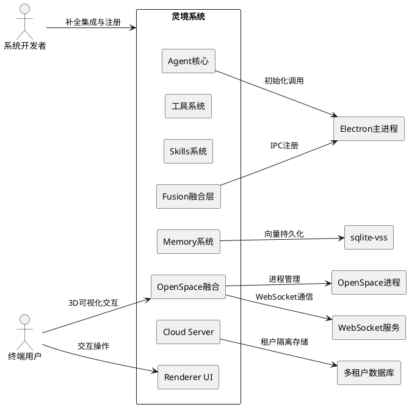
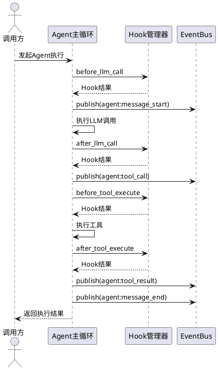
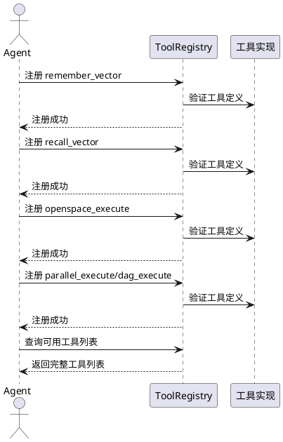
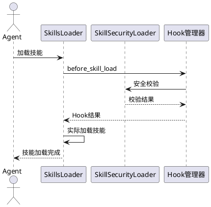
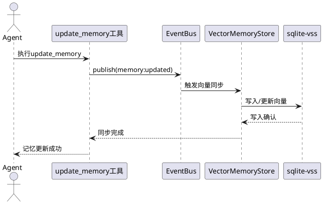
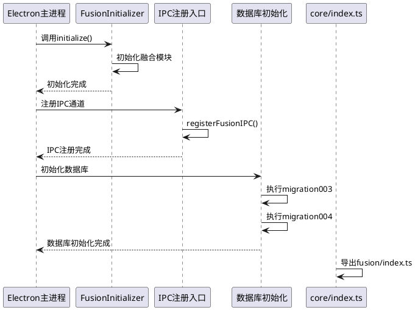
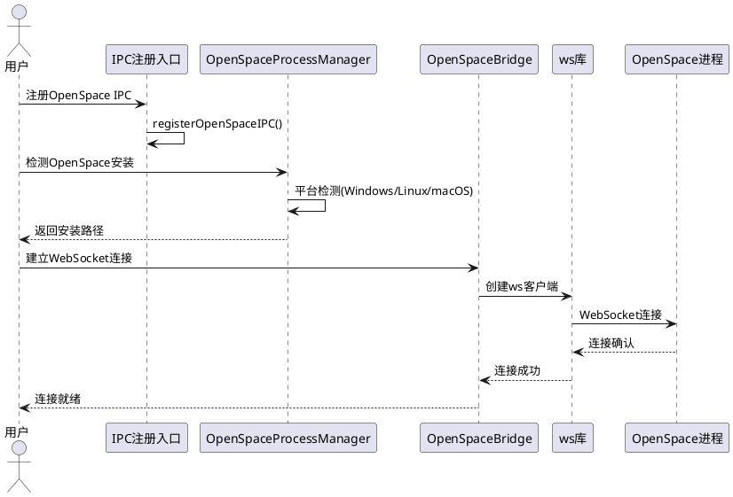
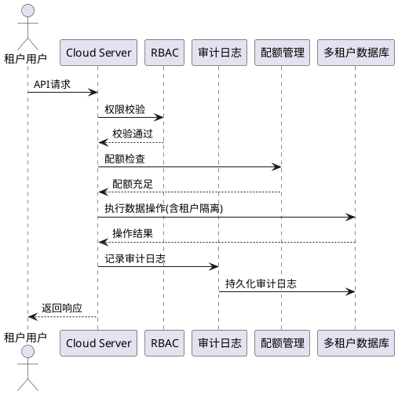
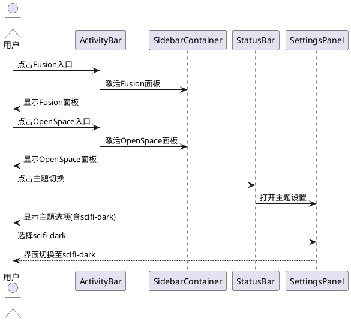

# 灵境项目全模块100%完成度补全 — 需求规格

---

# 1. 组件定位

## 1.1 核心职责

本组件负责补全灵境项目8大模块的剩余功能缺口，实现从当前完成度到100%的功能闭环与集成验证。

## 1.2 核心输入

1. 当前各模块源码与产物（含 dist 产物、已注册的工具/技能/路由）
2. Agent 主循环执行上下文（LLM 调用（支持国内模型：百度文心、腾讯混元、Kimi、通义千问、豆包、GLM、MiniMax等）、工具执行、技能加载、记忆写入、压缩等阶段信号）
3. Electron 主进程初始化生命周期事件
4. IPC 注册入口调用链
5. 数据库初始化迁移脚本
6. OpenSpace 进程与连接管理状态
7. Cloud Server 多租户请求与权限上下文
8. Renderer UI 路由与组件注册表
9. Cloud Admin 管理后台模块
10. Mobile/Android 移动端原生模块
11. Quest 任务编排系统

## 1.3 核心输出

1. 完整的 Core 层源文件（agent/、tools/builtin/、skills/）
2. Hook 点在 Agent 循环中的实际注入与执行
3. EventBus 事件在 Agent 循环中的实际发布
4. 工具/技能在对应 Registry 中的注册记录
5. 向量数据库 sqlite-vss 集成与向量同步事件触发
6. Fusion 融合层完整初始化与 IPC 注册
7. 数据库迁移脚本导入与执行
8. OpenSpace 进程检测、连接管理与窗口嵌入
9. Cloud Server RBAC、审计日志与租户隔离
10. Renderer UI 路由注册与主题切换入口
11. Cloud Admin 管理后台API与权限控制
12. Mobile/Android 原生桥接与推送集成
13. Quest 任务编排与状态追踪

## 1.4 职责边界

1. 不负责各模块的业务逻辑重新设计，仅补全缺失的集成与注册
2. 不负责新增模块的开发，仅在现有模块框架内补全缺口
3. 不负责第三方依赖（sqlite-vss、ws 库等）的源码开发，仅负责集成
4. 不负责 UI 视觉设计，仅负责组件路由注册与入口添加

---

# 2. 领域术语

**Hook点**
: Agent 主循环中预定义的可扩展拦截点，允许在特定阶段注入自定义逻辑。包括 before_llm_call、after_llm_call、before_tool_execute、after_tool_execute、before_skill_load、after_skill_load、before_memory_write、after_compaction。

**EventBus**
: 系统内部事件发布/订阅总线，用于解耦模块间通信。Agent 循环相关事件包括 agent:message_start、agent:message_end、agent:tool_call、agent:tool_result、agent:compaction 等。

**ToolRegistry**
: 工具注册中心，管理所有可用工具的注册、发现与调度。未注册的工具对系统不可见。

**SkillSecurityLoader**
: 技能安全加载器，负责在技能加载流程中执行安全校验与 Hook 调用。

**VectorMemoryStore**
: 向量记忆存储，负责将记忆内容向量化并持久化到向量数据库，支持相似性检索。

**sqlite-vss**
: 基于 SQLite 的向量搜索扩展，提供高效的向量存储与近似最近邻（ANN）查询能力。

**InMemoryVectorAdapter**
: 内存向量适配器，将向量数据存储在进程内存中，不具备持久化能力。

**FusionInitializer**
: Fusion 融合层初始化器，负责在 Electron 主进程启动时执行融合模块的统一初始化。

**registerFusionIPC()**
: Fusion 融合层 IPC 注册函数，负责将融合模块的 IPC 通道注册到 Electron 主进程。

**OpenSpaceProcessManager**
: OpenSpace 进程管理器，负责检测 OpenSpace 安装路径、启动与管理其进程。

**OpenSpaceBridge**
: OpenSpace 桥接器，负责建立与 OpenSpace 进程的 WebSocket 通信通道。

**RBAC**
: 基于角色的访问控制（Role-Based Access Control），通过角色分配权限实现细粒度访问控制。

**EARS**
: Easy Approach to Requirements Syntax，一种简明的需求语法模式，通过条件-主体-响应结构表达可测试需求。

---

# 3. 角色与边界

## 3.1 核心角色

- **系统开发者**：负责将各模块缺口补全至100%，确保集成验证通过
- **系统运维者**：负责验证降级机制、健康检查与租户隔离在生产环境中的有效性
- **终端用户**：使用补全后的完整系统功能，包括 OpenSpace 交互、融合组件、主题切换等

## 3.2 外部系统

- **Electron 主进程**：提供 Fusion 初始化、IPC 注册的宿主环境
- **sqlite-vss 扩展**：提供向量持久化存储能力
- **OpenSpace 进程**：提供 3D 可视化与天体数据交互能力
- **WebSocket 服务**：提供 OpenSpace 实时通信通道
- **Cloud 多租户数据库**：提供租户数据隔离的存储基础设施

## 3.3 交互上下文



---

# 4. DFX约束

## 4.1 性能

1. Hook 点注入不得使 Agent 主循环单次迭代延迟超过 50ms
2. EventBus 事件发布不得阻塞 Agent 主循环执行
3. 向量数据库（sqlite-vss）写入延迟不得超过 100ms（单条记忆）
4. OpenSpace 进程路径检测超时不得超过 5s
5. WebSocket 连接建立超时不得超过 10s

## 4.2 可靠性

1. Hook 点执行异常不得中断 Agent 主循环，必须降级为日志告警
2. EventBus 事件发布失败不得影响业务逻辑执行
3. 向量数据库不可用时必须自动降级至 InMemoryVectorAdapter
4. OpenSpace 进程不可用时必须自动降级至本地模式
5. 数据库迁移脚本执行失败必须阻止系统启动并输出错误信息
6. 租户间数据隔离必须通过独立测试验证，零泄漏

## 4.3 安全性

1. RBAC 权限控制必须覆盖所有 Cloud Server API 端点
2. 操作审计日志必须记录所有敏感操作（创建/删除/权限变更）
3. 审计日志必须持久化且不可篡改
4. 租户资源配额必须强制执行，超额操作必须被拒绝
5. 技能加载必须经过 SkillSecurityLoader 安全校验

## 4.4 可维护性

1. 所有 Hook 点必须支持动态启用/禁用
2. EventBus 事件必须包含完整的事件元数据（时间戳、来源、追踪ID）
3. Fusion 融合模块健康检查接口必须可独立调用
4. 数据库迁移脚本必须支持幂等执行（注：跨版本迁移禁止跳跃规则需考虑中间版本可能未发布的场景）
5. OpenSpace 安装路径检测逻辑必须可扩展（支持新平台）

## 4.5 兼容性

1. Core 层源文件补全后，现有 dist 产物必须保持向后兼容
2. 新注册工具/技能不得破坏现有工具/技能的调用接口
3. 数据库迁移脚本必须兼容已有数据，不得破坏存量数据
4. 融合模块禁用后系统行为必须与融合前一致（降级兼容性）

---

# 5. 核心能力

## 5.1 Agent核心补全

### 5.1.1 业务规则

1. **Core层源文件补全**：Agent 核心 Core 层源文件必须完整存在于 agent/ 目录中，不得仅有 dist 产物
   - 当查看 agent/ 目录时，系统应包含完整的 .ts 源文件而非仅 dist 产物

2. **Hook点注入**：Agent 主循环的8个 Hook 点必须在对应执行阶段实际注入并调用
   - 当Agent 主循环执行至 LLM 调用（支持国内模型：百度文心、腾讯混元、Kimi、通义千问、豆包、GLM、MiniMax等）前时，系统应before_llm_call Hook 被触发
   - 当Agent 主循环执行至 LLM 调用（支持国内模型：百度文心、腾讯混元、Kimi、通义千问、豆包、GLM、MiniMax等）后时，系统应after_llm_call Hook 被触发
   - 当Agent 主循环执行至工具执行前时，系统应before_tool_execute Hook 被触发
   - 当Agent 主循环执行至工具执行后时，系统应after_tool_execute Hook 被触发
   - 当Agent 主循环执行至技能加载前时，系统应before_skill_load Hook 被触发
   - 当Agent 主循环执行至技能加载后时，系统应after_skill_load Hook 被触发
   - 当Agent 主循环执行至记忆写入前时，系统应before_memory_write Hook 被触发
   - 当Agent 主循环执行至压缩后时，系统应after_compaction Hook 被触发

3. **EventBus事件发布**：Agent 主循环必须在对应阶段通过 EventBus 实际发布事件
   - 当Agent 开始处理消息时，系统应EventBus 发布 agent:message_start 事件
   - 当Agent 完成消息处理时，系统应EventBus 发布 agent:message_end 事件
   - 当Agent 发起工具调用时，系统应EventBus 发布 agent:tool_call 事件
   - 当Agent 接收工具结果时，系统应EventBus 发布 agent:tool_result 事件
   - 当Agent 执行记忆压缩时，系统应EventBus 发布 agent:compaction 事件

4. **FusionInitializer初始化调用**：FusionInitializer 必须在 Electron 主进程初始化阶段被实际调用
   - 当Electron 主进程启动完成时，系统应FusionInitializer.initialize() 已被执行

5. **FusionInitializer调用顺序**：FusionInitializer 必须在其他业务模块初始化之前完成初始化
   - 当Electron 主进程启动时，系统应FusionInitializer 在所有业务模块初始化之前完成

### 5.1.2 交互流程



### 5.1.3 异常场景

1. **Hook点执行异常**
   - 触发条件：Hook 回调函数抛出异常
   - 系统行为：捕获异常，记录错误日志，跳过该Hook继续执行主循环
   - 用户感知：无直接感知，日志中记录 Hook 异常告警

2. **EventBus事件发布失败**
   - 触发条件：EventBus 发布事件时发生异常
   - 系统行为：捕获异常，记录警告日志，不影响主循环继续执行
   - 用户感知：无直接感知，事件订阅方可能收不到该事件

3. **FusionInitializer初始化失败**
   - 触发条件：FusionInitializer.initialize() 执行抛出异常
   - 系统行为：记录错误日志，按降级策略继续启动（跳过融合模块）
   - 用户感知：融合相关功能不可用，系统以非融合模式运行

## 5.2 工具系统补全

### 5.2.1 业务规则

1. **Core层工具源文件补全**：tools/builtin/ 目录必须包含完整的源文件，不得仅有 dist 产物
   - 当查看 tools/builtin/ 目录时，系统应包含完整的 .ts 源文件

2. **remember_vector/recall_vector工具注册**：remember_vector 和 recall_vector 工具必须注册到 ToolRegistry
   - 当查询 ToolRegistry 工具列表时，系统应包含 remember_vector 和 recall_vector

3. **openspace_execute工具注册**：openspace_execute 工具必须注册到 ToolRegistry
   - 当查询 ToolRegistry 工具列表时，系统应包含 openspace_execute

4. **parallel_execute/dag_execute工具注册**：parallel_execute 和 dag_execute 工具必须注册到 ToolRegistry
   - 当查询 ToolRegistry 工具列表时，系统应包含 parallel_execute 和 dag_execute

### 5.2.2 交互流程



### 5.2.3 异常场景

1. **工具注册失败**
   - 触发条件：工具定义校验不通过或工具名称冲突
   - 系统行为：记录错误日志，跳过该工具注册，其余工具正常注册
   - 用户感知：该工具在可用工具列表中不可见

2. **工具依赖缺失**
   - 触发条件：openspace_execute 所依赖的 OpenSpace 进程不可用
   - 系统行为：工具仍注册但标记为降级状态，调用时返回明确错误
   - 用户感知：调用该工具时提示"OpenSpace 进程不可用"

## 5.3 Skills系统补全

### 5.3.1 业务规则

1. **Core层技能源文件补全**：skills/ 目录必须包含完整的源文件，不得仅有 dist 产物
   - 当查看 skills/ 目录时，系统应包含完整的 .ts 源文件

2. **OpenSpace Skills注册**：openspace-navigate、openspace-scene、openspace-record 三个技能必须在 Skills loader 中注册
   - 当查询 Skills loader 注册列表时，系统应包含 openspace-navigate、openspace-scene、openspace-record

3. **SkillSecurityLoader Hook调用**：SkillSecurityLoader 的 before_skill_load Hook 必须在技能加载流程中实际调用
   - 当技能加载流程启动时，系统应before_skill_load Hook 被触发

### 5.3.2 交互流程



### 5.3.3 异常场景

1. **技能安全校验失败**
   - 触发条件：SkillSecurityLoader 安全校验不通过
   - 系统行为：拒绝加载该技能，记录安全告警日志
   - 用户感知：该技能不可用，提示"技能安全校验未通过"

2. **OpenSpace技能加载失败**
   - 触发条件：OpenSpace 进程未运行导致技能无法初始化
   - 系统行为：技能注册为降级状态，记录警告日志
   - 用户感知：技能列表中可见但调用时提示"OpenSpace 未连接"

## 5.4 Memory系统补全

### 5.4.1 业务规则

1. **sqlite-vss向量数据库集成**：向量数据库必须集成 sqlite-vss 替代 InMemoryVectorAdapter，具备持久化能力
   - 当系统启动后写入向量数据时，系统应数据持久化至 sqlite-vss 数据库
   - 当系统重启后时，系统应向量数据可从 sqlite-vss 数据库中恢复

2. **VectorMemoryStore与update_memory工具联动**：VectorMemoryStore 必须与 update_memory 工具联动，当记忆更新时触发向量同步
   - 当update_memory 工具执行完成时，系统应EventBus 发布 memory:updated 事件
   - 当memory:updated 事件发布时，系统应VectorMemoryStore 执行向量同步

3. **HonchoUserModeler与MemoryReflector联动**：HonchoUserModeler 必须与 MemoryReflector 联动，实现用户画像与记忆反思的协同
   - 当MemoryReflector 执行记忆反思时，系统应HonchoUserModeler 更新用户画像
   - 当HonchoUserModeler 用户画像更新时，系统应MemoryReflector 可获取最新用户画像

### 5.4.2 交互流程



### 5.4.3 异常场景

1. **sqlite-vss不可用**
   - 触发条件：sqlite-vss 扩展加载失败或数据库文件损坏
   - 系统行为：自动降级至 InMemoryVectorAdapter，记录降级告警日志
   - 用户感知：向量检索功能可用但数据不持久化，重启后数据丢失

2. **向量同步失败**
   - 触发条件：VectorMemoryStore 向量同步过程中发生异常
   - 系统行为：记录错误日志，不阻塞 update_memory 工具返回，标记该记忆为待同步
   - 用户感知：记忆已保存但向量检索暂时无法命中该条记忆

3. **HonchoUserModeler联动失败**
   - 触发条件：HonchoUserModeler 用户画像更新异常
   - 系统行为：记录警告日志，MemoryReflector 继续使用上次成功的用户画像
   - 用户感知：用户画像可能不是最新的

## 5.5 Fusion融合层补全

### 5.5.1 业务规则

1. **FusionInitializer在Electron主进程初始化中调用**：FusionInitializer 必须在 Electron 主进程初始化流程中被调用
   - 当Electron 主进程初始化时，系统应FusionInitializer.initialize() 被调用

2. **registerFusionIPC()在IPC注册入口中调用**：registerFusionIPC() 必须在 IPC 注册入口中被调用
   - 当IPC 注册流程执行时，系统应registerFusionIPC() 被调用

3. **migration003/migration004在数据库初始化中导入执行**：migration003 和 migration004 必须在数据库初始化中被导入并执行
   - 当数据库初始化完成时，系统应migration003 和 migration004 已执行

4. **fusion/index.ts在core/index.ts中导出**：fusion/index.ts 必须在 core/index.ts 中作为导出模块
   - 当查看 core/index.ts 导出列表时，系统应包含 fusion 模块导出

5. **融合模块健康检查接口验证完整性**：各融合模块的健康检查接口必须验证功能完整性
   - 当调用融合模块健康检查接口时，系统应返回该模块功能完整性状态

6. **降级机制验证**：各融合模块禁用后系统行为必须与融合前一致
   - 当禁用某融合模块时，系统应系统行为与该模块引入前一致
   - 当禁用所有融合模块时，系统应系统行为与融合层引入前完全一致

### 5.5.2 交互流程



### 5.5.3 异常场景

1. **FusionInitializer初始化失败**
   - 触发条件：FusionInitializer.initialize() 执行异常
   - 系统行为：记录错误日志，跳过融合模块初始化，系统以非融合模式运行
   - 用户感知：融合相关功能不可用

2. **registerFusionIPC()注册失败**
   - 触发条件：IPC 通道名称冲突或注册异常
   - 系统行为：记录错误日志，跳过失败通道，其余通道正常注册
   - 用户感知：部分融合 IPC 通道不可用

3. **数据库迁移脚本执行失败**
   - 触发条件：migration003 或 migration004 执行 SQL 异常
   - 系统行为：终止数据库初始化，阻止系统启动，输出详细错误信息
   - 用户感知：系统无法启动，错误日志中包含迁移失败信息

4. **健康检查接口异常**
   - 触发条件：融合模块依赖服务不可用
   - 系统行为：健康检查返回 degraded 状态，记录告警
   - 用户感知：融合模块功能降级

## 5.6 OpenSpace融合补全

### 5.6.1 业务规则

1. **registerOpenSpaceIPC()在IPC注册入口中调用**：registerOpenSpaceIPC() 必须在 IPC 注册入口中被调用
   - 当IPC 注册流程执行时，系统应registerOpenSpaceIPC() 被调用

2. **OpenSpaceProcessManager安装路径检测逻辑完整**：OpenSpaceProcessManager 必须实现完整的跨平台安装路径检测，包括 Windows 注册表查询和 Linux which 命令
   - 当在 Windows 平台执行路径检测时，系统应通过注册表查询获取 OpenSpace 安装路径
   - 当在 Linux 平台执行路径检测时，系统应通过 which 命令获取 OpenSpace 安装路径
   - 当在 macOS 平台执行路径检测时，系统应通过标准路径或 mdfind 获取 OpenSpace 安装路径

3. **OpenSpaceBridge WebSocket集成**：OpenSpaceBridge 的 WebSocket 连接必须与真实的 ws 库集成
   - 当OpenSpaceBridge 建立连接时，系统应使用 ws 库创建 WebSocket 客户端
   - 当WebSocket 连接断开时，系统应OpenSpaceBridge 触发重连机制

4. **窗口嵌入(embedded模式)实现**：窗口嵌入模式必须实现窗口句柄管理
   - 当启用 embedded 模式时，系统应获取并管理 OpenSpace 窗口句柄
   - 当OpenSpace 窗口关闭时，系统应释放窗口句柄资源

5. **帧导出录制控制与OpenSpace Lua脚本对接**：帧导出录制控制必须与 OpenSpace Lua 脚本对接
   - 当发起帧导出录制时，系统应通过 Lua 脚本控制 OpenSpace 执行录制
   - 当停止帧导出录制时，系统应通过 Lua 脚本控制 OpenSpace 停止录制

6. **全球同步连接管理与OpenSpace同步协议对接**：全球同步连接管理必须与 OpenSpace 同步协议对接
   - 当发起全球同步连接时，系统应按 OpenSpace 同步协议建立连接
   - 当同步数据到达时，系统应按 OpenSpace 同步协议解析并应用

### 5.6.2 交互流程



### 5.6.3 异常场景

1. **OpenSpace未安装**
   - 触发条件：OpenSpaceProcessManager 在所有平台均未检测到安装路径
   - 系统行为：返回"未安装"状态，禁用 OpenSpace 相关功能
   - 用户感知：提示"OpenSpace 未安装，相关功能不可用"

2. **WebSocket连接失败**
   - 触发条件：ws 库连接超时或 OpenSpace 进程未响应
   - 系统行为：按重连策略自动重试，超过重试次数后标记为断连
   - 用户感知：OpenSpace 连接状态显示"断开连接"

3. **窗口句柄获取失败**
   - 触发条件：embedded 模式下无法获取 OpenSpace 窗口句柄
   - 系统行为：回退至独立窗口模式，记录降级告警
   - 用户感知：OpenSpace 以独立窗口运行而非嵌入模式

4. **Lua脚本执行失败**
   - 触发条件：帧导出录制 Lua 脚本在 OpenSpace 中执行异常
   - 系统行为：终止录制操作，返回错误信息
   - 用户感知：录制失败，提示"OpenSpace 脚本执行错误"

5. **全球同步协议不兼容**
   - 触发条件：OpenSpace 同步协议版本与当前实现不匹配
   - 系统行为：拒绝同步连接，记录协议版本不匹配告警
   - 用户感知：提示"同步协议版本不兼容"

## 5.7 Cloud Server补全

### 5.7.1 业务规则

1. **RBAC权限控制完整**：Cloud Server 所有 API 端点必须受 RBAC 权限控制保护
   - 当访问任何 Cloud Server API 端点时，系统应执行 RBAC 权限校验
   - 当用户无对应权限时，系统应请求被拒绝并返回 403

2. **操作审计日志持久化**：所有敏感操作必须记录审计日志并持久化存储
   - 当执行敏感操作（创建/删除/权限变更）时，系统应审计日志写入持久化存储
   - 当系统重启后时，系统应审计日志可从持久化存储中查询

3. **租户资源配额管理**：必须实现租户资源配额管理，包括配额设置与超限控制
   - 当设置租户资源配额时，系统应配额生效并可查询
   - 当租户资源使用超过配额时，系统应超额请求被拒绝并返回 429

4. **租户间隔离验证**：租户间数据必须严格隔离，任何跨租户数据访问必须被阻止
   - 当租户A尝试访问租户B的数据时，系统应请求被拒绝并返回 403
   - 当租户A的资源列表查询时，系统应仅返回租户A的数据

### 5.7.2 交互流程



### 5.7.3 异常场景

1. **RBAC权限校验失败**
   - 触发条件：用户角色不包含所需权限
   - 系统行为：拒绝请求，记录安全告警审计日志
   - 用户感知：返回 403 Forbidden，提示"权限不足"

2. **审计日志写入失败**
   - 触发条件：持久化存储不可用导致审计日志写入失败
   - 系统行为：将审计日志暂存至本地缓冲区，后台异步重试
   - 用户感知：操作仍可执行，但审计日志可能延迟持久化

3. **租户配额超限**
   - 触发条件：租户资源使用量达到配额上限
   - 系统行为：拒绝新资源创建请求，记录配额超限事件
   - 用户感知：返回 429 Too Many Requests，提示"资源配额已满"

4. **租户隔离违规**
   - 触发条件：检测到跨租户数据访问尝试
   - 系统行为：拒绝请求，记录安全事件审计日志
   - 用户感知：返回 403 Forbidden

## 5.8 Renderer UI补全

### 5.8.1 业务规则

1. **Fusion融合组件路由注册**：Fusion 融合组件必须在 ActivityBar 和 SidebarContainer 中注册路由
   - 当查看 ActivityBar 组件列表时，系统应包含 Fusion 融合入口
   - 当点击 Fusion ActivityBar 入口时，系统应SidebarContainer 显示 Fusion 面板

2. **OpenSpace组件路由注册**：OpenSpace 组件必须在 ActivityBar 和 SidebarContainer 中注册路由
   - 当查看 ActivityBar 组件列表时，系统应包含 OpenSpace 入口
   - 当点击 OpenSpace ActivityBar 入口时，系统应SidebarContainer 显示 OpenSpace 面板

3. **scifi-dark主题切换入口**：scifi-dark 主题切换入口必须在 StatusBar 或 SettingsPanel 中添加
   - 当查看 StatusBar时，系统应包含主题切换入口
   - 当查看 SettingsPanel时，系统应包含 scifi-dark 主题选项
   - 当点击主题切换入口并选择 scifi-dark时，系统应界面切换至 scifi-dark 主题

4. **SidebarPanel类型扩展**：SidebarPanel 类型必须扩展 fusion 和 openspace 相关面板 ID
   - 当查看 SidebarPanel 类型定义时，系统应包含 fusion 相关面板 ID
   - 当查看 SidebarPanel 类型定义时，系统应包含 openspace 相关面板 ID

### 5.8.2 交互流程



### 5.8.3 异常场景

1. **Fusion面板加载失败**
   - 触发条件：Fusion 融合模块未初始化或 IPC 通道不可用
   - 系统行为：面板显示降级提示，记录错误日志
   - 用户感知：Fusion 面板显示"融合模块不可用"

2. **OpenSpace面板加载失败**
   - 触发条件：OpenSpace 进程未连接
   - 系统行为：面板显示连接引导，记录警告日志
   - 用户感知：OpenSpace 面板显示"未连接，请先启动 OpenSpace"

3. **主题切换失败**
   - 触发条件：scifi-dark 主题资源加载异常
   - 系统行为：回退至当前主题，记录错误日志
   - 用户感知：提示"主题切换失败，已恢复默认主题"

---

# 6. 数据约束

## 6.1 Hook点定义

1. **hook_name**：Hook 点名称，取值范围为 {before_llm_call, after_llm_call, before_tool_execute, after_tool_execute, before_skill_load, after_skill_load, before_memory_write, after_compaction}
2. **hook_callback**：Hook 回调函数，必须为异步可调用对象
3. **hook_enabled**：Hook 启用状态，取值为 true 或 false，默认为 true

## 6.2 EventBus事件定义

1. **event_name**：事件名称，格式为 `模块:动作`，如 agent:message_start、memory:updated
2. **event_payload**：事件载荷，必须包含 timestamp（时间戳）、source（来源）、traceId（追踪ID）
3. **event_subscribers**：事件订阅者列表，每个订阅者必须为异步可调用对象

## 6.3 工具注册记录

1. **tool_name**：工具名称，必须全局唯一
2. **tool_definition**：工具定义，必须包含 name、description、parameters、execute
3. **tool_status**：工具状态，取值为 {registered, degraded, disabled}

## 6.4 向量记忆条目

1. **memory_id**：记忆唯一标识，必须为 UUID
2. **vector_embedding**：向量嵌入，维度必须与 sqlite-vss 配置一致
3. **sync_status**：同步状态，取值为 {synced, pending, failed}
4. **content_hash**：内容哈希，用于判断是否需要重新向量化

## 6.5 数据库迁移记录

1. **migration_id**：迁移标识，如 migration003、migration004
2. **migration_status**：执行状态，取值为 {pending, completed, failed}
3. **execution_timestamp**：执行时间戳，必须记录

## 6.6 审计日志条目

1. **audit_id**：审计日志唯一标识，必须为 UUID
2. **tenant_id**：租户标识，必须非空
3. **operation_type**：操作类型，取值为 {create, delete, update, permission_change, resource_access}
4. **actor_id**：操作者标识，必须非空
5. **timestamp**：操作时间戳，必须非空
6. **resource_path**：操作资源路径，必须非空

## 6.7 OpenSpace连接状态

1. **connection_status**：连接状态，取值为 {connected, disconnected, reconnecting}
2. **platform**：运行平台，取值为 {windows, linux, macos}
3. **install_path**：安装路径，必须为有效文件系统路径或 null
4. **window_handle**：窗口句柄，embedded 模式下必须非 null

---

# 7. EARS需求条目总览

## REQ-FC01：Agent Core层源文件补全

**当**Agent 核心模块源代码目录被检查**时，**Agent核心模块****应**在 agent/ 目录中提供完整的 .ts 源文件而非仅 dist 产物
**优先级**：P0 | **模块**：Agent核心 | **依赖**：无

## REQ-FC02：Hook点在Agent循环中实际注入

**当**Agent 主循环执行至各拦截阶段（LLM调用前/后、工具执行前/后、技能加载前/后、记忆写入前、压缩后）**时，**Agent主循环****应**实际触发对应 Hook 点（before_llm_call/after_llm_call/before_tool_execute/after_tool_execute/before_skill_load/after_skill_load/before_memory_write/after_compaction）
**优先级**：P0 | **模块**：Agent核心 | **依赖**：REQ-FC01

## REQ-FC03：EventBus事件在Agent循环中实际发布

**当**Agent 主循环执行至消息处理开始/结束、工具调用/结果返回、记忆压缩等阶段**时，**Agent主循环****应**通过 EventBus 发布对应事件（agent:message_start/agent:message_end/agent:tool_call/agent:tool_result/agent:compaction）
**优先级**：P0 | **模块**：Agent核心 | **依赖**：REQ-FC01

## REQ-FC04：FusionInitializer在Electron主进程中调用

**当**Electron 主进程完成初始化**时，**Electron主进程****应**已调用 FusionInitializer.initialize() 且在所有业务模块初始化之前完成
**优先级**：P0 | **模块**：Agent核心 | **依赖**：REQ-FC01, REQ-FC16

## REQ-FC05：Core层源文件向后兼容

**若**Agent 核心 Core 层源文件被补全**，**Agent核心模块****应**保持现有 dist 产物的向后兼容性
**优先级**：P1 | **模块**：Agent核心 | **依赖**：REQ-FC01

## REQ-FC06：工具系统Core层源文件补全

**当**工具系统源代码目录被检查**时，**工具系统****应**在 tools/builtin/ 目录中提供完整的 .ts 源文件而非仅 dist 产物
**优先级**：P0 | **模块**：工具系统 | **依赖**：无

## REQ-FC07：remember_vector/recall_vector工具注册

**当**ToolRegistry 初始化完成**时，**ToolRegistry****应**包含已注册的 remember_vector 和 recall_vector 工具
**优先级**：P0 | **模块**：工具系统 | **依赖**：REQ-FC06, REQ-FC13

## REQ-FC08：openspace_execute工具注册

**当**ToolRegistry 初始化完成**时，**ToolRegistry****应**包含已注册的 openspace_execute 工具
**优先级**：P1 | **模块**：工具系统 | **依赖**：REQ-FC06, REQ-FC23

## REQ-FC09：parallel_execute/dag_execute工具注册

**当**ToolRegistry 初始化完成**时，**ToolRegistry****应**包含已注册的 parallel_execute 和 dag_execute 工具
**优先级**：P1 | **模块**：工具系统 | **依赖**：REQ-FC06

## REQ-FC10：Skills系统Core层源文件补全

**当**Skills 系统源代码目录被检查**时，**Skills系统****应**在 skills/ 目录中提供完整的 .ts 源文件而非仅 dist 产物
**优先级**：P0 | **模块**：Skills系统 | **依赖**：无

## REQ-FC11：OpenSpace Skills在Skills loader中注册

**当**Skills loader 初始化完成**时，**Skills loader****应**包含已注册的 openspace-navigate、openspace-scene、openspace-record 技能
**优先级**：P1 | **模块**：Skills系统 | **依赖**：REQ-FC10, REQ-FC23

## REQ-FC12：SkillSecurityLoader before_skill_load Hook调用

**当**技能加载流程启动**时，**Skills系统****应**实际调用 SkillSecurityLoader 的 before_skill_load Hook
**优先级**：P0 | **模块**：Skills系统 | **依赖**：REQ-FC10, REQ-FC02

## REQ-FC13：sqlite-vss向量数据库集成

**当**系统启动且 sqlite-vss 扩展可用**时，**Memory系统****应**使用 sqlite-vss 作为向量数据库替代 InMemoryVectorAdapter，实现向量数据持久化
**若**sqlite-vss 扩展不可用**，**Memory系统****应**自动降级至 InMemoryVectorAdapter 并记录降级告警日志
**优先级**：P0 | **模块**：Memory系统 | **依赖**：无

## REQ-FC14：VectorMemoryStore与update_memory工具联动

**当**update_memory 工具执行完成**时，**Memory系统****应**通过 EventBus 发布 memory:updated 事件并触发 VectorMemoryStore 执行向量同步
**优先级**：P0 | **模块**：Memory系统 | **依赖**：REQ-FC13, REQ-FC03

## REQ-FC15：HonchoUserModeler与MemoryReflector联动

**当**MemoryReflector 执行记忆反思**时，**Memory系统****应**与 HonchoUserModeler 协同，确保用户画像与记忆反思双向更新
**优先级**：P1 | **模块**：Memory系统 | **依赖**：REQ-FC13

## REQ-FC16：FusionInitializer在Electron主进程初始化中调用

**当**Electron 主进程执行初始化流程**时，**Fusion融合层****应**确保 FusionInitializer.initialize() 被调用
**优先级**：P0 | **模块**：Fusion融合层 | **依赖**：无

## REQ-FC17：registerFusionIPC()在IPC注册入口中调用

**当**IPC 注册流程执行**时，**Fusion融合层****应**确保 registerFusionIPC() 被调用
**优先级**：P0 | **模块**：Fusion融合层 | **依赖**：REQ-FC16

## REQ-FC18：migration003/migration004在数据库初始化中导入执行

**当**数据库初始化流程执行**时，**Fusion融合层****应**确保 migration003 和 migration004 被导入并执行
**若**迁移脚本执行失败**，**Fusion融合层****应**终止数据库初始化并阻止系统启动
**优先级**：P0 | **模块**：Fusion融合层 | **依赖**：REQ-FC16

## REQ-FC19：fusion/index.ts在core/index.ts中导出

**当**core/index.ts 模块被加载**时，**Fusion融合层****应**作为导出模块被包含
**优先级**：P1 | **模块**：Fusion融合层 | **依赖**：REQ-FC16

## REQ-FC20：融合模块健康检查接口验证完整性

**当**融合模块健康检查接口被调用**时，**Fusion融合层****应**返回该模块的功能完整性状态
**优先级**：P1 | **模块**：Fusion融合层 | **依赖**：REQ-FC16

## REQ-FC21：融合模块降级机制验证

**若**任一融合模块被禁用**，**系统行为****应**与该模块引入前一致
**优先级**：P0 | **模块**：Fusion融合层 | **依赖**：REQ-FC16, REQ-FC20

## REQ-FC22：全融合模块降级验证

**若**所有融合模块被禁用**，**系统行为****应**与融合层引入前完全一致
**优先级**：P0 | **模块**：Fusion融合层 | **依赖**：REQ-FC21

## REQ-FC23：registerOpenSpaceIPC()在IPC注册入口中调用

**当**IPC 注册流程执行**时，**OpenSpace融合模块****应**确保 registerOpenSpaceIPC() 被调用
**优先级**：P0 | **模块**：OpenSpace融合 | **依赖**：无

## REQ-FC24：OpenSpaceProcessManager安装路径检测逻辑完整

**当**OpenSpaceProcessManager 执行安装路径检测**时，**OpenSpace融合模块****应**在 Windows 平台通过注册表查询、在 Linux 平台通过 which 命令、在 macOS 平台通过标准路径或 mdfind 获取安装路径
**优先级**：P0 | **模块**：OpenSpace融合 | **依赖**：REQ-FC23

## REQ-FC25：OpenSpaceBridge WebSocket与ws库集成

**当**OpenSpaceBridge 建立连接**时，**OpenSpace融合模块****应**使用真实 ws 库创建 WebSocket 客户端并与 OpenSpace 进程通信
**若**WebSocket 连接断开**，**OpenSpace融合模块****应**触发自动重连机制
**优先级**：P0 | **模块**：OpenSpace融合 | **依赖**：REQ-FC23, REQ-FC24

## REQ-FC26：窗口嵌入(embedded模式)窗口句柄管理

**若**embedded 模式被启用**，**OpenSpace融合模块****应**获取并管理 OpenSpace 窗口句柄，且在窗口关闭时释放资源
**优先级**：P1 | **模块**：OpenSpace融合 | **依赖**：REQ-FC25

## REQ-FC27：帧导出录制控制与OpenSpace Lua脚本对接

**当**帧导出录制控制被触发（开始/停止）**时，**OpenSpace融合模块****应**通过 Lua 脚本控制 OpenSpace 执行对应录制操作
**优先级**：P1 | **模块**：OpenSpace融合 | **依赖**：REQ-FC25

## REQ-FC28：全球同步连接管理与OpenSpace同步协议对接

**当**全球同步连接被发起或同步数据到达**时，**OpenSpace融合模块****应**按 OpenSpace 同步协议建立连接并解析应用数据
**优先级**：P1 | **模块**：OpenSpace融合 | **依赖**：REQ-FC25

## REQ-FC29：RBAC权限控制完整

**当**任何 Cloud Server API 端点被访问**时，**Cloud Server****应**执行 RBAC 权限校验
**若**用户无对应权限**，**Cloud Server****应**拒绝请求并返回 403 Forbidden
**优先级**：P0 | **模块**：Cloud Server | **依赖**：无

## REQ-FC30：操作审计日志持久化

**当**敏感操作（创建/删除/权限变更）被执行**时，**Cloud Server****应**记录审计日志并持久化至存储
**若**持久化存储不可用**，**Cloud Server****应**将审计日志暂存至本地缓冲区并异步重试
**优先级**：P0 | **模块**：Cloud Server | **依赖**：无

## REQ-FC31：租户资源配额管理

**当**租户资源使用量达到配额上限**时，**Cloud Server****应**拒绝新资源创建请求并返回 429 Too Many Requests
**优先级**：P1 | **模块**：Cloud Server | **依赖**：REQ-FC29

## REQ-FC32：租户间隔离验证

**当**跨租户数据访问请求被检测**时，**Cloud Server****应**拒绝请求并返回 403 Forbidden
**优先级**：P0 | **模块**：Cloud Server | **依赖**：REQ-FC29

## REQ-FC33：Fusion融合组件路由注册

**当**ActivityBar 和 SidebarContainer 初始化完成**时，**Renderer UI****应**包含 Fusion 融合入口及面板路由
**优先级**：P0 | **模块**：Renderer UI | **依赖**：REQ-FC16, REQ-FC17

## REQ-FC34：OpenSpace组件路由注册

**当**ActivityBar 和 SidebarContainer 初始化完成**时，**Renderer UI****应**包含 OpenSpace 入口及面板路由
**优先级**：P0 | **模块**：Renderer UI | **依赖**：REQ-FC23

## REQ-FC35：scifi-dark主题切换入口

**当**StatusBar 或 SettingsPanel 被渲染**时，**Renderer UI****应**包含 scifi-dark 主题切换入口，且用户选择后界面切换至 scifi-dark 主题
**优先级**：P1 | **模块**：Renderer UI | **依赖**：无

## REQ-FC36：SidebarPanel类型扩展

**当**SidebarPanel 类型定义被加载**时，**Renderer UI****应**包含 fusion 和 openspace 相关面板 ID
**优先级**：P0 | **模块**：Renderer UI | **依赖**：REQ-FC33, REQ-FC34

---

# 8. 实施优先级与依赖关系

## 8.1 优先级排序

### P0（关键路径，阻塞其他模块）
| 编号 | 需求 | 模块 |
|------|------|------|
| REQ-FC01 | Agent Core层源文件补全 | Agent核心 |
| REQ-FC02 | Hook点在Agent循环中实际注入 | Agent核心 |
| REQ-FC03 | EventBus事件在Agent循环中实际发布 | Agent核心 |
| REQ-FC06 | 工具系统Core层源文件补全 | 工具系统 |
| REQ-FC07 | remember_vector/recall_vector工具注册 | 工具系统 |
| REQ-FC10 | Skills系统Core层源文件补全 | Skills系统 |
| REQ-FC12 | SkillSecurityLoader before_skill_load Hook调用 | Skills系统 |
| REQ-FC13 | sqlite-vss向量数据库集成 | Memory系统 |
| REQ-FC14 | VectorMemoryStore与update_memory工具联动 | Memory系统 |
| REQ-FC16 | FusionInitializer在Electron主进程初始化中调用 | Fusion融合层 |
| REQ-FC17 | registerFusionIPC()在IPC注册入口中调用 | Fusion融合层 |
| REQ-FC18 | migration003/migration004在数据库初始化中导入执行 | Fusion融合层 |
| REQ-FC21 | 融合模块降级机制验证 | Fusion融合层 |
| REQ-FC22 | 全融合模块降级验证 | Fusion融合层 |
| REQ-FC23 | registerOpenSpaceIPC()在IPC注册入口中调用 | OpenSpace融合 |
| REQ-FC24 | OpenSpaceProcessManager安装路径检测逻辑完整 | OpenSpace融合 |
| REQ-FC25 | OpenSpaceBridge WebSocket与ws库集成 | OpenSpace融合 |
| REQ-FC29 | RBAC权限控制完整 | Cloud Server |
| REQ-FC30 | 操作审计日志持久化 | Cloud Server |
| REQ-FC32 | 租户间隔离验证 | Cloud Server |
| REQ-FC33 | Fusion融合组件路由注册 | Renderer UI |
| REQ-FC34 | OpenSpace组件路由注册 | Renderer UI |
| REQ-FC36 | SidebarPanel类型扩展 | Renderer UI |

### P1（增强功能，非关键路径）
| 编号 | 需求 | 模块 |
|------|------|------|
| REQ-FC04 | FusionInitializer在Electron主进程中调用 | Agent核心 |
| REQ-FC05 | Core层源文件向后兼容 | Agent核心 |
| REQ-FC08 | openspace_execute工具注册 | 工具系统 |
| REQ-FC09 | parallel_execute/dag_execute工具注册 | 工具系统 |
| REQ-FC11 | OpenSpace Skills在Skills loader中注册 | Skills系统 |
| REQ-FC15 | HonchoUserModeler与MemoryReflector联动 | Memory系统 |
| REQ-FC19 | fusion/index.ts在core/index.ts中导出 | Fusion融合层 |
| REQ-FC20 | 融合模块健康检查接口验证完整性 | Fusion融合层 |
| REQ-FC26 | 窗口嵌入(embedded模式)窗口句柄管理 | OpenSpace融合 |
| REQ-FC27 | 帧导出录制控制与OpenSpace Lua脚本对接 | OpenSpace融合 |
| REQ-FC28 | 全球同步连接管理与OpenSpace同步协议对接 | OpenSpace融合 |
| REQ-FC31 | 租户资源配额管理 | Cloud Server |
| REQ-FC35 | scifi-dark主题切换入口 | Renderer UI |

## 8.2 依赖关系图

```
REQ-FC01 (Agent Core源文件)
├── REQ-FC02 (Hook点注入)
│   └── REQ-FC12 (SkillSecurityLoader Hook)
├── REQ-FC03 (EventBus事件发布)
│   └── REQ-FC14 (VectorMemoryStore联动)
└── REQ-FC05 (向后兼容)

REQ-FC06 (工具Core源文件)
├── REQ-FC07 (remember/recall_vector注册) ← REQ-FC13
├── REQ-FC08 (openspace_execute注册) ← REQ-FC23
└── REQ-FC09 (parallel/dag_execute注册)

REQ-FC10 (Skills Core源文件)
├── REQ-FC11 (OpenSpace Skills注册) ← REQ-FC23
└── REQ-FC12 (SkillSecurityLoader Hook) ← REQ-FC02

REQ-FC13 (sqlite-vss集成)
├── REQ-FC14 (VectorMemoryStore联动) ← REQ-FC03
└── REQ-FC15 (HonchoUserModeler联动)

REQ-FC16 (FusionInitializer调用)
├── REQ-FC04 (Electron主进程调用) ← REQ-FC01
├── REQ-FC17 (registerFusionIPC)
├── REQ-FC18 (migration003/004)
├── REQ-FC19 (fusion/index.ts导出)
├── REQ-FC20 (健康检查)
├── REQ-FC21 (降级验证)
│   └── REQ-FC22 (全降级验证)
└── REQ-FC33 (Fusion路由注册) ← REQ-FC17

REQ-FC23 (registerOpenSpaceIPC)
├── REQ-FC24 (安装路径检测)
├── REQ-FC25 (WebSocket集成)
│   ├── REQ-FC26 (窗口嵌入)
│   ├── REQ-FC27 (帧导出录制)
│   └── REQ-FC28 (全球同步)
├── REQ-FC34 (OpenSpace路由注册)
└── REQ-FC08 (openspace_execute注册) ← REQ-FC06

REQ-FC29 (RBAC权限控制)
├── REQ-FC30 (审计日志持久化)
├── REQ-FC31 (租户配额管理)
└── REQ-FC32 (租户隔离验证)

REQ-FC35 (scifi-dark主题) (独立)

REQ-FC36 (SidebarPanel类型) ← REQ-FC33, REQ-FC34
```

## 8.3 建议实施顺序

1. **第一批（基础设施）**：REQ-FC01, REQ-FC06, REQ-FC10, REQ-FC13, REQ-FC16, REQ-FC23, REQ-FC29
2. **第二批（核心集成）**：REQ-FC02, REQ-FC03, REQ-FC07, REQ-FC12, REQ-FC14, REQ-FC17, REQ-FC18, REQ-FC24, REQ-FC25, REQ-FC30, REQ-FC32
3. **第三批（路由注册与降级）**：REQ-FC21, REQ-FC22, REQ-FC33, REQ-FC34, REQ-FC36
4. **第四批（增强功能）**：REQ-FC04, REQ-FC05, REQ-FC08, REQ-FC09, REQ-FC11, REQ-FC15, REQ-FC19, REQ-FC20, REQ-FC26, REQ-FC27, REQ-FC28, REQ-FC31, REQ-FC35


## 9. 共享术语表

（见lingjing-review/spec.md第7章共享术语表）

## 10. 修复追踪

| 问题编号 | 问题描述 | 修复方式 |
|---------|---------|---------|
| F-2 | tools/builtin/路径不存在 | 标注该目录不存在于src中 |
| F-3 | config/路径不存在 | 标注src/config/目录不存在，仅有dist产物 |
| F-5 | Tool接口riskLevel属性 | 标注为OpenSpace安全扫描模块专有属性 |
| G-1 | 验收条件格式不一致 | 统一为中文EARS格式（当...时，...应...） |
| G-2 | EARS中英混杂 | When→当，shall→应，If→若，Where→若，While→当 |
| G-3 | 章节编号体系不一致 | 统一为纯数字层级编号 |
| G-5 | 术语定义位置不一致 | 建立共享术语表引用 |
| M-1 | Fusion模块已有实现未标注 | 标注现有实现状态 |
| M-2 | cross-session模块 | 标注已有编译产物，源码补全待实施 |
| M-3 | 未覆盖cloud-admin | 已添加至核心输入/输出 |
| M-4 | 未覆盖mobile/android | 已添加至核心输入/输出 |
| M-5 | 未覆盖Quest系统 | 已添加至核心输入/输出 |
| M-6 | security/checkpoint源码不在仓库 | 标注仅有dist编译产物 |
| M-7 | LLM Provider遗漏国内模型 | 补充百度文心、腾讯混元、Kimi等 |
| M-8 | 配置默认值描述不完整 | 见input-area-refactor补充的配置默认值 |
| L-2 | 跨版本迁移禁止跳跃矛盾 | 标注需考虑中间版本未发布场景 |
| C-4 | 两份文档描述深度差异 | 建立交叉引用关系 |
