# Hermes Fusion 技术设计文档

---

# **1. 实现模型**

## **1.1 上下文视图**

### 系统上下文图

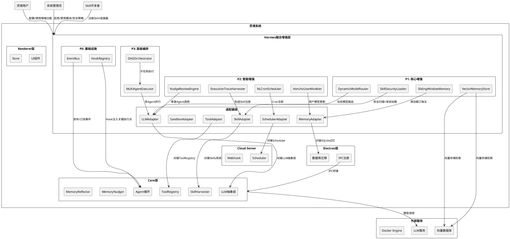

### 非侵入式融合边界声明

| 边界类型 | 描述 | 约束 |
|---------|------|------|
| Hook注入边界 | 仅在Agent循环关键执行点注册回调，不修改Agent.run内部逻辑 | 零修改原则 |
| 事件订阅边界 | 增强模块通过EventBus订阅事件，不直接调用Core模块内部方法 | 独立旁路原则 |
| 适配器调用边界 | 通过标准化适配器接口与已有模块交互，适配器为只读包装 | 增量接口原则 |
| IPC增量边界 | 新增IPC通道为纯增量注册，不修改已有IPC处理逻辑 | 兼容性保障 |
| 数据库增量边界 | migration003为纯增量DDL，不修改已有表结构 | 兼容性保障 |

---

## **1.2 服务/组件总体架构**

### 三层融合架构总览

```plantuml
@startuml
skinparam componentStyle rectangle

rectangle "融合增强层" as FusionLayer {
    rectangle "事件总线 (EventBus)" as EB #LightBlue {
        note right: 发布-订阅模式\n解耦所有增强模块
    }
    rectangle "Hook注册中心 (HookRegistry)" as HK #LightGreen {
        note right: 关键执行点注入回调\n同步/异步模式
    }
    rectangle "适配器层 (Adapter Layer)" as AD #LightYellow {
        rectangle "LLMAdapter" as LLM_A
        rectangle "MemoryAdapter" as MEM_A
        rectangle "SkillAdapter" as SK_A
        rectangle "ToolAdapter" as T_A
        rectangle "SandboxAdapter" as SB_A
        rectangle "SchedulerAdapter" as SCH_A
    }
}

rectangle "增强模块层" as ModuleLayer {
    rectangle "SlidingWindowMemoryManager" as M1
    rectangle "VectorMemoryStore" as M2
    rectangle "NudgeReviewEngine" as M3
    rectangle "ExecutionTraceHarvester" as M4
    rectangle "SkillSecurityLoader" as M5
    rectangle "DAGOrchestrator" as M6
    rectangle "MultiAgentExecutor" as M7
    rectangle "DynamicModelRouter" as M8
    rectangle "NLCronScheduler" as M9
    rectangle "HonchoUserModeler" as M10
}

rectangle "灵境现有系统" as Lingjing {
    rectangle "Agent循环" as Agent
    rectangle "ToolRegistry" as Tools
    rectangle "Skills系统" as Skills
    rectangle "LLM抽象层" as LLM
    rectangle "记忆系统" as Memory
    rectangle "Scheduler" as Sched
}

M1 --> EB : 发布memory:window_compacted
M1 --> HK : 注册after_compaction Hook
M2 --> EB : 订阅memory:updated / 发布vector:synced
M3 --> EB : 订阅agent:message_end / 发布review:completed
M4 --> EB : 订阅agent:tool_call+tool_result
M5 --> HK : 注册before_skill_load Hook
M6 --> EB : 发布dag:completed/dag:failed
M7 --> EB : 发布parallel:completed
M8 --> HK : 注册before_llm_call Hook
M9 --> SCH_A : 调用SchedulerAdapter
M10 --> EB : 发布user_model:updated

EB --> Agent : 事件投递
HK --> Agent : Hook回调执行
AD --> Lingjing : 适配器调用
@enduml
```

### 模块间通信协议

| 通信方式 | 适用场景 | 协议定义 | 可靠性 |
|---------|---------|---------|--------|
| EventBus.publish/subscribe | 模块间异步通知、事件驱动 | `{topic: string, payload: unknown, source: string, timestamp: string, priority: 'critical'\|'high'\|'normal'\|'low'}` | 最终一致，异常不传播 |
| HookRegistry.register | 关键执行点拦截、前置/后置处理 | `{hookPoint: HookPoint, callback: (ctx) => result, priority: number, mode: 'sync'\|'async', timeout: number}` | 超时跳过，异常隔离 |
| Adapter调用 | 与灵境已有模块标准化交互 | 各适配器定义独立接口 | 降级回退，异常提示 |

---

## **1.3 实现设计文档**

### 1.3.1 EventBus 事件总线

#### 类图

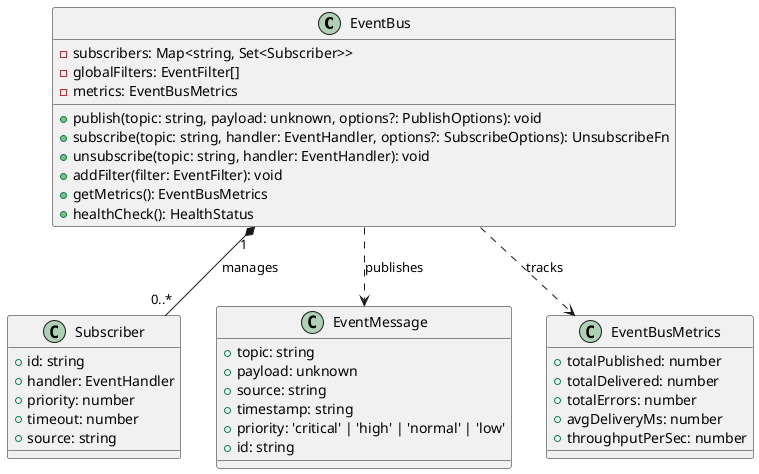

#### 接口定义

```typescript
// packages/core/src/fusion/event-bus/types.ts

/** 事件主题枚举 — 融合层预定义事件 */
export type EventTopic =
  | 'agent:message_start'    // Agent开始生成消息
  | 'agent:message_end'      // Agent完成消息生成
  | 'agent:tool_call'        // Agent调用工具
  | 'agent:tool_result'      // 工具返回结果
  | 'agent:compaction'       // 上下文压缩触发
  | 'memory:updated'         // 记忆写入更新
  | 'memory:window_compacted' // 滑动窗口淘汰完成
  | 'vector:synced'          // 向量索引同步完成
  | 'review:completed'       // 审查报告生成完成
  | 'review:failed'          // 审查执行失败
  | 'skill:loaded'           // Skill加载完成
  | 'skill:blocked'          // Skill被安全扫描阻止
  | 'skill:executed'         // Skill执行完成
  | 'dag:completed'          // DAG执行完成
  | 'dag:failed'             // DAG执行失败
  | 'dag:node_completed'     // DAG节点完成
  | 'parallel:completed'     // 并行执行完成
  | 'model:fallback'         // 模型降级回退
  | 'user_model:updated'    // 用户模型更新
  | 'cron:registered'        // Cron任务注册
  | 'cron:executed'          // Cron任务执行;

/** 事件消息 */
export interface EventMessage<T = unknown> {
  readonly id: string;
  readonly topic: EventTopic;
  readonly payload: T;
  readonly source: string;
  readonly timestamp: string; // ISO 8601
  readonly priority: 'critical' | 'high' | 'normal' | 'low';
}

/** 事件处理函数 */
export type EventHandler<T = unknown> = (event: EventMessage<T>) => Promise<void> | void;

/** 订阅选项 */
export interface SubscribeOptions {
  priority?: number;        // 默认 0，数值越小越先执行
  timeout?: number;         // 默认 100ms，超时自动跳过
  filter?: EventFilter;     // 事件过滤
  source?: string;          // 订阅方标识
}

/** 发布选项 */
export interface PublishOptions {
  priority?: 'critical' | 'high' | 'normal' | 'low';
  source?: string;
}

/** 事件过滤器 */
export type EventFilter = (event: EventMessage) => boolean;

/** 取消订阅函数 */
export type UnsubscribeFn = () => void;

/** 事件总线接口 */
export interface IEventBus {
  publish<T = unknown>(topic: EventTopic, payload: T, options?: PublishOptions): void;
  subscribe<T = unknown>(topic: EventTopic, handler: EventHandler<T>, options?: SubscribeOptions): UnsubscribeFn;
  addFilter(filter: EventFilter): void;
  healthCheck(): HealthStatus;
}
```

#### 数据流

```
发布者 → EventBus.publish(topic, payload)
  → EventMessage构造（添加id/timestamp/priority）
  → 全局过滤器过滤
  → 主题匹配找到订阅者集合
  → 按优先级排序
  → 逐个执行订阅者handler（超时100ms跳过）
  → 异常捕获记录日志，不中断后续订阅者
```

#### 与灵境的集成点

| 集成方式 | 集成位置 | 说明 |
|---------|---------|------|
| Hook注入 | `Agent.run()` 中LLM调用前后 | 在`before_llm_call`/`after_llm_call` Hook内发布`agent:message_start`/`agent:message_end`事件 |
| Hook注入 | `ToolExecutor.execute()` 前后 | 在`before_tool_execute`/`after_tool_execute` Hook内发布`agent:tool_call`/`agent:tool_result`事件 |
| Hook注入 | `Agent.run()` auto-compaction后 | 在`after_compaction` Hook内发布`agent:compaction`事件 |
| Hook注入 | `update_memory` 工具执行后 | 在`after_memory_write` Hook内发布`memory:updated`事件 |

---

### 1.3.2 HookRegistry Hook机制

#### 类图

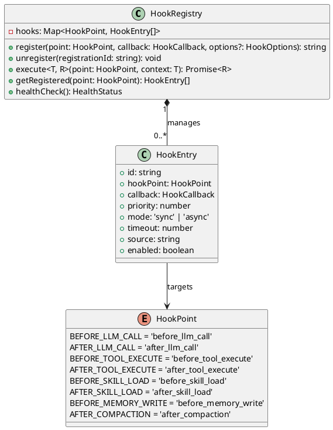

#### 接口定义

```typescript
// packages/core/src/fusion/hook-registry/types.ts

/** Hook执行点 */
export enum HookPoint {
  BEFORE_LLM_CALL = 'before_llm_call',
  AFTER_LLM_CALL = 'after_llm_call',
  BEFORE_TOOL_EXECUTE = 'before_tool_execute',
  AFTER_TOOL_EXECUTE = 'after_tool_execute',
  BEFORE_SKILL_LOAD = 'before_skill_load',
  AFTER_SKILL_LOAD = 'after_skill_load',
  BEFORE_MEMORY_WRITE = 'before_memory_write',
  AFTER_COMPACTION = 'after_compaction',
}

/** Hook上下文 — 携带当前执行点的业务数据 */
export interface HookContext {
  readonly point: HookPoint;
  data: Record<string, unknown>; // 可修改，传递给后续Hook和主流程
  readonly original: Record<string, unknown>; // 原始不可变数据
}

/** Hook回调函数 */
export type HookCallback = (context: HookContext) => Promise<HookContext | void> | (HookContext | void);

/** Hook注册选项 */
export interface HookOptions {
  priority?: number;    // 默认 0，数值越小越先执行
  mode?: 'sync' | 'async'; // 默认 'async'
  timeout?: number;     // 默认 100ms
  source?: string;      // 注册方标识
}

/** Hook注册条目 */
export interface HookEntry {
  readonly id: string;
  readonly hookPoint: HookPoint;
  readonly callback: HookCallback;
  readonly priority: number;
  readonly mode: 'sync' | 'async';
  readonly timeout: number;
  readonly source: string;
  enabled: boolean;
}

/** Hook注册中心接口 */
export interface IHookRegistry {
  register(point: HookPoint, callback: HookCallback, options?: HookOptions): string;
  unregister(registrationId: string): void;
  execute<T extends HookContext>(point: HookPoint, context: T): Promise<T>;
  healthCheck(): HealthStatus;
}
```

#### 数据流

```
主流程到达执行点 → HookRegistry.execute(point, context)
  → 查找该point的所有HookEntry
  → 按priority升序排序
  → 逐个执行callback:
     - sync模式: await执行，超时100ms跳过
     - async模式: Promise.race([callback, timeout])，不阻塞
  → 异常捕获记录日志，不中断主流程
  → 返回最终context（可能被Hook修改）
```

#### 与灵境的集成点

| 集成方式 | 集成位置 | 说明 |
|---------|---------|------|
| 装饰器注入 | `Agent.run()` LLM调用处 | `before_llm_call` / `after_llm_call` — 在LLM provider.chat()调用前后执行 |
| 装饰器注入 | `ToolExecutor.execute()` | `before_tool_execute` / `after_tool_execute` — 在工具执行前后执行 |
| 装饰器注入 | `SkillLoader.load()` | `before_skill_load` / `after_skill_load` — 在Skill加载前后执行 |
| 装饰器注入 | `update_memory` 工具 | `before_memory_write` — 在记忆写入前执行 |
| 装饰器注入 | `Agent.run()` compaction | `after_compaction` — 在上下文压缩后执行 |

**关键约束**：Hook注入通过在Agent类构造函数中调用`HookRegistry.execute()`实现，不修改Agent.run内部已有逻辑，仅在执行点前后插入Hook调用。

---

### 1.3.3 SlidingWindowMemoryManager

#### 类图

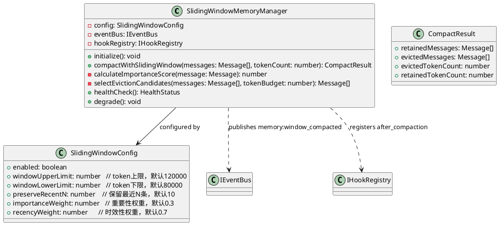

#### 接口定义

```typescript
// packages/core/src/fusion/sliding-window/types.ts

export interface SlidingWindowConfig {
  enabled: boolean;
  windowUpperLimit: number;  // 默认 120000
  windowLowerLimit: number;  // 默认 80000
  preserveRecentN: number;   // 默认 10
  importanceWeight: number;  // 默认 0.3
  recencyWeight: number;     // 默认 0.7
}

export interface CompactResult {
  retainedMessages: Message[];
  evictedMessages: Message[];
  evictedTokenCount: number;
  retainedTokenCount: number;
}

export interface ISlidingWindowMemoryManager {
  initialize(hookRegistry: IHookRegistry, eventBus: IEventBus): void;
  compactWithSlidingWindow(messages: Message[], tokenCount: number): CompactResult;
  healthCheck(): HealthStatus;
  degrade(): void;  // 降级到原有auto-compaction
}
```

#### 数据流

```
Hook: after_compaction触发
  → 获取当前对话messages和tokenCount
  → if tokenCount > windowUpperLimit:
      → 计算每条消息的importanceScore（重要性+时效性加权）
      → 标记最近preserveRecentN条为不可淘汰
      → 按score升序选择淘汰候选
      → 淘汰直到tokenCount <= windowLowerLimit
      → 发布memory:window_compacted事件
  → else: 保持不变
  → 返回CompactResult
```

#### 与灵境的集成点

| 集成方式 | 集成位置 | 说明 |
|---------|---------|------|
| Hook注册 | `after_compaction` | 在auto-compaction后执行滑动窗口淘汰，作为二次优化 |
| 事件发布 | EventBus | 发布`memory:window_compacted`通知其他模块 |
| 降级策略 | 自身 | 初始化失败或运行异常时，degrade()回退到原有compaction逻辑 |

---

### 1.3.4 VectorMemoryStore

#### 类图

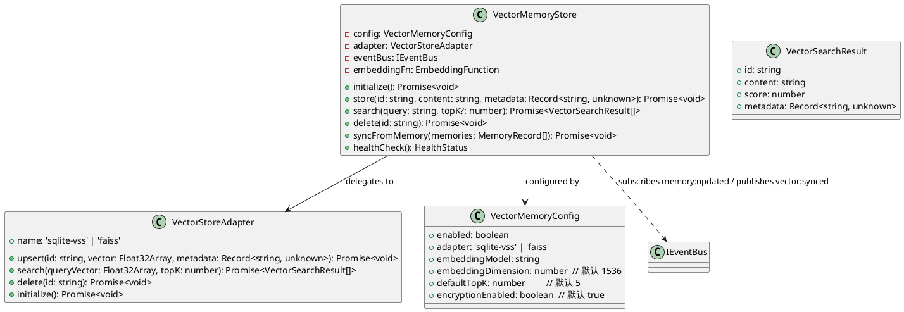

#### 接口定义

```typescript
// packages/core/src/fusion/vector-memory/types.ts

export interface VectorMemoryConfig {
  enabled: boolean;
  adapter: 'sqlite-vss' | 'faiss';
  embeddingModel: string;
  embeddingDimension: number;  // 默认 1536
  defaultTopK: number;         // 默认 5
  encryptionEnabled: boolean;  // 默认 true
}

export interface VectorSearchResult {
  id: string;
  content: string;
  score: number;  // 相似度分数 0-1
  metadata: Record<string, unknown>;
}

export type EmbeddingFunction = (text: string) => Promise<Float32Array>;

export interface IVectorStoreAdapter {
  readonly name: string;
  upsert(id: string, vector: Float32Array, metadata: Record<string, unknown>): Promise<void>;
  search(queryVector: Float32Array, topK: number): Promise<VectorSearchResult[]>;
  delete(id: string): Promise<void>;
  initialize(): Promise<void>;
}

export interface IVectorMemoryStore {
  initialize(eventBus: IEventBus): Promise<void>;
  store(id: string, content: string, metadata: Record<string, unknown>): Promise<void>;
  search(query: string, topK?: number): Promise<VectorSearchResult[]>;
  delete(id: string): Promise<void>;
  syncFromMemory(memories: MemoryRecord[]): Promise<void>;
  healthCheck(): HealthStatus;
}
```

#### 数据流

```
[存储] 用户调用remember_vector工具
  → embeddingFn(content) 生成向量
  → 若encryptionEnabled: 加密metadata
  → adapter.upsert(id, vector, metadata)
  → 发布 vector:synced 事件

[检索] 用户调用recall_vector工具
  → embeddingFn(query) 生成查询向量
  → adapter.search(queryVector, topK)
  → 返回 VectorSearchResult[]

[同步] 订阅 memory:updated 事件
  → 获取新写入的MemoryRecord
  → embeddingFn + upsert 同步到向量索引
```

#### 与灵境的集成点

| 集成方式 | 集成位置 | 说明 |
|---------|---------|------|
| 事件订阅 | EventBus `memory:updated` | 自动将新写入的结构化记忆同步到向量索引 |
| 工具注册 | ToolRegistry | 注册`remember_vector`和`recall_vector`工具 |
| 降级策略 | 自身 | 向量数据库不可用时返回降级提示，不影响其他记忆操作 |

---

### 1.3.5 NudgeReviewEngine

#### 类图

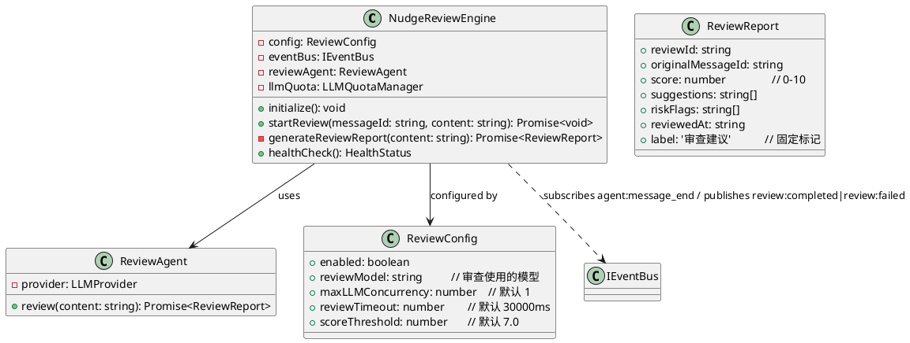

#### 接口定义

```typescript
// packages/core/src/fusion/review-engine/types.ts

export interface ReviewConfig {
  enabled: boolean;
  reviewModel: string;
  maxLLMConcurrency: number;  // 默认 1
  reviewTimeout: number;      // 默认 30000ms
  scoreThreshold: number;     // 默认 7.0
}

export interface ReviewReport {
  reviewId: string;
  originalMessageId: string;
  score: number;       // 0-10
  suggestions: string[];
  riskFlags: string[];
  reviewedAt: string;  // ISO 8601
  label: '审查建议';
}

export interface INudgeReviewEngine {
  initialize(eventBus: IEventBus, llmAdapter: LLMAdapter): void;
  startReview(messageId: string, content: string): Promise<void>;
  healthCheck(): HealthStatus;
}
```

#### 数据流

```
订阅 agent:message_end 事件
  → 获取主Agent回复内容
  → 检查LLM并发配额（≤1）
  → 若配额充足: 启动独立ReviewAgent
    → ReviewAgent.review(content) 生成ReviewReport
    → 发布 review:completed 事件
  → 若配额不足: 排队等待
  → 若审查失败/超时: 发布 review:failed 事件，静默降级
```

#### 与灵境的集成点

| 集成方式 | 集成位置 | 说明 |
|---------|---------|------|
| 事件订阅 | EventBus `agent:message_end` | 主Agent完成回复后触发审查 |
| 事件发布 | EventBus | 发布`review:completed`/`review:failed`供UI展示 |
| LLM配额 | LLMAdapter | 通过适配器调用审查模型，最多占1个并发配额 |

---

### 1.3.6 ExecutionTraceHarvester

#### 类图

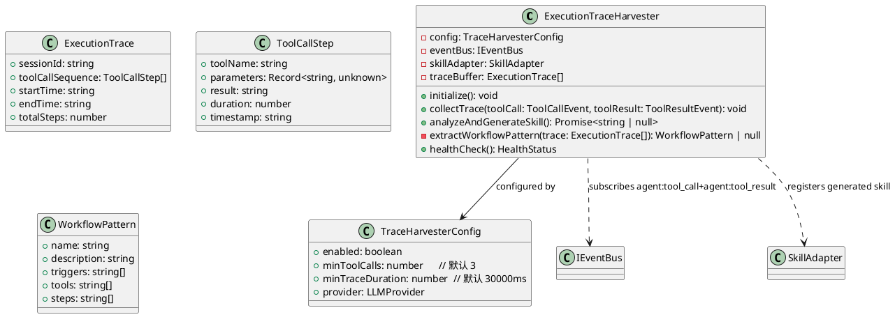

#### 接口定义

```typescript
// packages/core/src/fusion/trace-harvester/types.ts

export interface TraceHarvesterConfig {
  enabled: boolean;
  minToolCalls: number;      // 默认 3
  minTraceDuration: number;  // 默认 30000ms
}

export interface ExecutionTrace {
  sessionId: string;
  toolCallSequence: ToolCallStep[];
  startTime: string;
  endTime: string;
  totalSteps: number;
}

export interface ToolCallStep {
  toolName: string;
  parameters: Record<string, unknown>;
  result: string;
  duration: number;
  timestamp: string;
}

export interface IExecutionTraceHarvester {
  initialize(eventBus: IEventBus, skillAdapter: SkillAdapter): void;
  collectTrace(toolCall: ToolCallStep): void;
  analyzeAndGenerateSkill(): Promise<string | null>;
  healthCheck(): HealthStatus;
}
```

#### 数据流

```
订阅 agent:tool_call + agent:tool_result 事件
  → 收集ToolCallStep到traceBuffer
  → 对话轮次结束时:
    → if traceBuffer.length >= minToolCalls:
      → extractWorkflowPattern(traceBuffer)
      → 使用LLM生成SKILL.md（标记level: 'auto-generated'）
      → skillAdapter.register(skillDef) 注册到Skills系统
    → else: 静默跳过
  → 清空traceBuffer
```

#### 与灵境的集成点

| 集成方式 | 集成位置 | 说明 |
|---------|---------|------|
| 事件订阅 | EventBus `agent:tool_call` + `agent:tool_result` | 收集执行轨迹 |
| 适配器调用 | SkillAdapter | 生成的Skill通过适配器注册到Skills系统 |
| 增强关系 | `skills/harvester.ts` | 扩展SkillHarvester的输入源，不修改其原有对话分析逻辑 |

---

### 1.3.7 SkillSecurityLoader

#### 类图

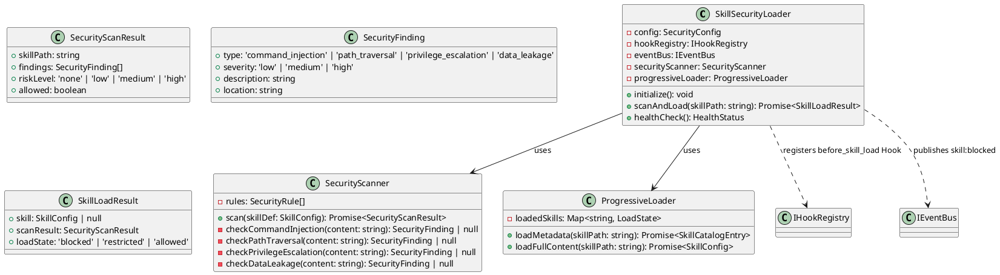

#### 接口定义

```typescript
// packages/core/src/fusion/skill-security/types.ts

export interface SecurityConfig {
  enabled: boolean;
  blockOnHighRisk: boolean;  // 默认 true
  warnOnMediumRisk: boolean; // 默认 true
  scanRules: SecurityRule[];
}

export type SecurityRisk = 'command_injection' | 'path_traversal' | 'privilege_escalation' | 'data_leakage';

export interface SecurityFinding {
  type: SecurityRisk;
  severity: 'low' | 'medium' | 'high';
  description: string;
  location: string;
}

export interface SecurityScanResult {
  skillPath: string;
  findings: SecurityFinding[];
  riskLevel: 'none' | 'low' | 'medium' | 'high';
  allowed: boolean;
}

export interface ISkillSecurityLoader {
  initialize(hookRegistry: IHookRegistry, eventBus: IEventBus): void;
  scanAndLoad(skillPath: string): Promise<SkillLoadResult>;
  healthCheck(): HealthStatus;
}
```

#### 数据流

```
Hook: before_skill_load 触发
  → SecurityScanner.scan(skillDef)
    → 执行4类安全检查（命令注入/路径遍历/权限提升/数据泄露）
    → 汇总findings，计算riskLevel
  → if riskLevel === 'high' && blockOnHighRisk:
    → 阻止加载，发布 skill:blocked 事件
  → else if riskLevel >= 'medium':
    → 标记为 'restricted'，附加安全修补建议
  → else:
    → ProgressiveLoader.loadMetadata() 仅加载元数据
  → 当Skill被调用时:
    → ProgressiveLoader.loadFullContent() 按需加载完整内容
```

#### 与灵境的集成点

| 集成方式 | 集成位置 | 说明 |
|---------|---------|------|
| Hook注册 | `before_skill_load` | 在Skill加载前执行安全扫描 |
| 事件发布 | EventBus | 发布`skill:blocked`通知 |
| 增强关系 | `skills/loader.ts` | 在Skill加载流程中插入扫描和渐进加载，不修改原有加载逻辑 |

---

### 1.3.8 DAGOrchestrator

#### 类图

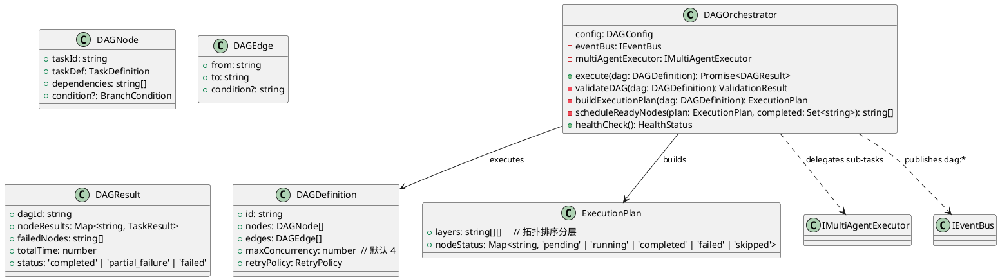

#### 接口定义

```typescript
// packages/core/src/fusion/dag-orchestrator/types.ts

export interface DAGDefinition {
  id: string;
  nodes: DAGNode[];
  edges: DAGEdge[];
  maxConcurrency: number;  // 默认 4
  retryPolicy: RetryPolicy;
}

export interface DAGNode {
  taskId: string;
  taskDef: TaskDefinition;
  dependencies: string[];
  condition?: BranchCondition;
}

export interface DAGEdge {
  from: string;
  to: string;
  condition?: string;
}

export interface RetryPolicy {
  maxRetries: number;   // 默认 3
  retryDelay: number;   // 默认 1000ms
}

export interface IDAGOrchestrator {
  execute(dag: DAGDefinition): Promise<DAGResult>;
  healthCheck(): HealthStatus;
}
```

#### 数据流

```
execute(dag)
  → validateDAG: 检查环路（DFS拓扑排序）
  → if 有环路: 拒绝执行，返回验证错误
  → buildExecutionPlan: 拓扑分层
  → 逐层执行:
    → scheduleReadyNodes: 找到无依赖/依赖已完成的节点
    → 并行执行ready节点（≤maxConcurrency）
      → MultiAgentExecutor并行执行子任务
    → 收集结果，更新nodeStatus
    → 条件分支: 根据条件评估选择分支
  → 失败处理:
    → 标记失败节点及其下游
    → 支持从失败节点重试
  → 发布 dag:completed/dag:failed
```

#### 与灵境的集成点

| 集成方式 | 集成位置 | 说明 |
|---------|---------|------|
| 事件发布 | EventBus | 发布`dag:completed`/`dag:failed`/`dag:node_completed` |
| 工具注册 | ToolRegistry | 注册`dag_execute`工具供Agent调用 |
| 依赖 | MultiAgentExecutor | 委托子任务执行给并行执行器 |

---

### 1.3.9 MultiAgentExecutor

#### 类图

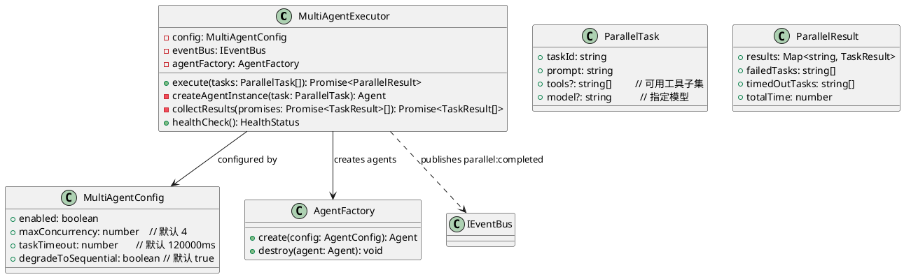

#### 接口定义

```typescript
// packages/core/src/fusion/multi-agent/types.ts

export interface MultiAgentConfig {
  enabled: boolean;
  maxConcurrency: number;     // 默认 4
  taskTimeout: number;        // 默认 120000ms
  degradeToSequential: boolean; // 默认 true
}

export interface ParallelTask {
  taskId: string;
  prompt: string;
  tools?: string[];
  model?: string;
}

export interface IMultiAgentExecutor {
  execute(tasks: ParallelTask[]): Promise<ParallelResult>;
  healthCheck(): HealthStatus;
}
```

#### 数据流

```
execute(tasks)
  → if tasks.length > maxConcurrency:
    → 分批执行（批次大小 = maxConcurrency）
  → 为每个task创建独立Agent实例（AgentFactory.create）
  → Promise.allSettled() 并行执行
    → 每个Agent实例独立运行
    → 超时终止：taskTimeout后强制终止
  → 收集结果:
    → 成功: 存入results
    → 超时: 标记为timedOutTasks
    → 失败: 标记为failedTasks
  → 释放所有Agent实例资源（AgentFactory.destroy）
  → if 并发配额不足 && degradeToSequential:
    → 降级为串行执行
  → 发布 parallel:completed
```

#### 与灵境的集成点

| 集成方式 | 集成位置 | 说明 |
|---------|---------|------|
| 工厂模式 | `Agent`类 | 通过AgentFactory创建Agent实例，复用现有Agent循环 |
| 事件发布 | EventBus | 发布`parallel:completed` |
| 工具注册 | ToolRegistry | 注册`parallel_execute`工具 |

---

### 1.3.10 DynamicModelRouter

#### 类图

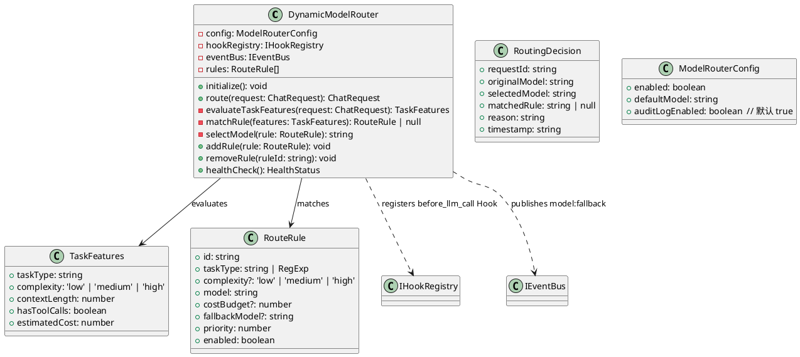

#### 接口定义

```typescript
// packages/core/src/fusion/model-router/types.ts

export interface ModelRouterConfig {
  enabled: boolean;
  defaultModel: string;
  auditLogEnabled: boolean;  // 默认 true
}

export interface RouteRule {
  id: string;
  taskType: string | RegExp;
  complexity?: 'low' | 'medium' | 'high';
  model: string;
  costBudget?: number;
  fallbackModel?: string;
  priority: number;
  enabled: boolean;
}

export interface IDynamicModelRouter {
  initialize(hookRegistry: IHookRegistry, eventBus: IEventBus): void;
  route(request: ChatRequest): ChatRequest;
  addRule(rule: RouteRule): void;
  removeRule(ruleId: string): void;
  healthCheck(): HealthStatus;
}
```

#### 数据流

```
Hook: before_llm_call 触发
  → evaluateTaskFeatures(request)
    → 识别taskType、complexity、contextLength等特征
  → matchRule(features)
    → 按priority遍历rules，匹配taskType和complexity
  → if matchedRule:
    → selectModel(rule)
    → 检查选定模型可用性
    → if 模型不可用 && fallbackModel:
      → 降级到fallbackModel，发布model:fallback
    → 替换request中的模型标识
    → 记录RoutingDecision到审计日志
  → else:
    → 使用defaultModel，不修改request
  → 返回修改后的request
```

#### 与灵境的集成点

| 集成方式 | 集成位置 | 说明 |
|---------|---------|------|
| Hook注册 | `before_llm_call` | 拦截LLM调用，替换模型标识 |
| 事件发布 | EventBus | 发布`model:fallback` |
| 审计日志 | 数据库 | RoutingDecision写入model_routing_audit表 |

---

### 1.3.11 NLCronScheduler

#### 类图

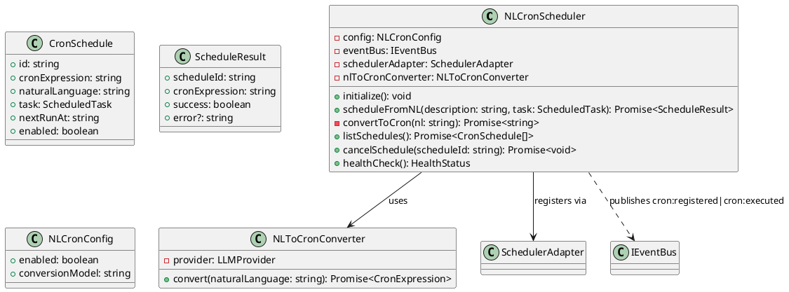

#### 接口定义

```typescript
// packages/core/src/fusion/nl-cron/types.ts

export interface NLCronConfig {
  enabled: boolean;
  conversionModel: string;
}

export interface CronSchedule {
  id: string;
  cronExpression: string;
  naturalLanguage: string;
  task: ScheduledTask;
  nextRunAt: string;
  enabled: boolean;
}

export interface INLCronScheduler {
  initialize(eventBus: IEventBus, schedulerAdapter: SchedulerAdapter): void;
  scheduleFromNL(description: string, task: ScheduledTask): Promise<ScheduleResult>;
  listSchedules(): Promise<CronSchedule[]>;
  cancelSchedule(scheduleId: string): Promise<void>;
  healthCheck(): HealthStatus;
}
```

#### 数据流

```
scheduleFromNL(description, task)
  → NLToCronConverter.convert(description)
    → LLM将自然语言转换为Cron表达式
  → if 转换成功:
    → 验证Cron表达式有效性
    → schedulerAdapter.register(cronExpr, task)
    → 写入cron_schedules表
    → 发布 cron:registered
    → 返回 ScheduleResult
  → else:
    → 返回解析错误+示例格式提示
```

#### 与灵境的集成点

| 集成方式 | 集成位置 | 说明 |
|---------|---------|------|
| 适配器调用 | SchedulerAdapter | 通过适配器注册到Cloud Server Scheduler |
| 事件发布 | EventBus | 发布`cron:registered`/`cron:executed` |
| 增强关系 | `tools/builtin/schedule.ts` | 在现有schedule工具前增加NL转换层 |

---

### 1.3.12 HonchoUserModeler

#### 类图

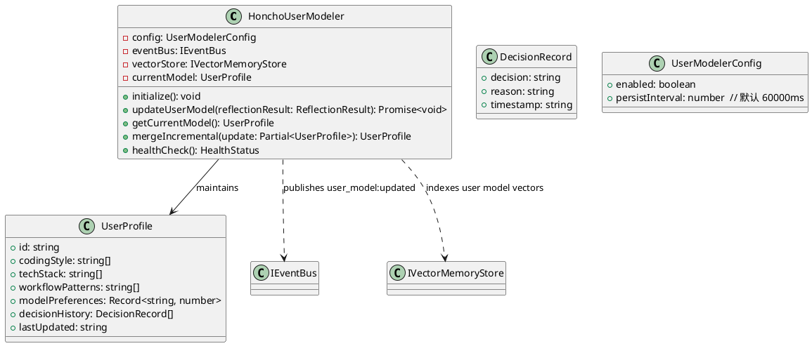

#### 接口定义

```typescript
// packages/core/src/fusion/user-modeler/types.ts

export interface UserProfile {
  id: string;
  codingStyle: string[];
  techStack: string[];
  workflowPatterns: string[];
  modelPreferences: Record<string, number>;
  decisionHistory: DecisionRecord[];
  lastUpdated: string;
}

export interface IHonchoUserModeler {
  initialize(eventBus: IEventBus, vectorStore: IVectorMemoryStore): void;
  updateUserModel(reflectionResult: ReflectionResult): Promise<void>;
  getCurrentModel(): UserProfile;
  healthCheck(): HealthStatus;
}
```

#### 数据流

```
MemoryReflector完成反思 → 发布事件（由增强层拦截）
  → HonchoUserModeler.updateUserModel(reflectionResult)
    → mergeIncremental: 合并增量到currentModel
    → vectorStore.store: 将用户模型向量索引
    → 写入user_profiles表
    → 发布 user_model:updated 事件
  → 其他模块订阅 user_model:updated:
    → DynamicModelRouter: 调整路由偏好
    → VectorMemoryStore: 调整检索权重
```

#### 与灵境的集成点

| 集成方式 | 集成位置 | 说明 |
|---------|---------|------|
| 增强关系 | `memory/reflector.ts` | 订阅Reflector输出，发布用户模型更新事件 |
| 事件发布 | EventBus | 发布`user_model:updated`供其他模块订阅 |
| 向量索引 | VectorMemoryStore | 用户模型向量索引 |

---

### 1.3.13 适配器层设计

#### 适配器接口总表

```typescript
// packages/core/src/fusion/adapters/types.ts

/** LLM适配器 — 对接LLM抽象层 */
export interface LLMAdapter {
  readonly version: string;
  call(request: ChatRequest): AsyncIterable<StreamEvent>;
  getModel(): string;
  isAvailable(model: string): Promise<boolean>;
}

/** 记忆适配器 — 对接SQLite记忆系统 */
export interface MemoryAdapter {
  readonly version: string;
  write(entry: { category: string; title: string; content: string; scope: 'global' | 'project' }): Promise<void>;
  query(filter: { category?: string; scope?: string; keyword?: string }): Promise<MemoryRecord[]>;
}

/** Skill适配器 — 对接Skills系统 */
export interface SkillAdapter {
  readonly version: string;
  register(skillDef: SkillConfig): Promise<void>;
  load(skillId: string): Promise<SkillConfig | null>;
  list(): Promise<SkillCatalogEntry[]>;
}

/** 工具适配器 — 对接ToolRegistry */
export interface ToolAdapter {
  readonly version: string;
  register(tool: Tool): void;
  get(name: string): Tool | undefined;
}

/** 调度适配器 — 对接Cloud Server Scheduler */
export interface SchedulerAdapter {
  readonly version: string;
  register(cronExpr: string, task: ScheduledTask): Promise<string>;
  cancel(scheduleId: string): Promise<void>;
  list(): Promise<CronSchedule[]>;
}
```

---

# **2. 接口设计**

## **2.1 总体设计**

### 接口分层架构

```
┌─────────────────────────────────────────────────────┐
│                  Renderer层 (UI)                      │
│  通过IPC通道调用Electron层，获取增强模块数据/操作     │
└──────────────────────┬──────────────────────────────┘
                       │ IPC通道 (ipcMain.handle)
┌──────────────────────▼──────────────────────────────┐
│                 Electron层 (IPC)                      │
│  注册增强模块IPC通道，桥接Core层增强模块接口          │
└──────────────────────┬──────────────────────────────┘
                       │ 直接调用
┌──────────────────────▼──────────────────────────────┐
│                Core层 (融合增强模块)                   │
│  EventBus / HookRegistry / 各增强模块 / 适配器层      │
└──────────────────────┬──────────────────────────────┘
                       │ 适配器/事件
┌──────────────────────▼──────────────────────────────┐
│              灵境现有系统 (不修改)                     │
│  Agent / ToolRegistry / Skills / LLM / Memory        │
└─────────────────────────────────────────────────────┘
```

## **2.2 接口清单**

### 2.2.1 EventBus IPC通道

| IPC通道 | 方向 | 参数 | 返回值 | 说明 |
|---------|------|------|--------|------|
| `fusion:eventbus:publish` | Renderer→Core | `{topic: string, payload: unknown}` | `void` | 发布事件 |
| `fusion:eventbus:subscribe` | Renderer→Core | `{topic: string}` | `AsyncIterable<EventMessage>` | 订阅事件（Renderer端通过EventEmitter代理） |
| `fusion:eventbus:metrics` | Renderer→Core | 无 | `EventBusMetrics` | 获取事件总线指标 |

### 2.2.2 HookRegistry IPC通道

| IPC通道 | 方向 | 参数 | 返回值 | 说明 |
|---------|------|------|--------|------|
| `fusion:hook:list` | Renderer→Core | `{point?: string}` | `HookEntry[]` | 列出已注册Hook |
| `fusion:hook:unregister` | Renderer→Core | `{id: string}` | `void` | 取消注册Hook |

### 2.2.3 SlidingWindowMemory IPC通道

| IPC通道 | 方向 | 参数 | 返回值 | 说明 |
|---------|------|------|--------|------|
| `fusion:memory:window:config` | Renderer→Core | `SlidingWindowConfig` | `void` | 更新滑动窗口配置 |
| `fusion:memory:window:status` | Renderer→Core | 无 | `{enabled: boolean, upperLimit: number, lowerLimit: number}` | 获取当前配置 |

### 2.2.4 VectorMemory IPC通道

| IPC通道 | 方向 | 参数 | 返回值 | 说明 |
|---------|------|------|--------|------|
| `fusion:vector:store` | Renderer→Core | `{id: string, content: string, metadata: Record<string, unknown>}` | `void` | 存储向量记忆 |
| `fusion:vector:search` | Renderer→Core | `{query: string, topK?: number}` | `VectorSearchResult[]` | 语义检索 |
| `fusion:vector:delete` | Renderer→Core | `{id: string}` | `void` | 删除向量记忆 |
| `fusion:vector:sync` | Renderer→Core | 无 | `{synced: number}` | 手动触发同步 |
| `fusion:vector:status` | Renderer→Core | 无 | `{enabled: boolean, totalVectors: number, adapter: string}` | 获取状态 |

### 2.2.5 NudgeReviewEngine IPC通道

| IPC通道 | 方向 | 参数 | 返回值 | 说明 |
|---------|------|------|--------|------|
| `fusion:review:config` | Renderer→Core | `ReviewConfig` | `void` | 更新审查引擎配置 |
| `fusion:review:reports` | Renderer→Core | `{messageId?: string, limit?: number}` | `ReviewReport[]` | 获取审查报告 |
| `fusion:review:status` | Renderer→Core | 无 | `{enabled: boolean, pendingReviews: number}` | 获取审查引擎状态 |

### 2.2.6 ExecutionTraceHarvester IPC通道

| IPC通道 | 方向 | 参数 | 返回值 | 说明 |
|---------|------|------|--------|------|
| `fusion:trace:config` | Renderer→Core | `TraceHarvesterConfig` | `void` | 更新轨迹采集配置 |
| `fusion:trace:history` | Renderer→Core | `{limit?: number}` | `ExecutionTrace[]` | 获取执行轨迹历史 |
| `fusion:trace:skills` | Renderer→Core | 无 | `SkillCatalogEntry[]` | 获取轨迹生成的Skill列表 |

### 2.2.7 SkillSecurityLoader IPC通道

| IPC通道 | 方向 | 参数 | 返回值 | 说明 |
|---------|------|------|--------|------|
| `fusion:skill:scan` | Renderer→Core | `{skillPath: string}` | `SecurityScanResult` | 手动触发安全扫描 |
| `fusion:skill:audit` | Renderer→Core | `{limit?: number}` | `SecurityAuditRecord[]` | 获取安全审计记录 |
| `fusion:skill:blocked` | Renderer→Core | 无 | `SecurityScanResult[]` | 获取被阻止的Skill列表 |

### 2.2.8 DAGOrchestrator IPC通道

| IPC通道 | 方向 | 参数 | 返回值 | 说明 |
|---------|------|------|--------|------|
| `fusion:dag:execute` | Renderer→Core | `DAGDefinition` | `DAGResult` | 执行DAG任务 |
| `fusion:dag:status` | Renderer→Core | `{dagId: string}` | `ExecutionPlan` | 获取执行状态 |
| `fusion:dag:retry` | Renderer→Core | `{dagId: string, failedNodeId: string}` | `DAGResult` | 从失败节点重试 |
| `fusion:dag:cancel` | Renderer→Core | `{dagId: string}` | `void` | 取消DAG执行 |

### 2.2.9 MultiAgentExecutor IPC通道

| IPC通道 | 方向 | 参数 | 返回值 | 说明 |
|---------|------|------|--------|------|
| `fusion:parallel:execute` | Renderer→Core | `ParallelTask[]` | `ParallelResult` | 并行执行任务 |
| `fusion:parallel:status` | Renderer→Core | 无 | `{activeAgents: number, maxConcurrency: number}` | 获取执行器状态 |

### 2.2.10 DynamicModelRouter IPC通道

| IPC通道 | 方向 | 参数 | 返回值 | 说明 |
|---------|------|------|--------|------|
| `fusion:router:rules` | Renderer→Core | 无 | `RouteRule[]` | 获取路由规则列表 |
| `fusion:router:addRule` | Renderer→Core | `RouteRule` | `void` | 添加路由规则 |
| `fusion:router:removeRule` | Renderer→Core | `{ruleId: string}` | `void` | 删除路由规则 |
| `fusion:router:audit` | Renderer→Core | `{limit?: number}` | `RoutingDecision[]` | 获取路由审计日志 |
| `fusion:router:status` | Renderer→Core | 无 | `{enabled: boolean, defaultModel: string, ruleCount: number}` | 获取路由器状态 |

### 2.2.11 NLCronScheduler IPC通道

| IPC通道 | 方向 | 参数 | 返回值 | 说明 |
|---------|------|------|--------|------|
| `fusion:cron:schedule` | Renderer→Core | `{description: string, task: ScheduledTask}` | `ScheduleResult` | 自然语言调度 |
| `fusion:cron:list` | Renderer→Core | 无 | `CronSchedule[]` | 列出所有调度 |
| `fusion:cron:cancel` | Renderer→Core | `{scheduleId: string}` | `void` | 取消调度 |
| `fusion:cron:preview` | Renderer→Core | `{description: string}` | `{cronExpression: string, nextRuns: string[]}` | 预览Cron转换结果 |

### 2.2.12 HonchoUserModeler IPC通道

| IPC通道 | 方向 | 参数 | 返回值 | 说明 |
|---------|------|------|--------|------|
| `fusion:usermodel:profile` | Renderer→Core | 无 | `UserProfile` | 获取用户模型 |
| `fusion:usermodel:trigger` | Renderer→Core | 无 | `void` | 手动触发模型更新 |
| `fusion:usermodel:status` | Renderer→Core | 无 | `{enabled: boolean, lastUpdated: string}` | 获取建模器状态 |

### 2.2.13 融合层全局IPC通道

| IPC通道 | 方向 | 参数 | 返回值 | 说明 |
|---------|------|------|--------|------|
| `fusion:health:check` | Renderer→Core | 无 | `Map<string, HealthStatus>` | 所有模块健康检查 |
| `fusion:config:get` | Renderer→Core | 无 | `FusionConfig` | 获取融合层全局配置 |
| `fusion:config:set` | Renderer→Core | `FusionConfig` | `void` | 更新融合层配置 |
| `fusion:module:toggle` | Renderer→Core | `{module: string, enabled: boolean}` | `void` | 启用/禁用模块 |

---

# **4. 数据模型**

## **4.1 设计目标**

1. **增量迁移**：migration003为纯增量DDL，不修改已有表结构（memories、checkpoints等）
2. **兼容现有**：所有新表使用sql.js（WASM SQLite），存储路径`~/.lingjing/lingjing.db`
3. **加密存储**：向量记忆和用户模型中的敏感字段使用AES-256-GCM加密
4. **索引优化**：为新表创建合理索引，支持高效查询
5. **软删除**：关键数据使用软删除（deleted_at字段），支持审计追溯

## **4.2 模型实现**

### migration003: Hermes Fusion 增量表

```sql
-- ============================================================
-- migration003_hermes_fusion.ts
-- Hermes融合增强模块新增表
-- ============================================================

-- 1. 向量长期记忆表
CREATE TABLE IF NOT EXISTS vector_memory (
  id            TEXT PRIMARY KEY,           -- 向量记录唯一标识
  memory_id     TEXT,                       -- 关联的结构化记忆ID（memories表外键）
  content       TEXT NOT NULL,              -- 原始文本内容
  embedding     BLOB,                       -- 向量数据（Float32Array序列化）
  metadata      TEXT,                       -- JSON元数据
  scope         TEXT NOT NULL DEFAULT 'global',  -- 'global' | 'project'
  project_path  TEXT,                       -- 项目路径（scope=project时）
  category      TEXT,                       -- 记忆分类
  score         REAL NOT NULL DEFAULT 0,   -- 重要性评分
  encrypted     INTEGER NOT NULL DEFAULT 0, -- 是否加密 0|1
  created_at    TEXT NOT NULL,              -- ISO 8601
  updated_at    TEXT NOT NULL,              -- ISO 8601
  deleted_at    TEXT                        -- 软删除时间
);

CREATE INDEX IF NOT EXISTS idx_vector_memory_scope ON vector_memory(scope, project_path);
CREATE INDEX IF NOT EXISTS idx_vector_memory_category ON vector_memory(category);
CREATE INDEX IF NOT EXISTS idx_vector_memory_score ON vector_memory(score DESC);

-- sqlite-vss 虚拟表（若使用sqlite-vss适配器）
-- CREATE VIRTUAL TABLE IF NOT EXISTS vector_memory_vss USING vss0(
--   embedding(1536)
-- );

-- 2. 执行轨迹表
CREATE TABLE IF NOT EXISTS execution_traces (
  id            TEXT PRIMARY KEY,
  session_id    TEXT NOT NULL,              -- 对话会话ID
  tool_name     TEXT NOT NULL,              -- 工具名称
  parameters    TEXT,                       -- JSON参数
  result        TEXT,                       -- 工具返回结果（截断）
  duration_ms   INTEGER,                   -- 执行耗时
  importance    REAL NOT NULL DEFAULT 0,   -- 重要性评分
  created_at    TEXT NOT NULL               -- ISO 8601
);

CREATE INDEX IF NOT EXISTS idx_execution_traces_session ON execution_traces(session_id);
CREATE INDEX IF NOT EXISTS idx_execution_traces_tool ON execution_traces(tool_name);
CREATE INDEX IF NOT EXISTS idx_execution_traces_importance ON execution_traces(importance DESC);

-- 3. Skill安全审计表
CREATE TABLE IF NOT EXISTS skill_security_audit (
  id            TEXT PRIMARY KEY,
  skill_path    TEXT NOT NULL,              -- Skill文件路径
  skill_name    TEXT NOT NULL,              -- Skill名称
  scan_result   TEXT NOT NULL,              -- JSON: SecurityScanResult
  risk_level    TEXT NOT NULL,              -- 'none' | 'low' | 'medium' | 'high'
  action_taken  TEXT NOT NULL,              -- 'allowed' | 'restricted' | 'blocked'
  scanner_ver   TEXT NOT NULL,              -- 扫描器版本
  scanned_at    TEXT NOT NULL               -- ISO 8601
);

CREATE INDEX IF NOT EXISTS idx_skill_security_skill ON skill_security_audit(skill_name);
CREATE INDEX IF NOT EXISTS idx_skill_security_risk ON skill_security_audit(risk_level);
CREATE INDEX IF NOT EXISTS idx_skill_security_time ON skill_security_audit(scanned_at DESC);

-- 4. DAG任务表
CREATE TABLE IF NOT EXISTS dag_tasks (
  id            TEXT PRIMARY KEY,           -- DAG执行实例ID
  dag_def       TEXT NOT NULL,              -- JSON: DAGDefinition
  status        TEXT NOT NULL DEFAULT 'pending',  -- 'pending'|'running'|'completed'|'partial_failure'|'failed'
  result        TEXT,                       -- JSON: DAGResult（完成后填充）
  created_at    TEXT NOT NULL,
  updated_at    TEXT NOT NULL,
  completed_at  TEXT
);

CREATE INDEX IF NOT EXISTS idx_dag_tasks_status ON dag_tasks(status);
CREATE INDEX IF NOT EXISTS idx_dag_tasks_time ON dag_tasks(created_at DESC);

-- 5. DAG边表（记录DAG节点执行状态）
CREATE TABLE IF NOT EXISTS dag_edges (
  id            TEXT PRIMARY KEY,
  dag_id        TEXT NOT NULL,              -- 关联dag_tasks.id
  node_id       TEXT NOT NULL,              -- 节点taskId
  status        TEXT NOT NULL DEFAULT 'pending',  -- 'pending'|'running'|'completed'|'failed'|'skipped'
  result        TEXT,                       -- JSON: TaskResult
  started_at    TEXT,
  completed_at  TEXT,
  retry_count   INTEGER NOT NULL DEFAULT 0,
  FOREIGN KEY (dag_id) REFERENCES dag_tasks(id)
);

CREATE INDEX IF NOT EXISTS idx_dag_edges_dag ON dag_edges(dag_id);
CREATE INDEX IF NOT EXISTS idx_dag_edges_status ON dag_edges(status);

-- 6. 模型路由规则表
CREATE TABLE IF NOT EXISTS model_routing_rules (
  id            TEXT PRIMARY KEY,
  task_type     TEXT NOT NULL,              -- 任务类型匹配（字符串或正则）
  complexity    TEXT,                       -- 'low'|'medium'|'high'|NULL(任意)
  model         TEXT NOT NULL,              -- 目标模型标识
  fallback_model TEXT,                      -- 备选模型
  cost_budget   REAL,                       -- 成本预算上限
  priority      INTEGER NOT NULL DEFAULT 0, -- 匹配优先级
  enabled       INTEGER NOT NULL DEFAULT 1, -- 是否启用
  created_at    TEXT NOT NULL,
  updated_at    TEXT NOT NULL
);

CREATE INDEX IF NOT EXISTS idx_routing_rules_enabled ON model_routing_rules(enabled);
CREATE INDEX IF NOT EXISTS idx_routing_rules_priority ON model_routing_rules(priority);

-- 模型路由审计日志表
CREATE TABLE IF NOT EXISTS model_routing_audit (
  id              TEXT PRIMARY KEY,
  request_id      TEXT NOT NULL,            -- LLM请求ID
  original_model  TEXT NOT NULL,            -- 原始模型
  selected_model  TEXT NOT NULL,            -- 选定模型
  matched_rule_id TEXT,                     -- 匹配的规则ID
  reason          TEXT,                     -- 路由原因
  fallback        INTEGER NOT NULL DEFAULT 0, -- 是否降级
  created_at      TEXT NOT NULL
);

CREATE INDEX IF NOT EXISTS idx_routing_audit_time ON model_routing_audit(created_at DESC);
CREATE INDEX IF NOT EXISTS idx_routing_audit_model ON model_routing_audit(selected_model);

-- 7. Cron调度表
CREATE TABLE IF NOT EXISTS cron_schedules (
  id              TEXT PRIMARY KEY,
  cron_expression TEXT NOT NULL,            -- 标准Cron表达式
  natural_language TEXT,                    -- 原始自然语言描述
  task_type       TEXT NOT NULL,            -- 任务类型
  task_config     TEXT NOT NULL,            -- JSON: 任务配置
  next_run_at     TEXT,                     -- 下次执行时间
  last_run_at     TEXT,                     -- 上次执行时间
  run_count       INTEGER NOT NULL DEFAULT 0,
  enabled         INTEGER NOT NULL DEFAULT 1,
  created_at      TEXT NOT NULL,
  updated_at      TEXT NOT NULL
);

CREATE INDEX IF NOT EXISTS idx_cron_enabled ON cron_schedules(enabled);
CREATE INDEX IF NOT EXISTS idx_cron_next_run ON cron_schedules(next_run_at);

-- 8. 用户画像表
CREATE TABLE IF NOT EXISTS user_profiles (
  id              TEXT PRIMARY KEY,         -- 固定为 'default'
  coding_style    TEXT,                     -- JSON: string[]
  tech_stack      TEXT,                     -- JSON: string[]
  workflow_patterns TEXT,                   -- JSON: string[]
  model_preferences TEXT,                   -- JSON: Record<string, number>
  decision_history TEXT,                    -- JSON: DecisionRecord[]
  reflection_summary TEXT,                  -- 最近反思摘要
  last_reflected_at TEXT,
  created_at      TEXT NOT NULL,
  updated_at      TEXT NOT NULL
);

-- 9. 融合层配置表
CREATE TABLE IF NOT EXISTS fusion_config (
  module_name     TEXT PRIMARY KEY,         -- 模块名称
  enabled         INTEGER NOT NULL DEFAULT 0, -- 默认禁用
  config_json     TEXT,                     -- JSON: 模块配置
  updated_at      TEXT NOT NULL
);

-- 初始化各模块默认配置
INSERT OR IGNORE INTO fusion_config (module_name, enabled, config_json, updated_at) VALUES
  ('event_bus', 1, '{"maxThroughput": 1000, "defaultTimeout": 100}', datetime('now')),
  ('hook_registry', 1, '{"defaultTimeout": 100}', datetime('now')),
  ('sliding_window', 0, '{"windowUpperLimit": 120000, "windowLowerLimit": 80000, "preserveRecentN": 10}', datetime('now')),
  ('vector_memory', 0, '{"adapter": "sqlite-vss", "embeddingDimension": 1536, "defaultTopK": 5}', datetime('now')),
  ('review_engine', 0, '{"maxLLMConcurrency": 1, "reviewTimeout": 30000}', datetime('now')),
  ('trace_harvester', 0, '{"minToolCalls": 3, "minTraceDuration": 30000}', datetime('now')),
  ('skill_security', 0, '{"blockOnHighRisk": true, "warnOnMediumRisk": true}', datetime('now')),
  ('dag_orchestrator', 0, '{"maxConcurrency": 4, "retryPolicy": {"maxRetries": 3, "retryDelay": 1000}}', datetime('now')),
  ('multi_agent', 0, '{"maxConcurrency": 4, "taskTimeout": 120000}', datetime('now')),
  ('model_router', 0, '{"defaultModel": "", "auditLogEnabled": true}', datetime('now')),
  ('nl_cron', 0, '{"conversionModel": ""}', datetime('now')),
  ('user_modeler', 0, '{"persistInterval": 60000}', datetime('now'));
```

### 数据模型ER图

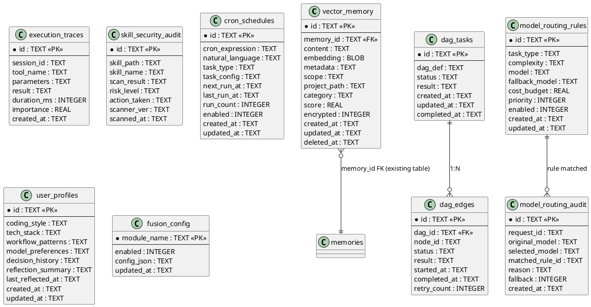

---

# **5. UI组件设计**

## **5.1 Renderer层新增组件**

### 5.1.1 向量记忆面板 `VectorMemoryPanel.vue`

| 属性 | 说明 |
|------|------|
| 路径 | `packages/renderer/src/components/fusion/VectorMemoryPanel.vue` |
| 功能 | 展示向量记忆列表、语义搜索、同步状态、记忆详情预览 |
| IPC调用 | `fusion:vector:search`, `fusion:vector:status`, `fusion:vector:delete`, `fusion:vector:sync` |
| Store | `useVectorMemoryStore` |

### 5.1.2 DAG编排画布 `DAGCanvas.vue`

| 属性 | 说明 |
|------|------|
| 路径 | `packages/renderer/src/components/fusion/DAGCanvas.vue` |
| 功能 | 可视化DAG节点和边、拖拽编排、执行状态实时更新、失败节点重试 |
| IPC调用 | `fusion:dag:execute`, `fusion:dag:status`, `fusion:dag:retry`, `fusion:dag:cancel` |
| Store | `useDAGStore` |
| 依赖库 | 可选集成Vue Flow或自绘Canvas |

### 5.1.3 多Agent状态面板 `MultiAgentPanel.vue`

| 属性 | 说明 |
|------|------|
| 路径 | `packages/renderer/src/components/fusion/MultiAgentPanel.vue` |
| 功能 | 展示并行执行中的Agent实例、各Agent状态（运行/完成/超时/失败）、结果汇总 |
| IPC调用 | `fusion:parallel:execute`, `fusion:parallel:status` |
| Store | `useMultiAgentStore` |

### 5.1.4 模型路由配置 `ModelRouterConfig.vue`

| 属性 | 说明 |
|------|------|
| 路径 | `packages/renderer/src/components/fusion/ModelRouterConfig.vue` |
| 功能 | 路由规则CRUD、审计日志查看、规则优先级拖拽排序、模型可用性检测 |
| IPC调用 | `fusion:router:rules`, `fusion:router:addRule`, `fusion:router:removeRule`, `fusion:router:audit`, `fusion:router:status` |
| Store | `useModelRouterStore` |

### 5.1.5 Cron调度管理 `CronScheduleManager.vue`

| 属性 | 说明 |
|------|------|
| 路径 | `packages/renderer/src/components/fusion/CronScheduleManager.vue` |
| 功能 | 自然语言输入调度、Cron表达式预览、调度列表管理、执行历史 |
| IPC调用 | `fusion:cron:schedule`, `fusion:cron:list`, `fusion:cron:cancel`, `fusion:cron:preview` |
| Store | `useCronStore` |

### 5.1.6 融合层全局设置 `FusionSettings.vue`

| 属性 | 说明 |
|------|------|
| 路径 | `packages/renderer/src/components/fusion/FusionSettings.vue` |
| 功能 | 各增强模块启用/禁用开关、健康状态指示、降级/熔断状态、全局配置 |
| IPC调用 | `fusion:health:check`, `fusion:config:get`, `fusion:config:set`, `fusion:module:toggle` |
| Store | `useFusionStore` |

### 5.1.7 审查报告面板 `ReviewReportPanel.vue`

| 属性 | 说明 |
|------|------|
| 路径 | `packages/renderer/src/components/fusion/ReviewReportPanel.vue` |
| 功能 | 审查报告列表、评分可视化、建议详情、风险标记 |
| IPC调用 | `fusion:review:reports`, `fusion:review:status` |
| Store | `useReviewStore` |

### 5.1.8 用户画像面板 `UserProfilePanel.vue`

| 属性 | 说明 |
|------|------|
| 路径 | `packages/renderer/src/components/fusion/UserProfilePanel.vue` |
| 功能 | 用户偏好展示、编码风格/技术栈/工作流模式标签云、手动触发更新 |
| IPC调用 | `fusion:usermodel:profile`, `fusion:usermodel:trigger`, `fusion:usermodel:status` |
| Store | `useUserModelStore` |

---

# **6. 非侵入式集成点详表**

| 增强模块 | 集成方式 | 灵境目标代码 | 集成点描述 | 是否修改目标代码 |
|---------|---------|-------------|-----------|:-------------:|
| EventBus | Hook注入 | `packages/core/src/agent/agent.ts` → `Agent.run()` | 在LLM调用前后发布`agent:message_start`/`agent:message_end` | 否 |
| EventBus | Hook注入 | `packages/core/src/tools/executor.ts` → `ToolExecutor.execute()` | 在工具执行前后发布`agent:tool_call`/`agent:tool_result` | 否 |
| EventBus | Hook注入 | `packages/core/src/agent/agent.ts` → compaction | 在auto-compaction后发布`agent:compaction` | 否 |
| EventBus | Hook注入 | `packages/core/src/tools/builtin/update-memory.ts` | 在记忆写入后发布`memory:updated` | 否 |
| HookRegistry | 装饰器注入 | `packages/core/src/agent/agent.ts` → `Agent.run()` | 在LLM调用处插入`before_llm_call`/`after_llm_call` | 否 |
| HookRegistry | 装饰器注入 | `packages/core/src/tools/executor.ts` | 在工具执行处插入`before_tool_execute`/`after_tool_execute` | 否 |
| HookRegistry | 装饰器注入 | `packages/core/src/skills/loader.ts` | 在Skill加载处插入`before_skill_load`/`after_skill_load` | 否 |
| HookRegistry | 装饰器注入 | `packages/core/src/tools/builtin/update-memory.ts` | 在记忆写入处插入`before_memory_write` | 否 |
| HookRegistry | 装饰器注入 | `packages/core/src/agent/agent.ts` → compaction | 在compaction后插入`after_compaction` | 否 |
| SlidingWindowMemoryManager | Hook消费 | `after_compaction` Hook点 | 订阅compaction后事件，执行滑动窗口淘汰 | 否 |
| VectorMemoryStore | 事件订阅 | `memory:updated` 事件 | 自动同步新记忆到向量索引 | 否 |
| VectorMemoryStore | 工具注册 | `packages/core/src/tools/registry.ts` → `ToolRegistry.register()` | 注册`remember_vector`/`recall_vector`工具（增量注册） | 否 |
| NudgeReviewEngine | 事件订阅 | `agent:message_end` 事件 | 主Agent完成回复后异步审查 | 否 |
| ExecutionTraceHarvester | 事件订阅 | `agent:tool_call`+`agent:tool_result` 事件 | 收集执行轨迹 | 否 |
| ExecutionTraceHarvester | 适配器调用 | `packages/core/src/skills/harvester.ts` | 生成的Skill通过SkillAdapter注册（不修改Harvester） | 否 |
| SkillSecurityLoader | Hook消费 | `before_skill_load` Hook点 | Skill加载前安全扫描 | 否 |
| DAGOrchestrator | 工具注册 | `ToolRegistry.register()` | 注册`dag_execute`工具 | 否 |
| MultiAgentExecutor | 工厂调用 | `packages/core/src/agent/agent.ts` → `Agent`类 | 通过AgentFactory创建Agent实例（不修改Agent类） | 否 |
| DynamicModelRouter | Hook消费 | `before_llm_call` Hook点 | 拦截LLM调用，替换模型标识 | 否 |
| NLCronScheduler | 适配器调用 | `cloud-server/` → Scheduler | 通过SchedulerAdapter注册Cron任务 | 否 |
| HonchoUserModeler | 事件订阅 | MemoryReflector输出 | 订阅Reflector结果，发布用户模型更新 | 否 |

**零修改原则验证**：所有集成点均通过Hook注入、事件订阅、适配器调用或增量工具注册实现，不修改任何灵境现有源代码文件。

---

# **7. 兼容性保障设计**

## **7.1 降级策略**

| 增强模块 | 降级触发条件 | 降级行为 | 降级后系统行为 |
|---------|-------------|---------|---------------|
| EventBus | 初始化失败 | 静默降级，所有publish/subscribe为no-op | 模块间无事件通信，各模块独立运行 |
| HookRegistry | 初始化失败 | 静默降级，所有Hook调用直接返回原context | 主流程不执行任何Hook回调 |
| SlidingWindowMemoryManager | 运行异常/初始化失败 | degrade()回退 | 使用原有auto-compaction策略 |
| VectorMemoryStore | 向量数据库不可用 | 返回降级提示 | 仅使用SQLite结构化记忆 |
| NudgeReviewEngine | 审查模型调用失败/超时 | 静默降级，发布review:failed | 主Agent输出无审查建议 |
| ExecutionTraceHarvester | LLM调用失败 | 静默跳过，不生成Skill | 仅使用对话分析模式生成Skill |
| SkillSecurityLoader | 安全扫描器异常 | 跳过扫描，允许加载 | 使用原有Skill加载流程 |
| DAGOrchestrator | 执行异常 | 标记失败节点，支持重试 | 从失败节点重试恢复 |
| MultiAgentExecutor | 并发配额不足 | 降级为串行执行 | 按顺序依次处理子任务 |
| DynamicModelRouter | 选定模型不可用 | 降级到fallbackModel | 使用备选模型或默认模型 |
| NLCronScheduler | NL转换失败 | 返回解析错误+示例 | 仅接受标准Cron表达式输入 |
| HonchoUserModeler | 事件发布失败 | 静默降级 | MemoryReflector原有功能不变 |

## **7.2 熔断机制**

```typescript
// packages/core/src/fusion/circuit-breaker.ts

interface CircuitBreakerConfig {
  failureThreshold: number;  // 默认 3
  resetTimeout: number;      // 默认 60000ms（1分钟）
}

class CircuitBreaker {
  private failures = 0;
  private state: 'closed' | 'open' | 'half-open' = 'closed';
  private lastFailureTime = 0;

  async execute<T>(fn: () => Promise<T>): Promise<T> {
    if (this.state === 'open') {
      if (Date.now() - this.lastFailureTime > this.config.resetTimeout) {
        this.state = 'half-open'; // 尝试恢复
      } else {
        throw new Error('Circuit breaker is OPEN');
      }
    }

    try {
      const result = await fn();
      this.onSuccess();
      return result;
    } catch (err) {
      this.onFailure();
      throw err;
    }
  }

  private onSuccess(): void {
    this.failures = 0;
    this.state = 'closed';
  }

  private onFailure(): void {
    this.failures++;
    this.lastFailureTime = Date.now();
    if (this.failures >= this.config.failureThreshold) {
      this.state = 'open'; // 熔断
    }
  }
}
```

## **7.3 隔离措施**

| 隔离维度 | 实现方式 | 说明 |
|---------|---------|------|
| 代码隔离 | 每个增强模块独立目录 `packages/core/src/fusion/{module}/` | 无交叉引用 |
| 状态隔离 | 模块内部状态不暴露，仅通过EventBus通信 | 禁止隐式全局状态共享 |
| 资源隔离 | 各模块有独立的LLM配额、内存上限 | 超限自动降级 |
| 故障隔离 | CircuitBreaker熔断 + 异常捕获 | 模块故障不传播 |
| 配置隔离 | fusion_config表按module_name独立配置 | 独立启用/禁用 |
| IPC隔离 | 各模块独立IPC通道前缀 `fusion:{module}:*` | 无通道冲突 |

## **7.4 回滚保障**

1. **模块禁用**：`fusion:module:toggle` 将任意模块的enabled设为0，模块立即停止运行
2. **数据保留**：模块禁用不删除已持久化的数据，重新启用可恢复
3. **行为一致**：模块禁用后，灵境系统行为与融合前完全一致，无残留影响
4. **配置快照**：每次配置变更前保存快照，支持配置回滚
