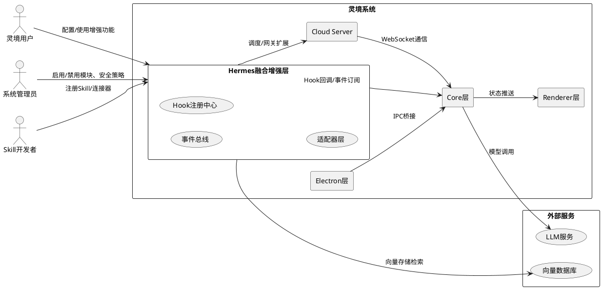
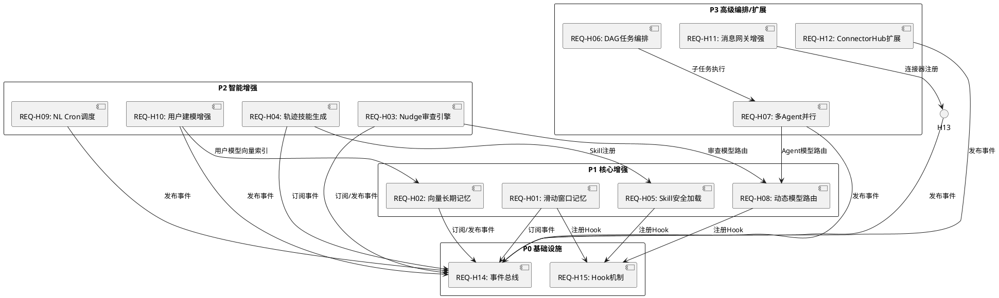

# Hermes Agent 特性融合增强方案 — 需求规格文档

## 1. 组件定位

### 1.1 核心职责

本组件负责将 Hermes Agent 的优秀特性以非侵入式方式融合到灵境系统中，实现功能增强而不影响现有核心业务流程。

### 1.2 核心输入

1. Hermes Agent 完整特性清单（14项核心特性及其行为定义）
2. 灵境系统现有架构信息（三层架构、Skills系统、内存系统、工具系统等）
3. 灵境系统现有能力基线（已实现特性的代码位置与接口）
4. 融合约束条件（非侵入式原则、插件化要求、兼容性保障）

### 1.3 核心输出

1. 功能对比矩阵（Hermes特性 vs 灵境现状 vs 融合策略）
2. 架构融合设计方案（事件总线、Hook机制、适配器模式）
3. 各增强模块的EARS格式需求规格
4. 实施优先级与兼容性保障措施
5. 依赖关系与接口约定

### 1.4 职责边界

1. 本组件不负责修改灵境现有Core/Electron/Renderer层的已有代码
2. 本组件不负责替换灵境已有的MemoryNudger、MemoryReflector、SkillHarvester等模块
3. 本组件不负责定义具体的数据库表结构或持久化方案
4. 本组件不负责实现具体的LLM调用逻辑或模型微调

---

## 2. 领域术语

**滑动窗口短期记忆（Sliding Window Short-term Memory）**
: 对话上下文窗口管理机制，当对话token数超出限制时，按照滑动窗口策略淘汰最早的消息，保持窗口内始终包含最近的对话内容。

**向量长期记忆（Vector Long-term Memory）**
: 基于语义向量的知识存储与检索机制，将信息编码为向量表示，支持相似度搜索的长期知识库。

**Nudge后台审查引擎（Nudge Review Engine）**
: 在后台独立运行的审查Agent实例，对主Agent的输出进行质量审查并生成修正建议，不干扰主流程。

**执行轨迹自动技能生成（Execution Trace Skill Generation）**
: 从Agent执行任务的完整轨迹（工具调用序列、参数、结果）中自动提取可复用工作流，生成SKILL.md文件。

**Skill安全修补与渐进式加载（Skill Security Patching & Progressive Loading）**
: Skill加载前执行安全扫描（检测恶意注入、越权操作等），并按需渐进加载Skill内容，避免一次性加载全部Skill导致性能和安全问题。

**DAG任务编排（DAG Task Orchestration）**
: 使用有向无环图（DAG）描述复杂任务中子任务之间的依赖与执行顺序关系，支持并行执行、串行执行和条件分支。

**多Agent并行执行器（Multi-Agent Parallel Executor）**
: 创建多个Agent实例并行处理独立的子任务，并在所有子任务完成后汇聚结果。

**动态模型路由（Dynamic Model Router）**
: 根据任务的类型、复杂度、成本预算等因素，自动选择当前最优的LLM模型进行调用。

**自然语言Cron调度（NL Cron Scheduler）**
: 接受自然语言描述的定时任务需求，自动转换为标准Cron表达式并注册调度。

**Honcho用户建模（Honcho User Modeling）**
: 基于对话历史和行为数据构建用户偏好模型，用于个性化Agent行为和输出。

**跨平台消息网关（Cross-platform Message Gateway）**
: 统一的消息接入层，支持多种外部平台（Telegram、Discord、Web等）的消息收发。

**ConnectorHub插件化连接器（ConnectorHub）**
: 插件化的连接器注册与分发中心，支持动态注册、发现和调用各类外部服务连接器。

**事件总线（Event Bus）**
: 系统内部的异步消息传递基础设施，发布者发布事件，订阅者按主题接收并处理事件。

**Hook机制（Hook Mechanism）**
: 在系统关键执行点预留的可扩展回调接口，允许外部模块注册钩子函数在特定时机执行。

**适配器模式（Adapter Pattern）**
: 为已有接口定义新的兼容层，使新模块无需修改原有接口即可接入系统。

---

## 3. 角色与边界

### 3.1 核心角色

- **灵境用户**：使用灵境AI编码助手的开发者，期望获得更智能、更安全的Agent体验
- **系统管理员**：负责配置融合模块的启用/禁用、安全策略和资源限制
- **Skill开发者**：编写和管理自定义Skill的第三方开发者

### 3.2 外部系统

- **灵境Core层**：Agent循环、工具系统、Skills系统、内存系统、LLM抽象层
- **灵境Electron层**：IPC注册、服务管理、数据库迁移
- **灵境Renderer层**：UI组件、Store、Hooks
- **灵境Cloud Server**：Express+WebSocket+Webhook+Scheduler
- **LLM服务**：提供大语言模型推理能力的外部服务
- **向量数据库服务**：提供语义向量存储与检索能力的外部服务

### 3.3 交互上下文

---

## 4. DFX约束

### 4.1 性能

1. 融合增强模块的初始化加载时间不得超过 500ms，不得阻塞灵境系统启动
2. 事件总线事件投递延迟不得超过 10ms（P99）
3. Hook回调执行时间不得超过 100ms（P99），超时自动跳过
4. 向量长期记忆的语义检索响应时间不得超过 200ms（P99）
5. Nudge后台审查引擎不得占用超过 1 个额外LLM并发配额
6. 多Agent并行执行器的并发Agent数上限为 4 个

### 4.2 可靠性

1. 融合增强模块的故障不得导致灵境主Agent循环中断
2. 任何增强模块异常时，灵境系统必须降级到无增强模块状态继续运行
3. 事件总线必须支持至少 1000 事件/秒的吞吐量
4. DAG任务编排执行中断后，必须支持从失败节点重试恢复

### 4.3 安全性

1. Skill安全扫描必须覆盖：命令注入、路径遍历、权限提升、敏感数据泄露
2. 向量长期记忆存储的用户数据必须加密
3. Nudge审查引擎的输出必须标记为"审查建议"，不得自动修改主Agent输出
4. 动态模型路由的决策日志必须完整记录以供审计

### 4.4 可维护性

1. 所有融合增强模块必须支持独立启用/禁用，无需修改其他模块代码
2. 每个增强模块必须提供健康检查接口
3. 所有模块间通信必须通过事件总线或显式接口，禁止隐式全局状态共享

### 4.5 兼容性

1. 融合方案必须兼容灵境现有SQL.js数据库，不得引入新的数据库依赖（向量存储除外）
2. 所有新增接口必须为纯增量，不得修改已有接口签名
3. 当融合模块禁用时，灵境系统行为必须与融合前完全一致

---

## 5. 核心能力

### 5.1 功能对比矩阵

| 编号 | Hermes特性 | 灵境现状 | 差距分析 | 融合策略 |
|------|-----------|---------|---------|---------|
| H01 | 滑动窗口短期记忆 | Agent循环中auto-compaction已部分实现 | auto-compaction是压缩策略，非滑动窗口淘汰；需补充窗口滑动逻辑 | **增强**：在auto-compaction前增加滑动窗口淘汰阶段，作为Hook注入Agent循环 |
| H02 | 向量长期记忆 | update_memory工具+SQLite存储（category+scope） | 现有记忆为结构化KV存储，无语义向量检索能力 | **新增**：引入向量存储适配器，作为独立旁路模块接入，与SQLite记忆并行存在 |
| H03 | Nudge后台审查引擎 | MemoryNudger（每3轮提醒持久化） | 现有Nudger仅做提醒，非质量审查；需新增独立审查Agent | **新增**：新建ReviewAgent实例，通过事件总线订阅主Agent输出，异步审查 |
| H04 | 执行轨迹自动技能生成 | SkillHarvester（对话后分析生成SKILL.md） | SkillHarvester基于对话分析，非执行轨迹；轨迹包含工具调用序列更精准 | **增强**：扩展SkillHarvester，增加执行轨迹输入源，作为Hook在工具调用后收集轨迹 |
| H05 | Skill安全修补与渐进式加载 | Skills系统三级扫描(builtin/user/project)，YAML frontmatter解析 | 现有扫描仅做分类，无安全审查和渐进加载 | **增强**：在Skill加载流程中插入安全扫描Hook和渐进加载适配器 |
| H06 | DAG任务编排 | WorkflowExecutor（流程执行引擎） | 现有WorkflowExecutor能力未明确是否支持DAG | **增强/新增**：评估WorkflowExecutor扩展性，若不支持DAG则新增DAG编排模块，通过适配器对接WorkflowExecutor |
| H07 | 多Agent并行执行器 | 单Agent循环 | 无多Agent并行能力 | **新增**：新建ParallelExecutor模块，管理多个Agent实例生命周期，通过事件总线汇聚结果 |
| H08 | 动态模型路由 | LLM抽象层（config/schema.ts + config/defaults.ts） | 现有模型选择为静态配置，无动态路由 | **新增**：新建ModelRouter模块，通过Hook拦截LLM调用，根据任务特征动态选择模型 |
| H09 | 自然语言Cron调度 | Cloud Server已有Scheduler | 现有Scheduler需手动配置Cron表达式，无自然语言转换 | **增强**：在Scheduler前增加NL-to-Cron转换层，作为独立适配器模块 |
| H10 | Honcho用户建模 | MemoryReflector（周期性聚合提炼用户画像和项目知识） | MemoryReflector已部分实现用户画像，但未与Agent行为深度联动 | **增强**：扩展MemoryReflector输出，通过事件总线发布用户模型更新事件，供其他模块订阅 |
| H11 | 跨平台消息网关 | Telegram Bot网关已实现 | 仅支持Telegram，未统一其他平台 | **增强**：以ConnectorHub为基础，扩展统一消息网关抽象层 |
| H12 | ConnectorHub插件化连接器 | ConnectorHub已实现 | 已完整实现 | **保持**：作为融合方案的基础设施，新模块通过ConnectorHub注册接入 |
| H14 | Nudge后台审查引擎（与MemoryNudger融合） | MemoryNudger已实现 | 见H03 | 见H03 |

### 5.2 非侵入式融合原则声明

1. **零修改原则**：融合增强模块不得修改灵境Core/Electron/Renderer层任何已有源代码文件
2. **插件化接入原则**：所有新功能必须以独立模块形式实现，通过事件总线、Hook机制或适配器模式接入
3. **独立旁路原则**：增强模块运行在主流程旁路，其故障不得影响主Agent循环的正常执行
4. **可降级原则**：每个增强模块必须支持启用/禁用开关，禁用时系统行为与融合前完全一致
5. **无隐式依赖原则**：增强模块之间不得存在硬编码的调用依赖，模块间通信仅通过事件总线
6. **增量接口原则**：新增接口必须为纯增量定义，不得修改已有接口签名或数据结构

### 5.3 架构融合设计概要

#### 5.3.1 事件总线（Event Bus）

- 作为融合层核心基础设施，提供发布-订阅模式的事件传递
- 主Agent循环在关键节点发布事件：`agent:message_start`、`agent:message_end`、`agent:tool_call`、`agent:tool_result`、`agent:compaction`、`skill:loaded`、`skill:executed`、`memory:updated`
- 增强模块订阅感兴趣的事件并异步处理
- 事件总线支持优先级、过滤器和超时跳过

#### 5.3.2 Hook机制

- 在灵境Core层关键执行点预留Hook注册接口
- Hook点包括：`before_llm_call`、`after_llm_call`、`before_tool_execute`、`after_tool_execute`、`before_skill_load`、`after_skill_load`、`before_memory_write`、`after_compaction`
- Hook回调支持同步和异步两种模式，异步模式不阻塞主流程
- Hook回调超时自动跳过，不影响主流程

#### 5.3.3 适配器模式

- 为已有模块定义标准化适配器接口，新模块通过适配器与已有模块交互
- 适配器包括：`LLMAdapter`（对接LLM抽象层）、`MemoryAdapter`（对接SQLite记忆系统）、`SkillAdapter`（对接Skills系统）、`ToolAdapter`（对接ToolRegistry）、`SchedulerAdapter`（对接Cloud Server Scheduler）

---

### 5.4 增强模块需求（EARS格式）

#### REQ-H01：滑动窗口短期记忆增强

**编号**：REQ-H01
**描述**：在灵境Agent循环的auto-compaction前增加滑动窗口淘汰阶段，当对话上下文超出token限制时，优先淘汰最早的消息而非直接压缩。
**前置条件**：灵境Agent循环正常运行，对话上下文token数接近上限。
**功能行为**：
- When 对话上下文token数超过配置的窗口上限，the 滑动窗口管理器 shall 从最早的消息开始淘汰，直到token数降至窗口下限。
- While 滑动窗口淘汰执行中，the 滑动窗口管理器 shall 保留最近N条消息（N可配置，默认10）不被淘汰。
- When 滑动窗口淘汰完成，the 滑动窗口管理器 shall 发布 `memory:window_compacted` 事件，携带淘汰的消息摘要。
- If 滑动窗口管理器初始化失败或运行异常，the 系统 shall 降级到原有auto-compaction策略继续运行。
**后置条件**：对话上下文token数在窗口下限以内，最早的超限消息已被淘汰，最近N条消息完整保留。

---

#### REQ-H02：向量长期记忆

**编号**：REQ-H02
**描述**：为灵境系统增加基于语义向量的长期记忆存储与检索能力，作为独立旁路模块与现有SQLite记忆系统并行存在。
**前置条件**：向量数据库服务可用，灵境系统已初始化事件总线。
**功能行为**：
- When 用户通过 `remember_vector` 工具存储信息，the 向量长期记忆模块 shall 将信息编码为向量表示并存储到向量数据库。
- When 用户通过 `recall_vector` 工具检索信息，the 向量长期记忆模块 shall 对查询进行向量编码，执行相似度搜索，返回Top-K结果（K可配置，默认5）。
- While 向量长期记忆模块启用，the 模块 shall 订阅 `memory:updated` 事件，自动将新写入的结构化记忆同步到向量索引。
- If 向量数据库服务不可用，the 向量长期记忆模块 shall 返回降级提示，不影响其他记忆操作。
- Where 向量长期记忆模块被禁用，the 系统行为 shall 与融合前完全一致。
**后置条件**：用户可以通过语义相似度检索历史知识，向量索引与SQLite记忆保持同步。

---

#### REQ-H03：Nudge后台审查引擎

**编号**：REQ-H03
**描述**：新增独立的后台审查Agent实例，异步对主Agent输出进行质量审查并生成修正建议。
**前置条件**：灵境Agent循环正常运行，审查模型已配置。
**功能行为**：
- When 主Agent完成一轮回复，the Nudge审查引擎 shall 订阅 `agent:message_end` 事件，异步启动审查流程。
- While 审查流程执行中，the Nudge审查引擎 shall 使用独立审查Agent对主Agent输出进行质量评估，生成审查报告。
- When 审查报告生成完成，the Nudge审查引擎 shall 发布 `review:completed` 事件，携带审查建议和评分。
- The Nudge审查引擎 shall 将审查建议标记为"审查建议"，不得自动修改主Agent输出。
- If 审查模型调用失败或超时，the Nudge审查引擎 shall 发布 `review:failed` 事件并静默降级，不干扰主流程。
- The Nudge审查引擎 shall 最多占用1个LLM并发配额。
**后置条件**：主Agent输出附带审查建议（可选查看），主流程不受审查结果影响。

---

#### REQ-H04：执行轨迹自动技能生成增强

**编号**：REQ-H04
**描述**：扩展SkillHarvester，增加执行轨迹输入源，从工具调用序列中提取更精准的可复用工作流。
**前置条件**：灵境Skills系统和SkillHarvester正常运行，事件总线已初始化。
**功能行为**：
- When Agent执行工具调用，the 执行轨迹收集器 shall 订阅 `agent:tool_call` 和 `agent:tool_result` 事件，记录完整调用序列。
- When 一轮对话结束且执行轨迹包含3个以上工具调用，the 轨迹技能生成器 shall 分析执行轨迹，提取可复用工作流模式。
- When 工作流模式提取成功，the 轨迹技能生成器 shall 生成SKILL.md文件（标记为auto-generated级别），通过SkillAdapter注册到Skills系统。
- If 轨迹分析未能提取有效模式，the 轨迹技能生成器 shall 静默跳过，不生成无效Skill。
- Where 轨迹技能生成功能被禁用，the SkillHarvester shall 仅使用原有对话分析模式生成Skill。
**后置条件**：基于执行轨迹生成的Skill已注册到Skills系统，可供后续对话复用。

---

#### REQ-H05：Skill安全修补与渐进式加载

**编号**：REQ-H05
**描述**：在Skill加载流程中增加安全扫描和渐进加载机制，防止恶意Skill注入并优化加载性能。
**前置条件**：灵境Skills系统正常运行，安全扫描规则已配置。
**功能行为**：
- When Skill被请求加载，the 安全扫描器 shall 在 `before_skill_load` Hook点执行安全审查，检测命令注入、路径遍历、权限提升、敏感数据泄露。
- If 安全扫描发现高风险问题，the 安全扫描器 shall 阻止该Skill加载，发布 `skill:blocked` 事件，携带风险详情。
- If 安全扫描发现中低风险问题，the 安全扫描器 shall 为Skill附加安全修补建议，允许加载但标记为"受限"。
- When Skill通过安全扫描，the 渐进加载器 shall 仅加载Skill的元数据和入口描述，不加载完整内容。
- When Skill被实际调用执行，the 渐进加载器 shall 按需加载Skill的完整定义和依赖。
- Where 安全扫描功能被禁用，the Skills系统 shall 使用原有加载流程。
**后置条件**：恶意Skill被阻止加载，合法Skill按需渐进加载，系统安全性提升。

---

#### REQ-H06：DAG任务编排

**编号**：REQ-H06
**描述**：为灵境系统增加基于有向无环图（DAG）的复杂任务编排能力，支持子任务并行执行、串行执行和条件分支。
**前置条件**：灵境Agent循环正常运行，事件总线已初始化。
**功能行为**：
- When 用户提交DAG编排请求，the DAG编排引擎 shall 解析DAG定义，验证无环路，构建执行计划。
- While DAG执行中，the DAG编排引擎 shall 按照依赖关系调度子任务，无依赖的子任务并行执行，有依赖的串行执行。
- When DAG子任务包含条件分支，the DAG编排引擎 shall 根据上游任务输出评估条件，选择执行分支。
- When DAG所有子任务执行完成，the DAG编排引擎 shall 汇聚结果，发布 `dag:completed` 事件。
- If DAG执行中某子任务失败，the DAG编排引擎 shall 标记该节点及下游节点为失败，发布 `dag:failed` 事件，支持从失败节点重试。
- If DAG定义存在环路，the DAG编排引擎 shall 拒绝执行并返回验证错误。
**后置条件**：复杂任务按DAG定义有序执行，结果正确汇聚，失败可重试恢复。

---

#### REQ-H07：多Agent并行执行器

**编号**：REQ-H07
**描述**：新增多Agent并行执行器，支持创建多个Agent实例并行处理独立子任务并汇聚结果。
**前置条件**：灵境Agent循环正常运行，并发配额充足。
**功能行为**：
- When 用户提交并行执行请求（包含多个独立子任务），the 并行执行器 shall 为每个子任务创建独立Agent实例。
- While 并行执行中，the 并行执行器 shall 同时运行所有Agent实例，并发数不超过配置上限（默认4）。
- When 所有Agent实例完成执行，the 并行执行器 shall 汇聚各子任务结果，发布 `parallel:completed` 事件。
- If 某Agent实例执行超时，the 并行执行器 shall 终止该实例，将其结果标记为超时，继续等待其他实例完成。
- If 并发配额不足，the 并行执行器 shall 降级为串行执行，按顺序依次处理子任务。
- The 并行执行器 shall 在执行完成后释放所有Agent实例资源。
**后置条件**：多个子任务并行执行完成，结果正确汇聚，资源已释放。

---

#### REQ-H08：动态模型路由

**编号**：REQ-H08
**描述**：新增动态模型路由模块，根据任务类型、复杂度、成本预算等因素自动选择最优LLM模型。
**前置条件**：灵境LLM抽象层正常运行，多模型配置已定义。
**功能行为**：
- When 主Agent发起LLM调用，the 动态模型路由器 shall 在 `before_llm_call` Hook点拦截请求，评估任务特征（类型、复杂度、上下文长度）。
- While 评估任务特征，the 动态模型路由器 shall 根据路由规则选择最优模型（考虑能力匹配、成本预算、当前负载）。
- When 模型选择完成，the 动态模型路由器 shall 替换请求中的模型标识为选定模型，记录路由决策日志。
- If 无匹配路由规则，the 动态模型路由器 shall 使用默认模型配置，不修改请求。
- If 选定模型不可用，the 动态模型路由器 shall 自动降级到备选模型，发布 `model:fallback` 事件。
- Where 动态路由功能被禁用，the 系统行为 shall 与融合前完全一致（使用静态配置模型）。
**后置条件**：LLM调用使用了最优匹配模型，路由决策已记录审计日志。

---

#### REQ-H09：自然语言Cron调度

**编号**：REQ-H09
**描述**：为灵境Cloud Server Scheduler增加自然语言到Cron表达式的自动转换能力。
**前置条件**：Cloud Server Scheduler正常运行，NL-to-Cron转换服务可用。
**功能行为**：
- When 用户以自然语言描述定时任务需求（如"每天早上9点执行代码审查"），the NL调度器 shall 将自然语言转换为标准Cron表达式。
- When Cron表达式生成完成，the NL调度器 shall 通过SchedulerAdapter将任务注册到Cloud Server Scheduler。
- When 任务注册成功，the NL调度器 shall 返回任务ID和Cron表达式给用户确认。
- If 自然语言无法转换为有效Cron表达式，the NL调度器 shall 返回解析错误并提供示例格式提示。
- Where NL调度功能被禁用，the Scheduler shall 仅接受标准Cron表达式输入。
**后置条件**：自然语言描述的定时任务已转换为Cron表达式并注册调度。

---

#### REQ-H10：Honcho用户建模增强

**编号**：REQ-H10
**描述**：增强MemoryReflector的用户建模输出，通过事件总线发布用户模型更新事件，供其他模块订阅实现个性化Agent行为。
**前置条件**：MemoryReflector正常运行，事件总线已初始化。
**功能行为**：
- When MemoryReflector完成一轮用户画像更新，the 用户建模增强模块 shall 发布 `user_model:updated` 事件，携带用户偏好模型数据。
- When 其他增强模块订阅 `user_model:updated` 事件，the 订阅模块 shall 根据用户偏好调整自身行为（如模型路由偏好、记忆检索权重等）。
- While 用户模型持续更新，the 用户建模增强模块 shall 合并增量更新到完整用户模型，避免模型丢失历史信息。
- If 用户模型发布事件失败，the 用户建模增强模块 shall 静默降级，不影响MemoryReflector原有功能。
**后置条件**：用户偏好模型通过事件总线可被其他模块消费，Agent行为可根据用户模型个性化调整。

---

#### REQ-H11：跨平台消息网关增强

**编号**：REQ-H11
**描述**：以ConnectorHub为基础，扩展统一消息网关抽象层，支持多种外部平台的消息收发。
**前置条件**：ConnectorHub正常运行，Telegram Bot网关已实现。
**功能行为**：
- When 新的消息平台连接器（如Discord、Slack）被注册到ConnectorHub，the 统一消息网关 shall 通过标准适配器接口接入该平台。
- When 外部平台发送消息到灵境，the 统一消息网关 shall 将平台消息转换为统一的内部消息格式，路由到Agent处理。
- When Agent生成回复，the 统一消息网关 shall 将内部消息格式转换回目标平台格式，发送回复。
- If 某平台连接器初始化失败，the 统一消息网关 shall 标记该平台为不可用，不影响其他平台消息收发。
- Where 新平台连接器未注册，the 系统行为 shall 与融合前完全一致。
**后置条件**：多种外部平台通过统一接口接入灵境，消息格式正确转换和路由。

---

#### REQ-H12：ConnectorHub扩展接口

**编号**：REQ-H12
**描述**：确保ConnectorHub的接口可通过扩展供新增融合模块注册和发现连接器，无需修改ConnectorHub源码。
**前置条件**：ConnectorHub已实现且正常运行。
**功能行为**：
- When 融合模块需要注册新连接器，the 连接器适配器 shall 通过ConnectorHub的标准注册接口完成注册。
- When 融合模块需要发现可用连接器，the 连接器适配器 shall 通过ConnectorHub的发现接口返回连接器列表。
- The 连接器适配器 shall 不修改ConnectorHub的任何接口或实现。
**后置条件**：融合模块通过ConnectorHub注册和发现连接器，ConnectorHub行为不变。

---

#### REQ-H14：事件总线基础设施

**编号**：REQ-H14
**描述**：建立融合层核心基础设施——事件总线，提供发布-订阅模式的异步事件传递能力。
**前置条件**：灵境系统启动流程可插入事件总线初始化。
**功能行为**：
- When 事件总线初始化，the 事件总线 shall 注册所有预定义事件主题和默认订阅者。
- When 发布者发布事件，the 事件总线 shall 将事件投递到所有匹配主题的订阅者，投递延迟不超过10ms（P99）。
- While 事件总线运行中，the 事件总线 shall 支持事件过滤（按主题、来源、优先级）和超时跳过（订阅者回调超时100ms自动跳过）。
- If 订阅者回调执行异常，the 事件总线 shall 捕获异常，记录错误日志，不中断事件投递到其他订阅者。
- The 事件总线 shall 支持至少1000事件/秒的吞吐量。
**后置条件**：事件总线正常运行，融合模块可通过发布-订阅模式通信。

---

#### REQ-H15：Hook机制基础设施

**编号**：REQ-H15
**描述**：在灵境Core层关键执行点预留Hook注册接口，允许融合模块注册回调在特定时机执行。
**前置条件**：灵境Agent循环和工具系统正常运行。
**功能行为**：
- When Hook注册中心初始化，the Hook机制 shall 在预定义的执行点（before_llm_call、after_llm_call、before_tool_execute、after_tool_execute、before_skill_load、after_skill_load、before_memory_write、after_compaction）建立注册接口。
- When 融合模块注册Hook回调，the Hook机制 shall 按优先级排序注册的回调，支持同步和异步模式。
- When 执行点到达，the Hook机制 shall 按优先级依次调用注册的回调，异步回调不阻塞主流程。
- If Hook回调执行超时（超过100ms），the Hook机制 shall 自动跳过该回调，继续执行后续回调。
- If Hook回调执行异常，the Hook机制 shall 捕获异常，记录错误日志，不中断主流程。
**后置条件**：融合模块通过Hook接口在关键执行点注入逻辑，主流程不受Hook异常影响。

---

### 5.5 实施优先级与兼容性保障措施

#### 实施优先级

| 优先级 | 模块 | 编号 | 依据 |
|--------|------|------|------|
| P0（基础设施） | 事件总线 | REQ-H14 | 所有融合模块的通信基础，必须最先实现 |
| P0（基础设施） | Hook机制 | REQ-H15 | 融合模块接入Core层的前提，必须最先实现 |
| P1（核心增强） | Skill安全修补与渐进式加载 | REQ-H05 | 安全性优先，直接影响系统安全 |
| P1（核心增强） | 滑动窗口短期记忆增强 | REQ-H01 | 记忆管理是Agent核心能力，影响用户体验 |
| P1（核心增强） | 向量长期记忆 | REQ-H02 | 长期知识检索能力，显著提升Agent智能度 |
| P1（核心增强） | 动态模型路由 | REQ-H08 | 多模型场景下成本与质量优化的关键 |
| P2（智能增强） | Nudge后台审查引擎 | REQ-H03 | 提升输出质量，需额外LLM配额 |
| P2（智能增强） | 执行轨迹自动技能生成 | REQ-H04 | 增强Skill自动生成能力 |
| P2（智能增强） | Honcho用户建模增强 | REQ-H10 | 个性化能力，依赖向量记忆 |
| P2（智能增强） | 自然语言Cron调度 | REQ-H09 | 用户体验优化 |
| P3（高级编排） | DAG任务编排 | REQ-H06 | 复杂任务场景，依赖多Agent执行器 |
| P3（高级编排） | 多Agent并行执行器 | REQ-H07 | 并行能力，资源消耗较大 |
| P3（生态扩展） | 跨平台消息网关增强 | REQ-H11 | 生态扩展，非核心能力 |
| P3（适配保障） | ConnectorHub扩展接口 | REQ-H12 | 适配保障，ConnectorHub已存在 |

#### 兼容性保障措施

1. **模块隔离**：每个增强模块运行在独立的作用域，模块间仅通过事件总线通信，禁止直接引用其他模块内部状态
2. **降级熔断**：每个增强模块实现健康检查接口，连续3次异常自动熔断（禁用该模块），需管理员手动恢复
3. **配置开关**：所有增强模块通过统一配置文件控制启用/禁用（默认禁用），启用前检查依赖条件
4. **接口版本化**：适配器接口定义版本号，版本不兼容时拒绝加载并提示升级
5. **资源限制**：增强模块的总资源占用（内存、CPU、LLM配额）不得超过配置上限，超限自动降级
6. **审计日志**：所有增强模块的关键操作（启用、禁用、异常、熔断、降级）必须写入审计日志
7. **回滚保障**：任何增强模块禁用后，灵境系统行为必须与融合前完全一致，无残留影响

---

### 5.6 依赖关系与接口约定

#### 模块依赖关系图

#### 接口约定

| 接口名称 | 提供方 | 消费方 | 接口类型 | 说明 |
|---------|--------|--------|---------|------|
| EventBus.publish(topic, payload) | REQ-H14 | 所有模块 | 异步 | 发布事件到指定主题 |
| EventBus.subscribe(topic, handler, options) | REQ-H14 | 所有模块 | 异步 | 订阅指定主题的事件 |
| HookRegistry.register(hookPoint, callback, options) | REQ-H15 | REQ-H01/H05/H08 | 同步/异步 | 在指定Hook点注册回调 |
| LLMAdapter.call(request) | LLM抽象层适配器 | REQ-H08 | 同步 | 调用LLM模型 |
| MemoryAdapter.write(entry) | SQLite记忆适配器 | REQ-H02/H10 | 同步 | 写入结构化记忆 |
| MemoryAdapter.query(filter) | SQLite记忆适配器 | REQ-H02/H10 | 同步 | 查询结构化记忆 |
| VectorStoreAdapter.upsert(id, vector, metadata) | REQ-H02 | REQ-H10 | 异步 | 向量存储或更新 |
| VectorStoreAdapter.search(queryVector, topK) | REQ-H02 | REQ-H02/H10 | 异步 | 向量相似度检索 |
| SkillAdapter.register(skillDef) | Skills系统适配器 | REQ-H04/H05 | 同步 | 注册Skill定义 |
| SkillAdapter.load(skillId, options) | Skills系统适配器 | REQ-H05 | 异步 | 加载Skill |
| SchedulerAdapter.register(cronExpr, task) | Scheduler适配器 | REQ-H09 | 同步 | 注册定时任务 |
| ConnectorHubAdapter.register(connector) | ConnectorHub适配器 | REQ-H11/H12 | 同步 | 注册连接器 |

---

## 6. 数据约束

### 6.1 事件消息（EventMessage）

1. **topic**：事件主题标识，格式为 `模块:动作`（如 `agent:message_end`），必填，唯一标识事件类型
2. **payload**：事件载荷数据，JSON对象，必填，包含事件相关的业务数据
3. **source**：事件发布方模块标识，字符串，必填，用于追溯事件来源
4. **timestamp**：事件发生时间，ISO 8601格式，必填，精确到毫秒
5. **priority**：事件优先级，枚举值（critical/high/normal/low），默认normal

### 6.2 Hook注册（HookRegistration）

1. **hookPoint**：Hook执行点标识，枚举值（before_llm_call/after_llm_call/before_tool_execute/after_tool_execute/before_skill_load/after_skill_load/before_memory_write/after_compaction），必填
2. **callback**：Hook回调函数引用，必填，签名为 async (context) => result
3. **priority**：回调优先级，整数，默认0，数值越小优先级越高
4. **mode**：执行模式，枚举值（sync/async），默认async
5. **timeout**：回调超时时间，毫秒，默认100

### 6.3 路由规则（RouteRule）

1. **taskType**：任务类型匹配条件，字符串或正则表达式，用于匹配任务特征
2. **complexity**：复杂度匹配条件，枚举值（low/medium/high），用于评估任务复杂度
3. **model**：路由目标模型标识，字符串，必填，指定匹配时使用的LLM模型
4. **costBudget**：成本预算上限，浮点数，可选，超出预算时降级到备选模型
5. **fallbackModel**：备选模型标识，字符串，可选，目标模型不可用时的降级模型

### 6.4 DAG定义（DAGDefinition）

1. **nodes**：子任务节点列表，数组，必填，每个节点包含taskId、taskDef、dependencies
2. **edges**：节点间依赖边列表，数组，必填，每条边包含from、to、condition（可选）
3. **maxConcurrency**：最大并行度，整数，默认4，限制同时执行的子任务数
4. **retryPolicy**：重试策略，对象，包含maxRetries（默认3）和retryDelay（默认1000ms）

### 6.5 审查报告（ReviewReport）

1. **reviewId**：审查报告唯一标识，字符串，必填
2. **originalMessageId**：被审查的主Agent消息ID，字符串，必填
3. **score**：质量评分，浮点数0-10，必填
4. **suggestions**：修正建议列表，字符串数组，可为空
5. **riskFlags**：风险标记列表，字符串数组，可为空，标记潜在问题类型
6. **reviewedAt**：审查完成时间，ISO 8601格式，必填
