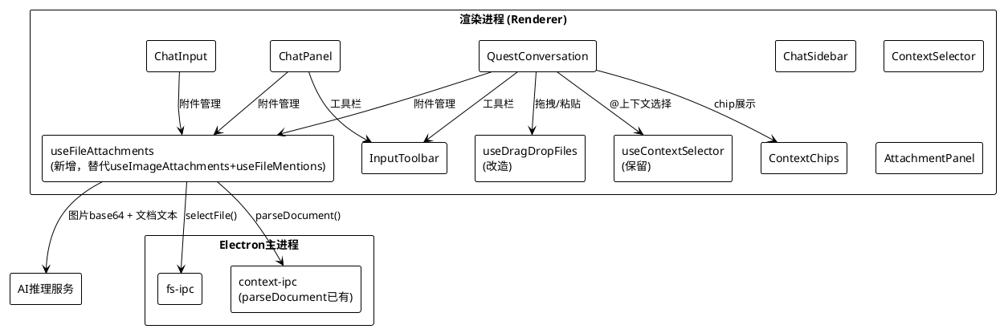
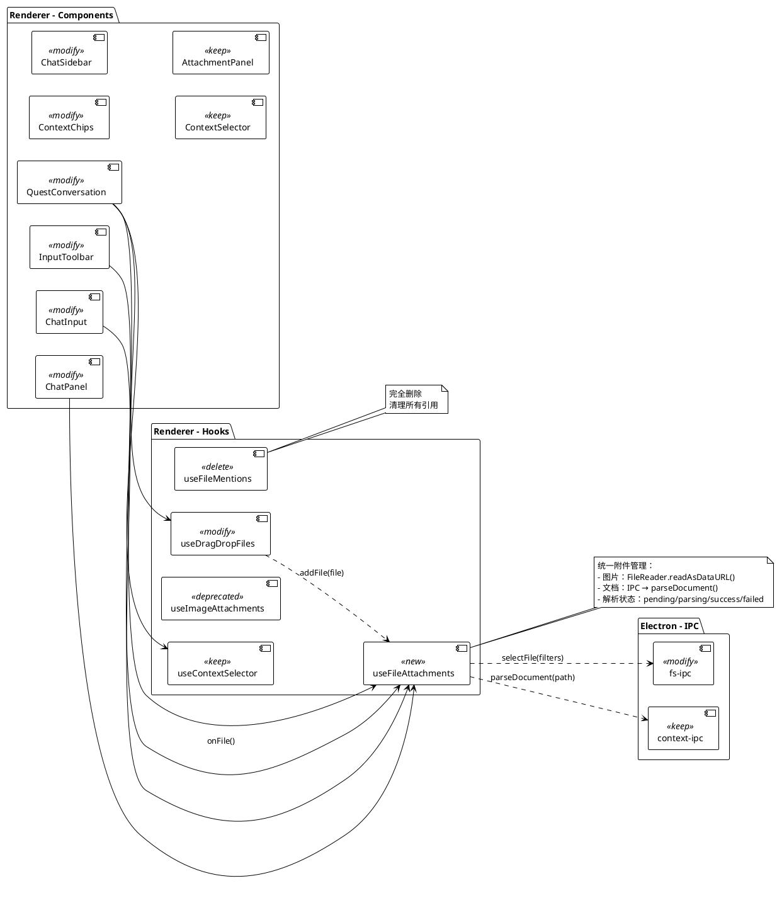

# **1. 实现模型**

## **1.1 上下文视图**



### 变更范围映射

| 需求规格章节 | 变更类型 | 涉及模块 | 说明 |
|---|---|---|---|
| 5.1 移除@提及文件 | 删除 | `useFileMentions.ts` | 整文件删除 |
| 5.1 移除@提及文件 | 修改 | `QuestConversation.tsx` | 移除`useFileMentions`引用、`mentionedFiles`、`removeMention`，清理ContextChips的`files`属性传递 |
| 5.1 移除@提及文件 | 修改 | `ChatPanel.tsx` | 移除`useFileMentions`引用及`mentionedFiles`/`addMention`/`removeMention`/`clearMentions` |
| 5.1 移除@提及文件 | 修改 | `ChatSidebar.tsx` | 移除`useFileMentions`引用及全部相关调用 |
| 5.1 移除@提及文件 | 修改 | `InputToolbar.tsx` | 移除`onMention`属性和@提及按钮渲染 |
| 5.1 移除@提及文件 | 修改 | `ChatInput.tsx` | 移除`onMention`属性传递及`InputToolbar`的`onMention`回调 |
| 5.1 移除@提及文件 | 修改 | `ContextChips.tsx` | 移除`files`属性及对应渲染块 |
| 5.2 通用文件上传 | 新增 | `useFileAttachments.ts` | 新hook，统一管理图片+文档附件，替代`useImageAttachments` |
| 5.2 通用文件上传 | 修改 | `useImageAttachments.ts` | 废弃（由`useFileAttachments`替代），保留接口兼容过渡 |
| 5.2 通用文件上传 | 修改 | `InputToolbar.tsx` | `onImage`→`onFile`，图标改为回形针，tooltip改为"上传文件" |
| 5.2 通用文件上传 | 修改 | `QuestConversation.tsx` | 隐藏`<input>`的accept扩展，附件管理切换到`useFileAttachments`，发送时携带文档内容 |
| 5.2 通用文件上传 | 修改 | `ChatInput.tsx` | 隐藏`<input>`的accept扩展，附件管理切换到`useFileAttachments` |
| 5.2 通用文件上传 | 修改 | `useDragDropFiles.ts` | 图片文件也走`useFileAttachments`统一流程 |
| 5.3 附件Chip展示 | 修改 | `ContextChips.tsx` | 新增文档附件chip渲染（格式图标+文件名+解析状态） |
| 5.2 通用文件上传 | 修改 | `fs-ipc.ts` | `fs:select-file`对话框增加filters参数，支持多格式过滤 |

## **1.2 服务/组件总体架构**



### 核心改造策略

**策略一：统一附件模型**

将 `useImageAttachments`（仅图片）和 `useFileMentions`（仅文件路径提及）合并为统一的 `useFileAttachments` hook。新hook管理一个 `FileAttachment[]` 数组，其中每个附件可以是图片类型（含`dataUrl`）或文档类型（含`content`+`parseStatus`）。

**策略二：文档解析走已有IPC**

`context-ipc.ts` 中已有 `context:parse-document` handler，支持 PDF（pdf-parse）、DOCX（mammoth）、XLSX（exceljs）、MD/TXT（直接读取）、XMind（adm-zip）。无需新增IPC，前端仅通过 `window.electronAPI.context.parseDocument(filePath)` 调用。

**策略三：文件选择对话框增强**

`fs-ipc.ts` 的 `fs:select-file` 当前无过滤器参数，需增加 `filters` 可选参数，使对话框可按文件类型过滤。

**策略四：附件Chip统一渲染**

`ContextChips` 组件当前分别渲染 `images[]` 和 `files[]`，改造后统一渲染 `attachments: FileAttachment[]`，图片chip展示缩略图，文档chip展示格式图标+文件名+解析状态。

## **1.3 实现设计文档**

### 1.3.1 useFileAttachments Hook（新增）

**文件路径**: `packages/renderer/src/hooks/useFileAttachments.ts`

**职责**: 统一管理图片和文档文件附件的添加、解析、移除和清空操作。

**状态模型**:

```typescript
type ParseStatus = 'pending' | 'parsing' | 'success' | 'failed';
type AttachmentType = 'image' | 'document';

interface FileAttachment {
  id: string;             // 唯一标识，格式：`att-${timestamp}-${random}`
  name: string;           // 文件名
  type: AttachmentType;   // 附件类型
  path: string;           // 本地磁盘路径
  size: number;           // 文件大小（字节）
  dataUrl?: string;       // 图片：base64 DataURL（仅image类型）
  content?: string;       // 文档：解析后文本内容（仅document类型）
  parseStatus?: ParseStatus; // 文档：解析状态（仅document类型）
  ext?: string;           // 文件扩展名，用于格式图标映射
}
```

**核心逻辑**:

```typescript
// 图片文件判定
const IMAGE_EXTENSIONS = new Set(['.png', '.jpg', '.jpeg', '.gif', '.webp', '.svg', '.bmp']);

// 支持的全部文件格式（用于accept属性）
const ACCEPT_FILTER = 'image/*,.pdf,.txt,.md,.doc,.docx,.xls,.xlsx';

function useFileAttachments() {
  const [attachments, setAttachments] = useState<FileAttachment[]>([]);
  const fileInputRef = useRef<HTMLInputElement>(null);

  // 触发隐藏文件输入框
  const triggerFileInput = useCallback(() => {
    fileInputRef.current?.click();
  }, []);

  // 从File对象添加附件（处理<input>的onChange事件）
  const addFiles = useCallback(async (e: React.ChangeEvent<HTMLInputElement>) => {
    const files = e.target.files;
    if (!files) return;
    for (const file of Array.from(files)) {
      await processFile(file);
    }
    e.target.value = ''; // 重置以允许重复选择
  }, []);

  // 从单个File对象添加（拖拽/粘贴入口）
  const addFileFromFile = useCallback(async (file: File) => {
    await processFile(file);
  }, []);

  // 核心处理逻辑
  async function processFile(file: File) {
    const ext = getExtension(file.name);
    const filePath = (file as any).path as string | undefined;
    const id = `att-${Date.now()}-${Math.random().toString(36).slice(2, 8)}`;

    if (IMAGE_EXTENSIONS.has(ext)) {
      // 图片：FileReader.readAsDataURL
      const dataUrl = await readFileAsDataURL(file);
      setAttachments(prev => [...prev, {
        id, name: file.name, type: 'image',
        path: filePath || '', size: file.size,
        dataUrl, ext,
      }]);
    } else if (filePath) {
      // 文档：通过路径调用IPC解析
      const attachment: FileAttachment = {
        id, name: file.name, type: 'document',
        path: filePath, size: file.size,
        parseStatus: 'parsing', ext,
      };
      setAttachments(prev => [...prev, attachment]);
      // 异步解析
      parseDocumentContent(id, filePath);
    }
  }

  // 文档解析（异步，更新状态）
  async function parseDocumentContent(id: string, filePath: string) {
    try {
      const result = await window.electronAPI.context.parseDocument(filePath);
      setAttachments(prev => prev.map(a =>
        a.id === id ? { ...a, content: result.content, parseStatus: 'success' } : a
      ));
    } catch {
      setAttachments(prev => prev.map(a =>
        a.id === id ? { ...a, parseStatus: 'failed' } : a
      ));
    }
  }

  // 移除单个附件
  const removeAttachment = useCallback((id: string) => {
    setAttachments(prev => prev.filter(a => a.id !== id));
  }, []);

  // 清空所有附件
  const clearAttachments = useCallback(() => {
    setAttachments([]);
  }, []);

  // 计算属性
  const images = attachments.filter(a => a.type === 'image');
  const documents = attachments.filter(a => a.type === 'document');
  const totalSize = attachments.reduce((sum, a) => sum + a.size, 0);

  return {
    attachments, images, documents, totalSize,
    addFiles, addFileFromFile, removeAttachment, clearAttachments,
    fileInputRef, triggerFileInput,
  };
}
```

**文件大小校验**: 在 `processFile` 入口处增加前置校验：

```typescript
const MAX_TOTAL_SIZE = 50 * 1024 * 1024; // 50MB

// processFile开头增加
if (totalSize + file.size > MAX_TOTAL_SIZE) {
  // 展示超限提示（由调用方处理UI反馈）
  return { error: 'FILE_SIZE_EXCEEDED' };
}
```

### 1.3.2 useFileMentions Hook（删除）

**文件路径**: `packages/renderer/src/hooks/useFileMentions.ts`

**操作**: 删除整个文件。

**引用清理清单**（必须全部移除）:

| 文件 | 清理内容 |
|---|---|
| `QuestConversation.tsx` | `import { useFileMentions }`, `const { mentionedFiles, addMention, removeMention } = useFileMentions()`, ContextChips的`files={mentionedFiles}`和`onRemoveFile={removeMention}` |
| `ChatPanel.tsx` | `import { useFileMentions }`, `const { mentionedFiles, addMention, removeMention, clearMentions } = useFileMentions()`, 相关传递 |
| `ChatSidebar.tsx` | `import { useFileMentions }`, `const { mentionedFiles, addMention, removeMention, clearMentions } = useFileMentions()`, 相关传递 |
| `ChatInput.tsx` | `onMention` prop定义及传递（如有） |

### 1.3.3 InputToolbar 改造

**文件路径**: `packages/renderer/src/components/chat/InputToolbar.tsx`

**接口变更**:

```typescript
// 改造前
interface InputToolbarProps {
  onMention: () => void;   // ← 删除
  onImage: () => void;     // ← 重命名
  onVoice: () => void;
  onPolish: () => void;
  onSend: () => void;
  onStop: () => void;
  isStreaming: boolean;
  isRecording: boolean;
  isPolishing: boolean;
  canSend: boolean;
}

// 改造后
interface InputToolbarProps {
  onFile: () => void;      // 通用文件上传（原onImage）
  onVoice: () => void;
  onPolish: () => void;
  onSend: () => void;
  onStop: () => void;
  isStreaming: boolean;
  isRecording: boolean;
  isPolishing: boolean;
  canSend: boolean;
}
```

**UI变更**:

| 元素 | 改造前 | 改造后 |
|---|---|---|
| @提及按钮 | `@ 提及文件`，@SVG图标 | **删除** |
| 上传按钮 | `上传图片`，图片SVG图标 | `上传文件`，回形针SVG图标 |

**回形针图标SVG**:

```xml
<svg className="w-3.5 h-3.5" fill="none" viewBox="0 0 24 24" stroke="currentColor" strokeWidth={2}>
  <path strokeLinecap="round" strokeLinejoin="round" d="M18.375 12.639c-1.32 1.32-3.24 1.32-4.56 0l-3.36-3.36a2.28 2.28 0 013.24-3.24l3.36 3.36m-6.72-1.44a2.28 2.28 0 00-3.24 3.24l3.36 3.36c1.32 1.32 3.24 1.32 4.56 0l3.36-3.36" />
</svg>
```

### 1.3.4 QuestConversation 改造

**文件路径**: `packages/renderer/src/components/quest/QuestConversation.tsx`

**变更点**:

1. **替换hook**:
   - 移除: `import { useFileMentions }`, `import { useImageAttachments }`
   - 新增: `import { useFileAttachments }`, `import type { FileAttachment }`
   - `const { images, addImages, removeImage, triggerFileInput } = useImageAttachments()` → `const { attachments, images, addFiles, addFileFromFile, removeAttachment, clearAttachments, triggerFileInput, totalSize } = useFileAttachments()`
   - 移除: `const { mentionedFiles, addMention, removeMention } = useFileMentions()`

2. **ContextChips传递变更**:
   ```tsx
   // 改造前
   <ContextChips
     images={images}
     files={mentionedFiles}
     contexts={selectedContexts}
     onRemoveImage={removeImage}
     onRemoveFile={removeMention}
     onRemoveContext={removeContext}
   />

   // 改造后
   <ContextChips
     attachments={attachments}
     contexts={selectedContexts}
     onRemoveAttachment={removeAttachment}
     onRemoveContext={removeContext}
   />
   ```

3. **InputToolbar变更**:
   ```tsx
   // 改造前
   <InputToolbar
     onMention={() => openViaButton('file')}
     onImage={triggerFileInput}
     ...
   />

   // 改造后
   <InputToolbar
     onFile={triggerFileInput}
     ...
   />
   ```

4. **隐藏文件输入框扩展**:
   ```tsx
   // 改造前
   <input ref={fileInputRef} type="file" accept="image/*" multiple className="hidden" onChange={addImages} />

   // 改造后
   <input ref={fileInputRef} type="file" accept="image/*,.pdf,.txt,.md,.doc,.docx,.xls,.xlsx" multiple className="hidden" onChange={addFiles} />
   ```

5. **拖拽处理变更**:
   ```tsx
   // 改造前
   const { isDragging, dragHandlers, pasteHandler } = useDragDropFiles('quest', {
     onImageAdd: (file: File) => {
       const dt = new DataTransfer();
       dt.items.add(file);
       const fakeEvent = { target: { files: dt.files } } as any;
       addImages(fakeEvent);
     },
   });

   // 改造后
   const { isDragging, dragHandlers, pasteHandler } = useDragDropFiles('quest', {
     onFileAdd: addFileFromFile,
   });
   ```

6. **handleSend变更 — 携带文档内容**:
   ```typescript
   // 改造后handleSend中构建附件payload
   const documentPayload = documents
     .filter(d => d.parseStatus === 'success' && d.content)
     .map(d => ({ name: d.name, content: d.content, ext: d.ext }));

   // quest:run调用时增加documents参数
   await window.electronAPI.quest.run({
     ...existingParams,
     images: imagePayload,
     documents: documentPayload,  // 新增
   });
   ```

7. **发送后清空附件**:
   ```typescript
   // handleSend中已有clearImages逻辑，改为
   clearAttachments();
   ```

8. **placeholder文案调整**:
   ```tsx
   // 改造前
   placeholder="发送消息... (@ 添加上下文, Enter 发送)"
   // 改造后
   placeholder="发送消息... (Enter 发送, @ 添加上下文)"
   ```

9. **canSend判定变更**:
   ```tsx
   // 改造前
   canSend={!!text.trim() || images.length > 0}
   // 改造后
   canSend={!!text.trim() || attachments.length > 0}
   ```

### 1.3.5 ChatInput 改造

**文件路径**: `packages/renderer/src/components/chat/ChatInput.tsx`

**变更点**:

1. **Props变更**:
   ```typescript
   // 移除
   onMention?: () => void;
   onImage?: () => void;
   onImageAdd?: (file: File) => void;
   images?: AttachedImage[];
   onRemoveImage?: (index: number) => void;

   // 新增
   onFile?: () => void;
   attachments?: FileAttachment[];
   onRemoveAttachment?: (id: string) => void;
   onFileAdd?: (file: File) => void;
   ```

2. **onSend签名变更**:
   ```typescript
   // 改造前
   onSend: (text: string, contexts?: MentionItem[], images?: AttachedImage[]) => void;
   // 改造后
   onSend: (text: string, contexts?: MentionItem[], attachments?: FileAttachment[]) => void;
   ```

3. **InputToolbar调用变更**: `onMention`→删除，`onImage`→`onFile`
4. **隐藏文件输入框accept扩展**: `image/*` → `image/*,.pdf,.txt,.md,.doc,.docx,.xls,.xlsx`
5. **图片缩略图区域替换为ContextChips统一渲染**

### 1.3.6 ContextChips 改造

**文件路径**: `packages/renderer/src/components/context/ContextChips.tsx`

**接口变更**:

```typescript
// 改造前
interface ContextChipsProps {
  images?: AttachedImage[];
  files?: string[];
  contexts?: MentionItem[];
  onRemoveImage?: (index: number) => void;
  onRemoveFile?: (path: string) => void;
  onRemoveContext?: (id: string) => void;
}

// 改造后
interface ContextChipsProps {
  attachments?: FileAttachment[];
  contexts?: MentionItem[];
  onRemoveAttachment?: (id: string) => void;
  onRemoveContext?: (id: string) => void;
}
```

**附件Chip渲染逻辑**:

```tsx
{attachments?.map((att) => (
  <span
    key={att.id}
    className={`inline-flex items-center gap-1 pl-0.5 pr-1.5 py-0.5 rounded-md text-[10px] border group ${
      att.type === 'image'
        ? 'bg-white/[0.06] border-cp-border/40 text-cp-text-dim'           // 图片：白色边框
        : 'bg-purple-500/10 border-purple-500/20 text-purple-300'          // 文档：紫色边框+霓虹光效
    }`}
  >
    {/* 图片缩略图 或 文档格式图标 */}
    {att.type === 'image' && att.dataUrl ? (
      
    ) : (
      <span className="text-xs">{getDocIcon(att.ext)}</span>
    )}

    {/* 文件名 */}
    <span className="truncate max-w-[80px]">{att.name}</span>

    {/* 文档解析状态 */}
    {att.type === 'document' && att.parseStatus === 'parsing' && (
      <span className="text-[9px] text-purple-400/60 animate-pulse">解析中</span>
    )}
    {att.type === 'document' && att.parseStatus === 'failed' && (
      <span className="text-[9px] text-red-400/80">失败</span>
    )}
    {att.type === 'document' && att.parseStatus === 'success' && att.content && (
      <span className="text-[9px] opacity-60">
        {att.content.length > 1000 ? `${(att.content.length / 1000).toFixed(0)}k` : `${att.content.length}`}
      </span>
    )}

    {/* 移除按钮（悬停显示） */}
    {onRemoveAttachment && (
      <button
        onClick={() => onRemoveAttachment(att.id)}
        className="opacity-0 group-hover:opacity-100 transition-opacity ml-0.5"
      >
        ×
      </button>
    )}
  </span>
))}
```

**文档格式图标映射**:

```typescript
function getDocIcon(ext?: string): string {
  switch (ext) {
    case '.pdf':  return '📕';
    case '.doc': case '.docx': return '📘';
    case '.xls': case '.xlsx': return '📊';
    case '.md':   return '📝';
    case '.txt':  return '📃';
    default:      return '📄';
  }
}
```

### 1.3.7 useDragDropFiles 改造

**文件路径**: `packages/renderer/src/hooks/useDragDropFiles.ts`

**接口变更**:

```typescript
// 改造前
interface UseDragDropFilesOptions {
  onImageAdd?: (file: File) => void;
}

// 改造后
interface UseDragDropFilesOptions {
  onFileAdd?: (file: File) => void;  // 统一文件添加回调（图片+文档）
}
```

**handleFile逻辑变更**:

```typescript
// 改造后 - 图片和文档统一走onFileAdd回调
const handleFile = useCallback((file: File) => {
  const ext = getExtension(file.name);
  const filePath = (file as any).path as string | undefined;
  if (!filePath) return;

  // 图片和文档统一交给useFileAttachments处理
  if (IMAGE_EXTENSIONS.has(ext) || DOCUMENT_EXTENSIONS.has(ext)) {
    options?.onFileAdd?.(file);
  } else {
    // 代码/其他文件 -> 仍作为file context添加
    const item: MentionItem = {
      id: `drop-${filePath}-${Date.now()}`,
      type: 'file', label: file.name, path: filePath, icon: 'file',
    };
    selectContext(scope, item);
  }
}, [scope, selectContext, options?.onFileAdd]);
```

**粘贴处理变更**: 同样统一走`onFileAdd`。

### 1.3.8 fs-ipc 改造

**文件路径**: `packages/electron/src/ipc/fs-ipc.ts`

**`fs:select-file` handler增强**:

```typescript
// 改造前
ipcMain.handle('fs:select-file', async () => {
  const result = await dialog.showOpenDialog(mainWindow, {
    properties: ['openFile'],
  });
  return result.canceled ? null : result.filePaths[0];
});

// 改造后 - 支持filters参数
ipcMain.handle('fs:select-file', async (_event, { filters }?: { filters?: Electron.FileFilter[] }) => {
  const defaultPath = getWorkspace?.();
  const result = await dialog.showOpenDialog(mainWindow, {
    properties: ['openFile', 'multiSelections'],
    defaultPath: defaultPath || undefined,
    filters: filters || [
      { name: '所有支持的文件', extensions: ['png', 'jpg', 'jpeg', 'gif', 'webp', 'svg', 'bmp', 'pdf', 'txt', 'md', 'doc', 'docx', 'xls', 'xlsx'] },
      { name: '图片', extensions: ['png', 'jpg', 'jpeg', 'gif', 'webp', 'svg', 'bmp'] },
      { name: '文档', extensions: ['pdf', 'txt', 'md', 'doc', 'docx', 'xls', 'xlsx'] },
      { name: '所有文件', extensions: ['*'] },
    ],
  });
  return result.canceled ? null : result.filePaths;
});
```

**返回值变更**: 从`string | null`变为`string[] | null`，支持多文件选择。

### 1.3.9 ChatPanel 改造

**文件路径**: `packages/renderer/src/components/chat/ChatPanel.tsx`

**变更点**:

1. 移除 `import { useFileMentions }`，移除 `const { mentionedFiles, addMention, removeMention, clearMentions } = useFileMentions()`
2. 替换 `useImageAttachments` 为 `useFileAttachments`
3. `ChatInput` props传递变更：移除`onMention`、`images`、`onRemoveImage`，新增`attachments`、`onRemoveAttachment`
4. `InputToolbar`调用中`onMention`→删除，`onImage`→`onFile`

### 1.3.10 ChatSidebar 改造

**文件路径**: `packages/renderer/src/components/sidebar/ChatSidebar.tsx`

**变更点**: 与ChatPanel相同的模式 — 移除`useFileMentions`，替换`useImageAttachments`为`useFileAttachments`，更新InputToolbar和ContextChips的props传递。

# **2. 接口设计**

## **2.1 总体设计**

本次改造涉及的接口分为三层：

1. **Hook接口层** — React hooks对外暴露的状态和操作接口
2. **组件Props接口层** — React组件间的props传递接口
3. **IPC接口层** — 渲染进程与Electron主进程间通信接口

### 接口变更原则

- **向后兼容**: `useFileAttachments` 同时提供 `images` 和 `documents` 计算属性，降低调用方适配成本
- **类型安全**: 所有新增接口均使用 TypeScript 强类型定义，禁止 `any`
- **渐进式替换**: `useImageAttachments` 在内部标记 `@deprecated`，不立即删除，但新代码不再使用

## **2.2 接口清单**

### 2.2.1 useFileAttachments Hook 接口

```typescript
interface UseFileAttachmentsReturn {
  /** 所有附件列表（图片+文档） */
  attachments: FileAttachment[];
  /** 仅图片附件（便捷访问） */
  images: FileAttachment[];
  /** 仅文档附件（便捷访问） */
  documents: FileAttachment[];
  /** 所有附件总大小（字节） */
  totalSize: number;
  /** 从<input>事件添加文件 */
  addFiles: (e: React.ChangeEvent<HTMLInputElement>) => Promise<void>;
  /** 从File对象添加单个文件（拖拽/粘贴入口） */
  addFileFromFile: (file: File) => Promise<void>;
  /** 移除指定ID的附件 */
  removeAttachment: (id: string) => void;
  /** 清空所有附件 */
  clearAttachments: () => void;
  /** 隐藏文件输入框ref */
  fileInputRef: React.RefObject<HTMLInputElement>;
  /** 触发文件选择对话框 */
  triggerFileInput: () => void;
}
```

### 2.2.2 InputToolbar Props 接口

```typescript
interface InputToolbarProps {
  /** 通用文件上传回调（替代原onImage+onMention） */
  onFile: () => void;
  /** 语音输入回调 */
  onVoice: () => void;
  /** 润色回调 */
  onPolish: () => void;
  /** 发送回调 */
  onSend: () => void;
  /** 停止回调 */
  onStop: () => void;
  /** 是否正在流式输出 */
  isStreaming: boolean;
  /** 是否正在录音 */
  isRecording: boolean;
  /** 是否正在润色 */
  isPolishing: boolean;
  /** 是否可发送 */
  canSend: boolean;
}
```

### 2.2.3 ContextChips Props 接口

```typescript
interface ContextChipsProps {
  /** 统一附件列表（替代原images+files） */
  attachments?: FileAttachment[];
  /** 上下文选择器选中的上下文 */
  contexts?: MentionItem[];
  /** 移除附件回调（替代原onRemoveImage+onRemoveFile） */
  onRemoveAttachment?: (id: string) => void;
  /** 移除上下文回调 */
  onRemoveContext?: (id: string) => void;
}
```

### 2.2.4 useDragDropFiles Options 接口

```typescript
interface UseDragDropFilesOptions {
  /** 统一文件添加回调（替代原onImageAdd，图片+文档统一） */
  onFileAdd?: (file: File) => void;
}
```

### 2.2.5 IPC 接口变更

**fs:select-file**（改造）:

```typescript
// 调用签名变更
// 改造前
window.electronAPI.fs.selectFile(): Promise<string | null>
// 改造后
window.electronAPI.fs.selectFile(filters?: Electron.FileFilter[]): Promise<string[] | null>
```

**context:parse-document**（保留，无变更）:

```typescript
window.electronAPI.context.parseDocument(filePath: string): Promise<{
  content: string;
  type: 'markdown' | 'pdf' | 'docx' | 'xlsx' | 'xmind' | 'unknown' | 'error';
}>
```

### 2.2.6 ChatInput Props 接口变更

```typescript
interface ChatInputProps {
  onSend: (text: string, contexts?: MentionItem[], attachments?: FileAttachment[]) => void;
  onStop?: () => void;
  disabled?: boolean;
  isStreaming?: boolean;
  interventionMode?: boolean;
  onIntervention?: (text: string) => void;
  // 文件附件（替代原images+onRemoveImage）
  onFileAdd?: (file: File) => void;
  attachments?: FileAttachment[];
  onRemoveAttachment?: (id: string) => void;
  // InputToolbar props（移除onMention，onImage→onFile）
  onFile?: () => void;
  onVoice?: () => void;
  onPolish?: () => void;
  isRecording?: boolean;
  isPolishing?: boolean;
  canSend?: boolean;
  fileInputRef?: React.RefObject<HTMLInputElement>;
  // Controlled mode
  value?: string;
  onChange?: (text: string) => void;
}
```

# **4. 数据模型**

## **4.1 设计目标**

1. **统一附件类型**: 将图片附件（AttachedImage）和文件提及（mentionedFiles: string[]）合并为统一的 FileAttachment 类型，消除双轨制
2. **解析状态可追踪**: 文档附件内置解析状态枚举，支持 pending/parsing/success/failed 四态
3. **类型安全**: 所有数据模型使用 TypeScript interface 严格定义，禁止隐式 any
4. **向后兼容**: FileAttachment 的 image 子集与原 AttachedImage 接口兼容（均含 name + dataUrl）

## **4.2 模型实现**

### 4.2.1 FileAttachment（核心模型）

```typescript
/** 附件类型枚举 */
type AttachmentType = 'image' | 'document';

/** 文档解析状态枚举 */
type ParseStatus = 'pending' | 'parsing' | 'success' | 'failed';

/** 统一文件附件模型 */
interface FileAttachment {
  /** 唯一标识，格式：`att-${timestamp}-${random}` */
  id: string;
  /** 文件名（含扩展名） */
  name: string;
  /** 附件类型：图片 或 文档 */
  type: AttachmentType;
  /** 文件在本地磁盘的绝对路径 */
  path: string;
  /** 文件大小（字节） */
  size: number;
  /** 图片文件的base64 DataURL，格式：data:<mediaType>;base64,<data>，仅 type='image' 时有值 */
  dataUrl?: string;
  /** 文档文件的解析文本内容，仅 type='document' 时有值，解析失败时为空 */
  content?: string;
  /** 文档解析状态，仅 type='document' 时使用 */
  parseStatus?: ParseStatus;
  /** 文件扩展名（含点号，如 .pdf），用于格式图标映射 */
  ext?: string;
}
```

### 4.2.2 FileAttachment 与原模型映射关系

| 原模型 | 字段 | FileAttachment对应字段 | 说明 |
|---|---|---|---|
| AttachedImage | `name: string` | `name` | 直接映射 |
| AttachedImage | `dataUrl: string` | `dataUrl` | 直接映射 |
| mentionedFiles项 | `path: string` | `path` + `type='document'` | 路径字符串提升为完整对象 |
| — | — | `id` | 新增，原模型无唯一标识 |
| — | — | `size` | 新增，用于总大小限制校验 |
| — | — | `content` | 新增，文档解析结果 |
| — | — | `parseStatus` | 新增，解析状态追踪 |
| — | — | `ext` | 新增，格式图标映射 |

### 4.2.3 支持的文件格式常量

```typescript
/** 图片文件扩展名集合 */
const IMAGE_EXTENSIONS: ReadonlySet<string> = new Set([
  '.png', '.jpg', '.jpeg', '.gif', '.webp', '.svg', '.bmp',
]);

/** 文档文件扩展名集合 */
const DOCUMENT_EXTENSIONS: ReadonlySet<string> = new Set([
  '.pdf', '.txt', '.md', '.doc', '.docx', '.xls', '.xlsx',
]);

/** 隐藏文件输入框accept属性值 */
const FILE_ACCEPT_FILTER = 'image/*,.pdf,.txt,.md,.doc,.docx,.xls,.xlsx';

/** 附件总大小上限（50MB） */
const MAX_TOTAL_ATTACHMENT_SIZE = 50 * 1024 * 1024;
```

### 4.2.4 Electron FileFilter 定义

```typescript
/** 文件选择对话框过滤器 */
const FILE_DIALOG_FILTERS: Electron.FileFilter[] = [
  { name: '所有支持的文件', extensions: ['png', 'jpg', 'jpeg', 'gif', 'webp', 'svg', 'bmp', 'pdf', 'txt', 'md', 'doc', 'docx', 'xls', 'xlsx'] },
  { name: '图片', extensions: ['png', 'jpg', 'jpeg', 'gif', 'webp', 'svg', 'bmp'] },
  { name: '文档', extensions: ['pdf', 'txt', 'md', 'doc', 'docx', 'xls', 'xlsx'] },
  { name: '所有文件', extensions: ['*'] },
];
```

### 4.2.5 消息发送时的附件Payload

```typescript
/** 发送消息时的图片Payload（与现有AI接口兼容） */
interface ImagePayload {
  data: string;       // base64编码数据
  mediaType: string;  // MIME类型，如 image/png
}

/** 发送消息时的文档Payload */
interface DocumentPayload {
  name: string;       // 文件名
  content: string;    // 解析后的文本内容
  ext?: string;       // 文件扩展名
}

/** 从FileAttachment[]构建发送payload的工具函数 */
function buildAttachmentPayloads(attachments: FileAttachment[]): {
  images: ImagePayload[];
  documents: DocumentPayload[];
} {
  const images = attachments
    .filter(a => a.type === 'image' && a.dataUrl)
    .map(a => {
      const m = a.dataUrl!.match(/^data:(image\/\w+);base64,(.+)$/);
      return m ? { data: m[2], mediaType: m[1] } : null;
    })
    .filter(Boolean) as ImagePayload[];

  const documents = attachments
    .filter(a => a.type === 'document' && a.parseStatus === 'success' && a.content)
    .map(a => ({ name: a.name, content: a.content!, ext: a.ext }));

  return { images, documents };
}
```
