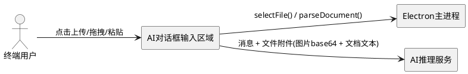
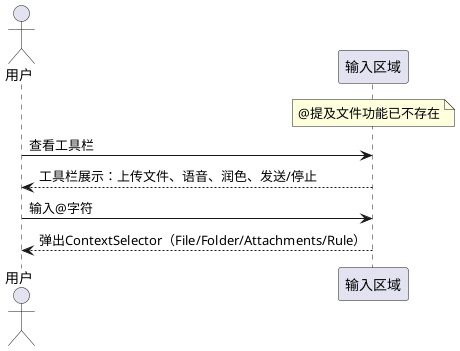
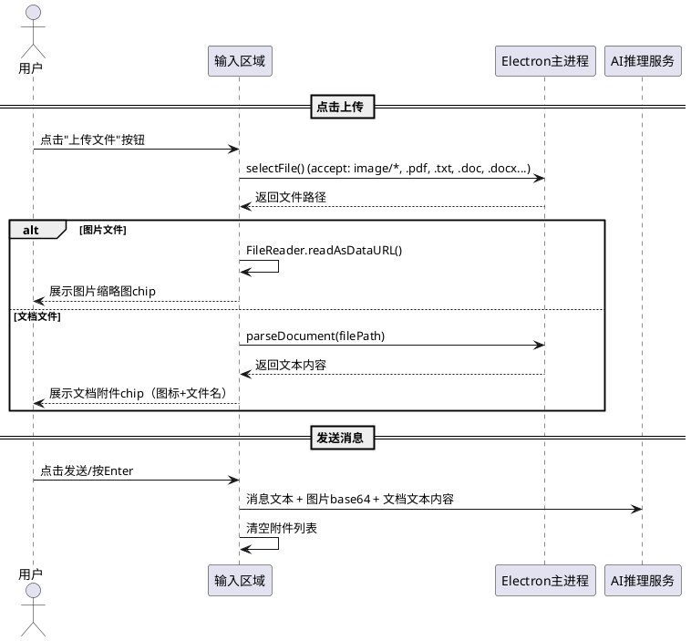
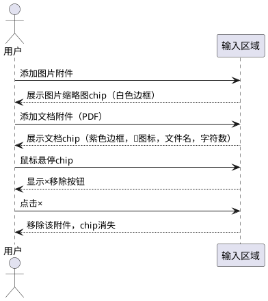

# **1. 组件定位**

## **1.1 核心职责**

本组件负责改造AI对话框输入区域，移除@提及文件功能并将图片上传扩展为通用文件上传，实现对PDF、TXT、DOC/DOCX等文档文件的直接附件支持。

## **1.2 核心输入**

1. 用户点击工具栏上传按钮：触发文件选择对话框
2. 用户拖拽文件到输入区域：触发拖放文件处理
3. 用户粘贴文件（截图或文件复制粘贴）：触发粘贴文件处理
4. 用户在文本框输入@字符：触发上下文选择器（保留，但不包含"提及文件"独立路径）
5. 用户移除已附加文件：触发附件删除操作

## **1.3 核心输出**

1. 已附加文件列表：以chip形式展示在输入区域上方
2. 发送消息时携带文件附件：文件内容（base64或解析后文本）作为消息上下文传递给AI
3. 文件解析结果：文档类文件解析为文本内容供AI理解

## **1.4 职责边界**

1. 本组件不负责文件内容的AI分析逻辑，仅负责文件的收集、展示和传递
2. 本组件不负责@上下文选择器的文件/文件夹/规则选择功能（ContextSelector独立负责）
3. 本组件不负责文件在磁盘上的读写操作（由Electron主进程负责）
4. 本组件不负责已移除的useFileMentions hook的任何残留逻辑

# **2. 领域术语**

**通用文件附件（File Attachment）**
: 用户通过上传、拖拽或粘贴方式添加到AI对话框输入区域的文件，包括图片文件和文档文件，作为AI对话的上下文输入。

**文档文件（Document File）**
: 非图片类的文本内容文件，包括PDF、TXT、Markdown（MD）、Word（DOC/DOCX）、Excel（XLS/XLSX）等格式，需要解析为文本后供AI理解。

**图片文件（Image File）**
: PNG、JPG、JPEG、GIF、WebP、SVG、BMP等格式的视觉文件，以base64编码方式作为视觉上下文传递给多模态AI。

**附件Chip（Attachment Chip）**
: 在输入区域上方以小标签形式展示的已附加文件缩略信息，支持单击移除。

**@提及文件（@ File Mention）**
: 通过在文本框输入@符号触发的文件提及功能，将文件路径以文本形式注入消息。此功能在本需求中将被移除。

**上下文选择器（Context Selector）**
: 通过@触发的高级选择面板，支持文件搜索、文件夹浏览、附件添加和规则选择，此功能保留。

# **3. 角色与边界**

## **3.1 核心角色**

- **终端用户**：通过AI对话框与AI交互的人，使用文件上传功能添加附件，使用@上下文选择器添加上下文

## **3.2 外部系统**

- **Electron主进程**：提供文件选择对话框（`electronAPI.fs.selectFile`）、文档解析（`electronAPI.context.parseDocument`）
- **AI推理服务**：接收包含文件附件的消息，处理图片（多模态）和文档（文本上下文）

## **3.3 交互上下文**

# **4. DFX约束**

## **4.1 性能**

1. 单个文件上传后的Chip展示响应时间不超过500ms
2. 文档文件解析（PDF/DOCX等）进度应有明确的加载状态反馈
3. 单次发送的文件附件总大小不超过50MB

## **4.2 可靠性**

1. 文件选择对话框取消时，输入区域状态不变
2. 不支持的文件格式选择后，应给出明确的格式限制提示
3. 文件解析失败时，附件仍保留（展示文件名），但标注解析失败状态

## **4.3 安全性**

1. 文件内容仅在本地处理，不上传至任何外部云服务
2. 图片文件以base64形式在进程间传递，不写入临时文件

## **4.4 可维护性**

1. 移除useFileMentions后，相关import和引用必须全部清理
2. 新的通用文件上传逻辑应复用现有的ContextSelector附件体系（AttachmentPanel），避免重复实现

## **4.5 兼容性**

1. 改造后的输入区域UI布局和交互模式应与现有设计语言保持一致（暗色主题、霓虹光效）
2. 拖拽和粘贴文件的现有行为不应被破坏

# **5. 核心能力**

## **5.1 移除@提及文件功能**

### **5.1.1 业务规则**

1. **移除useFileMentions hook**：useFileMentions hook及其所有引用必须从代码中完全移除

   a. 验收条件：When 代码中搜索"useFileMentions"，the 系统应无任何引用结果

2. **移除InputToolbar的onMention按钮**：工具栏中独立的@提及文件按钮必须移除

   a. 验收条件：When 用户查看输入工具栏，the 系统应不展示@提及文件按钮

3. **移除ContextChips的files属性**：ContextChips组件中基于mentionedFiles的文件chip展示必须移除

   a. 验收条件：When 用户在输入区域添加上下文，the ContextChips应不展示以@前缀标注的提及文件chip

4. **保留ContextSelector的@触发**：通过文本框输入@字符触发上下文选择器（文件搜索、文件夹、附件、规则）的功能必须保留

   a. 验收条件：When 用户在文本框输入@字符，the 上下文选择器应正常弹出，包含File/Folder/Attachments/Rule四个标签页

5. **移除InputToolbar的onMention回调**：InputToolbar组件的onMention prop及相关的按钮渲染逻辑必须移除

   a. 验收条件：When InputToolbar组件被渲染，the 组件应不接受onMention属性

6. **清理placeholder中的@提及提示**：文本框placeholder中"(@ 添加上下文"提示文本应调整为更通用的描述

   a. 验收条件：When 用户查看空文本框，the placeholder应不包含对@提及文件功能的单独提示

### **5.1.2 交互流程**

### **5.1.3 异常场景**

1. **残留引用检测**

   a. 触发条件：代码中仍存在对useFileMentions的import或调用

   b. 系统行为：编译失败

   c. 用户感知：构建报错，提示未定义的引用

## **5.2 通用文件上传改造**

### **5.2.1 业务规则**

1. **替换图片上传为文件上传按钮**：InputToolbar中原"上传图片"按钮改造为"上传文件"按钮，图标和tooltip相应更新

   a. 验收条件：When 用户查看输入工具栏，the 系统应展示"上传文件"按钮（使用文件/回形针图标）

2. **文件选择对话框支持多格式**：点击上传文件按钮触发的文件选择对话框必须支持图片和文档文件格式

   a. 验收条件：When 用户点击上传文件按钮，the 文件选择对话框的accept过滤器应包含image/*、.pdf、.txt、.md、.doc、.docx、.xls、.xlsx

3. **图片文件处理**：用户上传的图片文件仍按现有逻辑以base64 DataURL方式读取和展示

   a. 验收条件：When 用户上传PNG/JPG等图片文件，the 系统应以缩略图chip展示，并以base64编码随消息发送

4. **文档文件处理**：用户上传的PDF/TXT/DOC/DOCX等文档文件必须解析为文本内容

   a. 验收条件：When 用户上传PDF文件，the 系统应调用electronAPI.context.parseDocument解析文件内容，解析成功后以附件chip展示

5. **文档文件解析状态**：文档文件解析过程中必须展示加载状态，解析完成后展示文件名和内容摘要

   a. 验收条件：While 文档文件正在解析，the 系统应在对应chip上展示"解析中..."状态标识

6. **隐藏文件输入框扩展**：隐藏的`<input type="file">`元素的accept属性必须从`image/*`扩展为包含所有支持的文件格式

   a. 验收条件：When 检查隐藏文件输入框的accept属性，the 属性值应包含图片和文档格式的通配符

7. **文件附件chip统一展示**：图片和文档附件统一在输入区域上方以chip形式展示，图片显示缩略图，文档显示文件名和格式图标

   a. 验收条件：When 用户添加图片附件，the chip应展示缩略图预览；When 用户添加文档附件，the chip应展示格式图标+文件名

8. **单文件移除**：每个附件chip必须支持单独移除操作

   a. 验收条件：When 用户点击附件chip的移除按钮，the 该附件应从列表中移除

9. **发送时携带附件**：发送消息时，所有已附加的文件（图片以base64、文档以解析文本）必须作为消息上下文一起发送

   a. 验收条件：When 用户发送包含文件附件的消息，the AI请求应包含图片的base64数据和文档的文本内容

10. **发送后清空附件**：消息发送成功后，已附加的文件列表必须清空

    a. 验收条件：When 消息发送成功，the 输入区域的附件chip列表应为空

11. **拖拽文件兼容**：拖拽文件到输入区域的现有行为必须保持，图片走图片流程，文档走文档解析流程

    a. 验收条件：When 用户拖拽PDF文件到输入区域，the 系统应触发文档解析并添加为附件

12. **粘贴文件兼容**：粘贴文件（截图或文件复制粘贴）的现有行为必须保持

    a. 验收条件：When 用户粘贴截图，the 系统应添加为图片附件

### **5.2.2 交互流程**

### **5.2.3 异常场景**

1. **不支持的文件格式**

   a. 触发条件：用户通过文件选择对话框选择了不支持格式的文件（如.exe、.zip）

   b. 系统行为：文件选择对话框的accept过滤器阻止选择，若绕过选择则忽略该文件

   c. 用户感知：不支持的文件不会出现在附件列表中

2. **文档解析失败**

   a. 触发条件：PDF或DOCX文件损坏或格式异常，parseDocument返回错误

   b. 系统行为：保留附件chip，标注解析失败状态，文件名仍可展示

   c. 用户感知：chip显示"解析失败"标识，文件名可正常展示

3. **文件过大**

   a. 触发条件：单个文件或单次发送的总附件大小超过50MB限制

   b. 系统行为：拒绝添加，展示文件大小超限提示

   c. 用户感知：提示"文件大小超过限制（最大50MB）"

4. **文件选择取消**

   a. 触发条件：用户在文件选择对话框中点击取消

   b. 系统行为：不做任何操作，输入区域状态不变

   c. 用户感知：无任何变化

## **5.3 附件Chip展示与交互**

### **5.3.1 业务规则**

1. **图片附件chip样式**：图片附件chip必须展示缩略图预览、文件名和移除按钮

   a. 验收条件：When 图片附件chip被渲染，the chip应包含缩略图、截断文件名和×移除按钮

2. **文档附件chip样式**：文档附件chip必须展示格式图标、文件名、内容长度摘要和移除按钮

   a. 验收条件：When 文档附件chip被渲染，the chip应包含格式对应图标、文件名、字符数摘要和×移除按钮

3. **chip颜色区分**：不同类型附件chip应使用不同的颜色风格以便视觉区分

   a. 验收条件：When 图片附件chip展示，the 使用白色/默认边框；When 文档附件chip展示，the 使用紫色边框和背景

4. **chip悬停交互**：chip的移除按钮仅在鼠标悬停时显示

   a. 验收条件：While 鼠标未悬停在chip上，the 移除按钮应不可见；When 鼠标悬停在chip上，the 移除按钮应可见

### **5.3.2 交互流程**

### **5.3.3 异常场景**

1. **附件列表过长**

   a. 触发条件：用户添加大量附件导致chip区域溢出

   b. 系统行为：chip区域自动换行展示（flex-wrap），不限制附件数量（受总大小限制约束）

   c. 用户感知：附件chip自动换行排列，输入框自然下移

# **6. 数据约束**

## **6.1 附件文件对象**

1. **name**：文件名，必须为非空字符串，从文件路径中提取
2. **type**：文件类型，取值范围为"image"（图片附件）或"document"（文档附件）
3. **dataUrl**：图片文件的base64 DataURL，仅图片类型必填，格式为`data:<mediaType>;base64,<data>`
4. **content**：文档文件的解析文本内容，仅文档类型填写，解析失败时可为空
5. **path**：文件在本地磁盘的绝对路径，必须为非空字符串
6. **parseStatus**：文档解析状态，取值范围为"pending"（等待解析）、"parsing"（解析中）、"success"（解析成功）、"failed"（解析失败），仅文档类型使用

## **6.2 支持的文件格式**

1. **图片格式**：PNG（.png）、JPEG（.jpg/.jpeg）、GIF（.gif）、WebP（.webp）、SVG（.svg）、BMP（.bmp）
2. **文档格式**：PDF（.pdf）、纯文本（.txt）、Markdown（.md）、Word文档（.doc/.docx）、Excel表格（.xls/.xlsx）
3. **文件大小上限**：单次发送的附件总大小不超过50MB
