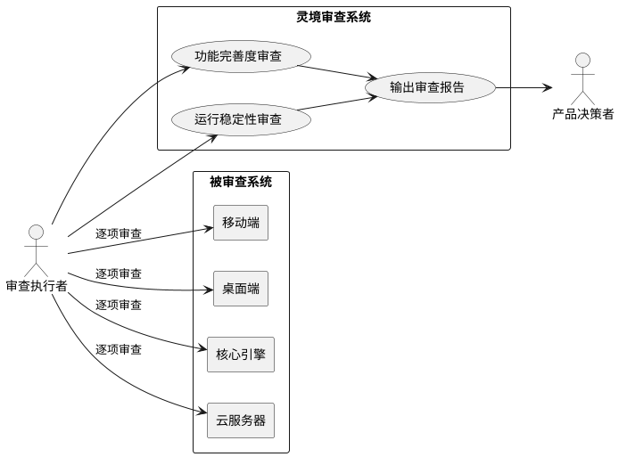
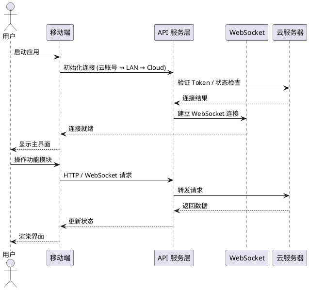
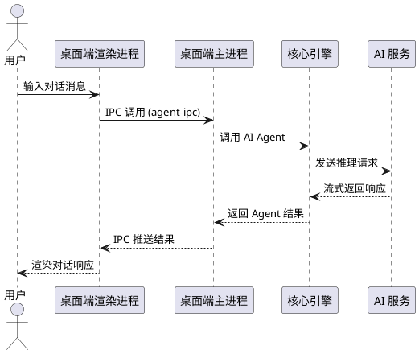
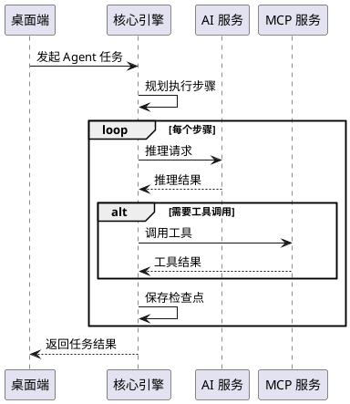
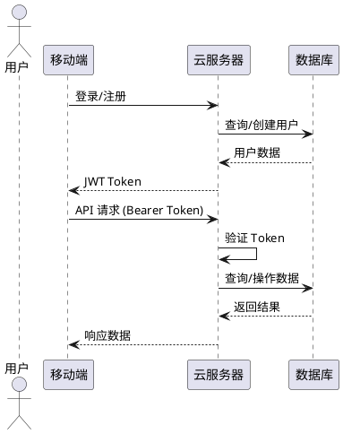
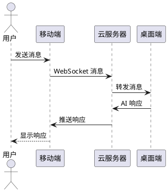

# **1. 组件定位**

## **1.1 核心职责**

本组件负责对灵境IDE已开发完成的功能进行全面审查评估，输出功能完善度与运行稳定性的审查报告。

## **1.2 核心输入**

1. 灵境IDE项目源代码（移动端 React Native + Expo、桌面端 Electron + React、核心引擎 @codepilot/core、云服务器 cloud-server）
2. 已部署服务的运行时状态（WebSocket 连接、HTTP API 可用性、数据库读写）
3. 用户操作场景与边界条件定义

## **1.3 核心输出**

1. 功能完善度审查报告：逐项评估每个功能是否完整实现预期需求，标识缺失业务逻辑、未覆盖边界情况及用户体验缺陷
2. 运行稳定性审查报告：逐项验证每个功能是否可正常执行，标识潜在报错、性能问题及异常输入处理不当
3. 汇总优化建议清单：针对每个已开发功能的审查结论与对应优化建议

## **1.4 职责边界**

1. 本组件不负责修复代码缺陷，仅输出审查结论与建议
2. 本组件不负责新增功能的开发工作
3. 本组件不负责对第三方依赖库的内部实现进行审查
4. 本组件不负责对构建脚本和部署脚本的业务逻辑审查

# **2. 领域术语**

**功能完善度**
: 指每个已开发功能是否完整实现了预期需求，包括业务逻辑完整性、边界情况覆盖度、用户体验完备性三个维度。

**运行稳定性**
: 指每个已开发功能是否可以正常执行，包括核心流程通畅性、潜在报错、性能瓶颈、异常输入处理四个维度。

**审查结论**
: 对某个功能模块在功能完善度和运行稳定性两个维度的评估结果，取值为"通过"、"部分通过"或"不通过"。

**审查报告**
: 包含所有已开发功能模块审查结论及优化建议的结构化文档。

**移动端**
: 基于 React Native + Expo 构建的 iOS/Android 客户端，包含对话、任务、计划、文件、定时、设置六大功能模块。

**桌面端**
: 基于 Electron + React 构建的桌面应用，包含编辑器、终端、Git、AI 对话、任务看板等核心功能。

**核心引擎**
: @codepilot/core 包，提供 AI Agent 模式、自动修复、检查点、补全、上下文、融合、意图识别、MCP、多文件编辑、流水线、项目管理、代码审查、规则、安全、语音等核心能力。

**云服务器**
: cloud-server，提供认证鉴权、订阅管理、支付、设备管理、推送通知、Webhook、定时任务调度等后端服务。

**连接模式**
: 移动端与后端的连接方式，包括 LAN 直连、Cloud 云中转、Cloud Account 云账号三种模式。

**EARS 格式**
: Easy Approach to Requirements Syntax，用于编写可测试验收条件的需求语法规范。

# **3. 角色与边界**

## **3.1 核心角色**

- **审查执行者**：负责逐项检查功能模块的功能完善度与运行稳定性，输出审查结论
- **产品决策者**：根据审查报告决定优化优先级与排期

## **3.2 外部系统**

- **灵境IDE 移动端**：被审查的前端应用
- **灵境IDE 桌面端**：被审查的桌面应用
- **@codepilot/core 核心引擎**：被审查的核心能力模块
- **cloud-server 云服务器**：被审查的后端服务

## **3.3 交互上下文**

# **4. DFX约束**

## **4.1 性能**

1. 审查执行时间应在可接受范围内，单个功能模块审查不超过30分钟
2. 审查报告生成时间不超过5分钟

## **4.2 可靠性**

1. 审查结论必须基于代码分析与运行验证双重证据
2. 每条审查结论必须可追溯至具体代码位置或运行时现象

## **4.3 安全性**

1. 审查过程中不得修改任何源代码
2. 审查过程中不得泄露用户敏感数据

## **4.4 可维护性**

1. 审查报告必须按统一格式输出
2. 审查项必须与功能模块一一对应，便于后续跟踪

## **4.5 兼容性**

1. 审查范围覆盖移动端（iOS/Android）、桌面端（Windows/Linux）、云服务器全平台

# **5. 核心能力**

## **5.1 移动端功能审查**

### **5.1.1 业务规则**

1. **登录/注册功能完整性**：移动端必须支持云账号登录与注册两种模式，且输入校验必须覆盖空值、格式错误、服务端错误码映射
   a. 验收条件：[用户提交空用户名或密码] → [系统显示"用户名和密码不能为空"]
   b. 验收条件：[用户注册时密码不足6位] → [系统显示"密码长度至少6位"]
   c. 验收条件：[服务端返回 invalid_credentials] → [系统显示"用户名或密码错误，请检查后重试"]
   d. 验收条件：[服务端返回 username_exists] → [系统显示"该用户名已被注册"]

2. **设备配对功能完整性**：移动端必须支持 LAN 直连与 Cloud 云中转两种通道，且通道尝试状态必须可视化呈现
   a. 验收条件：[用户输入 Token 和 IP 后点击连接] → [系统依次尝试 LAN 和 Cloud 通道]
   b. 验收条件：[LAN 连接成功] → [系统显示"已通过局域网连接"]
   c. 验收条件：[所有通道连接失败] → [系统显示包含 LAN/Cloud 状态的失败详情]

3. **对话功能完整性**：移动端对话功能必须支持消息列表加载、消息发送、实时推送接收和发送失败处理
   a. 验收条件：[用户进入对话列表页] → [系统加载并显示历史对话列表]
   b. 验收条件：[用户点击对话项] → [系统导航至对话详情并加载历史消息]
   c. 验收条件：[用户发送消息时 WebSocket 已连接] → [系统通过 WebSocket 发送消息]
   d. 验收条件：[用户发送消息时 WebSocket 未连接] → [系统通过 HTTP API 发送消息]
   e. 验收条件：[消息发送失败] → [系统显示"发送失败"提示并将失败消息标记为 system 角色]
   f. 验收条件：[WebSocket 推送新消息] → [系统实时追加消息并自动滚动到底部]

4. **任务看板功能完整性**：移动端任务功能必须支持任务列表加载、按状态分组展示和刷新
   a. 验收条件：[用户进入任务页] → [系统加载任务并按 idle/running/completed/failed 分组展示]
   b. 验收条件：[服务端返回的任务数据为非数组类型] → [系统应安全处理不崩溃]

5. **计划功能完整性**：移动端计划功能必须支持计划列表加载、展开详情查看目标和步骤
   a. 验收条件：[用户进入计划页] → [系统加载并显示计划列表]
   b. 验收条件：[用户点击计划展开] → [系统加载计划详情并显示目标与步骤]
   c. 验收条件：[用户再次点击已展开的计划] → [系统收起计划详情]

6. **文件浏览功能完整性**：移动端文件浏览器必须支持目录浏览、面包屑导航、文件类型图标识别
   a. 验收条件：[用户进入文件页] → [系统通过 WebSocket 加载根目录文件列表]
   b. 验收条件：[用户点击目录] → [系统展开该目录并更新面包屑路径]
   c. 验收条件：[用户点击上级导航] → [系统返回上级目录]
   d. 验收条件：[WebSocket 未连接时浏览文件] → [系统应显示连接错误而非崩溃]

7. **定时任务功能完整性**：移动端定时任务必须支持列表加载、手动触发和删除操作
   a. 验收条件：[用户进入定时任务页] → [系统加载并显示定时任务列表]
   b. 验收条件：[用户点击"执行"] → [系统确认后触发定时任务]
   c. 验收条件：[用户点击"删除"] → [系统确认后删除定时任务并更新列表]

8. **设置功能完整性**：设置页必须支持连接状态展示、设备信息展示、Token/IP 配置、云账号登录/退出
   a. 验收条件：[用户修改 Token 和 IP 并保存] → [系统尝试 LAN 和 Cloud 连接并更新状态]
   b. 验收条件：[用户点击退出登录] → [系统弹出确认框后清除认证状态]
   c. 验收条件：[云账号模式下] → [系统显示用户信息、订阅管理入口和退出按钮]

9. **订阅管理功能完整性**：订阅管理页必须支持套餐展示、用量配额、购买/升级/降级操作和支付记录
   a. 验收条件：[用户进入订阅页] → [系统加载当前订阅信息、套餐列表和支付记录]
   b. 验收条件：[用户点击非当前套餐] → [系统根据是否有活跃订阅执行购买/升级/降级流程]
   c. 验收条件：[用户点击免费套餐] → [系统提示"免费版无需购买，直接使用即可"]
   d. 验收条件：[用户点击当前套餐] → [系统提示"您当前已订阅该套餐"]

10. **连接初始化流程完整性**：应用启动必须按优先级尝试云账号认证 → 局域网配对连接 → 云中转连接 → 显示登录页
    a. 验收条件：[存在有效云账号 Token] → [系统自动验证并进入云账号模式]
    b. 验收条件：[云账号 Token 失效] → [系统回退到登录页]
    c. 验收条件：[存在配对 Token 且 LAN 可达] → [系统自动连接局域网模式]
    d. 验收条件：[无任何有效凭证] → [系统显示登录页]

11. **禁止项**：移动端不得在未连接状态下崩溃或白屏
    a. 验收条件：[应用启动时所有连接通道均失败] → [系统显示登录页而非崩溃]

### **5.1.2 交互流程**

### **5.1.3 异常场景**

1. **网络断开异常**
   a. 触发条件：用户操作时网络突然断开
   b. 系统行为：WebSocket 自动检测断开并启动重连（3秒间隔），HTTP 请求抛出错误
   c. 用户感知：顶部连接状态栏显示"未连接"，发送消息时显示"发送失败"提示

2. **Token 过期异常**
   a. 触发条件：存储的 Token 在服务端已失效
   b. 系统行为：服务端返回认证失败，移动端应引导用户重新登录
   c. 用户感知：显示登录页

3. **WebSocket 重连风暴异常**
   a. 触发条件：网络不稳定导致 WebSocket 频繁断开重连
   b. 系统行为：固定3秒间隔重连，无指数退避
   c. 用户感知：连接状态栏频繁切换，可能影响操作体验

4. **服务端返回非预期数据格式异常**
   a. 触发条件：API 返回数据结构与前端预期不一致（如任务数据非数组）
   b. 系统行为：前端应进行类型检查和安全降级
   c. 用户感知：显示空状态而非崩溃

5. **ErrorBoundary 捕获异常**
   a. 触发条件：React 组件渲染过程中抛出未捕获错误
   b. 系统行为：ErrorBoundary 捕获错误并显示重试界面
   c. 用户感知：显示错误信息和重试按钮

## **5.2 桌面端功能审查**

### **5.2.1 业务规则**

1. **AI 对话功能完整性**：桌面端必须支持多轮对话、代码上下文关联、Agent 模式切换、Expert 画布、模型选择
   a. 验收条件：[用户在对话面板输入消息] → [系统将消息发送至 AI 引擎并流式返回响应]
   b. 验收条件：[用户切换 Agent 模式] → [系统以 Agent 模式执行多步骤任务]
   c. 验收条件：[用户打开 Expert 画布] → [系统展示多专家协作状态与结果]
   d. 验收条件：[用户选择不同模型] → [系统使用选定模型进行推理]

2. **任务系统（Quest）完整性**：桌面端必须支持任务创建、执行、状态追踪、Diff 审查和确认
   a. 验收条件：[用户创建任务] → [系统在任务看板中创建新任务并设为 idle 状态]
   b. 验收条件：[任务执行完成] → [系统更新状态为 completed 并展示 Diff]
   c. 验收条件：[用户审查 Diff 后确认] → [系统应用代码变更]
   d. 验收条件：[用户审查 Diff 后拒绝] → [系统放弃代码变更]

3. **代码编辑器完整性**：桌面端必须支持 Monaco 编辑器、多文件编辑、内联对话、代码补全
   a. 验收条件：[用户在编辑器中选中文本并触发内联对话] → [系统在编辑器内展示对话面板]
   b. 验收条件：[用户输入代码时] → [系统提供 AI 驱动的代码补全建议]

4. **终端功能完整性**：桌面端必须支持集成终端（xterm.js）和终端命令建议
   a. 验收条件：[用户打开终端面板] → [系统启动 xterm.js 终端实例]
   b. 验收条件：[用户在终端输入命令] → [系统提供智能命令建议]

5. **Git/GitHub 集成完整性**：桌面端必须支持 Git 操作、GitHub PR 管理、代码审查
   a. 验收条件：[用户打开 Git 面板] → [系统展示仓库状态、变更文件列表]
   b. 验收条件：[用户打开 GitHub 面板] → [系统展示 PR 列表与审查入口]

6. **文件浏览器完整性**：桌面端必须支持项目文件树浏览、文件搜索、上下文管理
   a. 验收条件：[用户在侧栏打开文件浏览器] → [系统展示项目文件树]
   b. 验收条件：[用户触发全局搜索] → [系统展示搜索结果列表]

7. **MCP（Model Context Protocol）集成完整性**：桌面端必须支持 MCP 服务连接、工具注册与调用
   a. 验收条件：[用户配置 MCP 服务] → [系统连接 MCP 服务并注册可用工具]
   b. 验收条件：[AI 调用 MCP 工具] → [系统执行工具并返回结果]

8. **流水线/工作流完整性**：桌面端必须支持流水线编排与工作流自动化
   a. 验收条件：[用户创建流水线] → [系统保存流水线定义并可执行]
   b. 验收条件：[流水线执行] → [系统按步骤依次执行并展示进度]

9. **安全管理完整性**：桌面端必须支持安全扫描、漏洞检测与审查
   a. 验收条件：[用户触发安全扫描] → [系统扫描代码并报告安全漏洞]

10. **语音交互完整性**：桌面端必须支持语音输入、语音会话状态机
    a. 验收条件：[用户启用语音输入] → [系统捕获语音并转换为文本输入]

11. **Fusion 融合模式完整性**：桌面端必须支持 Fusion 融合交互模式
    a. 验收条件：[用户启用 Fusion 模式] → [系统进入融合交互状态]

12. **禁止项**：桌面端不得在 IPC 通信异常时崩溃
    a. 验收条件：[IPC 通道通信失败] → [系统显示错误提示而非崩溃]

### **5.2.2 交互流程**

### **5.2.3 异常场景**

1. **IPC 通信超时异常**
   a. 触发条件：渲染进程与主进程之间的 IPC 通信超时
   b. 系统行为：应设置超时机制并返回错误信息
   c. 用户感知：显示操作超时提示

2. **AI 服务不可用异常**
   a. 触发条件：AI 服务连接失败或返回错误
   b. 系统行为：应捕获错误并提示用户
   c. 用户感知：显示"AI 服务暂时不可用"提示

3. **主进程未捕获异常**
   a. 触发条件：Electron 主进程中出现未捕获异常
   b. 系统行为：应通过 process.on('uncaughtException') 捕获并记录
   c. 用户感知：显示错误对话框而非应用崩溃

4. **数据库读写异常**
   a. 触发条件：SQLite 数据库文件损坏或读写失败
   b. 系统行为：应捕获异常并尝试恢复或重建数据库
   c. 用户感知：显示数据加载失败提示

## **5.3 核心引擎功能审查**

### **5.3.1 业务规则**

1. **Agent 模式完整性**：核心引擎必须支持自主规划、多步骤执行、工具调用、自动修复
   a. 验收条件：[Agent 接收任务] → [系统自动规划步骤并逐步执行]
   b. 验收条件：[Agent 遇到代码错误] → [系统触发自动修复流程]

2. **检查点功能完整性**：核心引擎必须支持会话检查点保存与恢复
   a. 验收条件：[Agent 执行步骤前] → [系统保存检查点]
   b. 验收条件：[任务执行失败后用户选择回滚] → [系统恢复至最近检查点]

3. **上下文管理完整性**：核心引擎必须支持代码上下文收集、索引、检索和上下文计量
   a. 验收条件：[用户发起对话] → [系统自动收集相关代码上下文]
   b. 验收条件：[上下文超出 Token 限制] → [系统按优先级裁剪上下文]

4. **MCP 集成完整性**：核心引擎必须支持 MCP 协议连接、工具发现与调用
   a. 验收条件：[配置 MCP 服务端] → [系统连接并发现可用工具]
   b. 验收条件：[Agent 调用 MCP 工具] → [系统执行远程工具并返回结果]

5. **多文件编辑完整性**：核心引擎必须支持跨文件编辑、变更追踪与 Diff 生成
   a. 验收条件：[Agent 修改多个文件] → [系统生成多文件 Diff 并支持审查]

6. **代码审查功能完整性**：核心引擎必须支持代码审查报告生成与审查意见追踪
   a. 验收条件：[用户触发代码审查] → [系统生成审查报告含问题列表与建议]

7. **安全扫描完整性**：核心引擎必须支持代码安全扫描与漏洞检测
   a. 验收条件：[用户触发安全扫描] → [系统返回安全漏洞列表与修复建议]

8. **项目管理完整性**：核心引擎必须支持项目规则、配置管理与约束检查
   a. 验收条件：[项目包含规则配置] → [系统在执行过程中遵守项目规则约束]

9. **禁止项**：核心引擎不得在工具调用失败时中断整个 Agent 流程
   a. 验收条件：[工具调用抛出异常] → [系统记录错误并继续或优雅降级]

### **5.3.2 交互流程**

### **5.3.3 异常场景**

1. **AI 推理超时异常**
   a. 触发条件：AI 服务响应时间超过预设阈值
   b. 系统行为：应设置超时并返回部分结果
   c. 用户感知：显示"推理超时"提示，已获取的部分结果仍可用

2. **MCP 工具调用失败异常**
   a. 触发条件：MCP 服务不可用或工具执行出错
   b. 系统行为：应记录错误并尝试替代方案或跳过该步骤
   c. 用户感知：显示工具调用失败提示，Agent 流程继续

3. **Token 计数溢出异常**
   a. 触发条件：上下文 Token 数超过模型限制
   b. 系统行为：应按优先级裁剪上下文
   c. 用户感知：显示上下文计量条警告

## **5.4 云服务器功能审查**

### **5.4.1 业务规则**

1. **认证鉴权功能完整性**：云服务器必须支持设备注册、Token 验证、云账号登录/注册、JWT 鉴权
   a. 验收条件：[设备发送注册请求] → [系统返回 JWT Token 和设备 ID]
   b. 验收条件：[携带有效 Token 的请求] → [系统通过鉴权并处理请求]
   c. 验收条件：[携带无效 Token 的请求] → [系统返回 401 Unauthorized]

2. **订阅管理功能完整性**：云服务器必须支持套餐查询、订阅创建/升级/降级、用量统计
   a. 验收条件：[用户查询订阅信息] → [系统返回当前订阅状态与用量配额]
   b. 验收条件：[用户升级套餐] → [系统更新订阅并重新计算用量限额]

3. **支付功能完整性**：云服务器必须支持支付订单创建、确认、查询
   a. 验收条件：[用户创建支付订单] → [系统生成订单号并返回]
   b. 验收条件：[用户确认支付] → [系统激活订阅]

4. **设备管理功能完整性**：云服务器必须支持设备注册、心跳上报、设备列表查询
   a. 验收条件：[设备发送心跳] → [系统更新设备在线状态]
   b. 验收条件：[用户查询设备列表] → [系统返回所有已注册设备]

5. **推送通知功能完整性**：云服务器必须支持 Push Token 注册与通知推送
   a. 验收条件：[移动端注册 Push Token] → [系统保存 Token 并可用于后续推送]

6. **定时任务功能完整性**：云服务器必须支持定时任务的 CRUD、手动触发、执行日志查询
   a. 验收条件：[创建定时任务] → [系统保存 Cron 表达式和动作配置]
   b. 验收条件：[手动触发定时任务] → [系统立即执行动作并记录日志]

7. **Webhook 功能完整性**：云服务器必须支持 Webhook 接收与转发
   a. 验收条件：[外部系统发送 Webhook] → [系统接收并根据频道转发]

8. **管理后台功能完整性**：云服务器必须支持管理员用户管理、系统配置、数据统计
   a. 验收条件：[管理员登录后台] → [系统展示用户列表、系统状态与统计数据]

9. **禁止项**：云服务器不得在数据库连接异常时静默丢弃请求
   a. 验收条件：[数据库连接断开] → [系统返回 503 Service Unavailable]

### **5.4.2 交互流程**

### **5.4.3 异常场景**

1. **数据库连接异常**
   a. 触发条件：数据库服务不可达或连接池耗尽
   b. 系统行为：应返回 503 错误码并记录日志
   c. 用户感知：显示"服务暂时不可用"提示

2. **JWT Token 过期异常**
   a. 触发条件：请求携带的 JWT Token 已过期
   b. 系统行为：应返回 401 错误码
   c. 用户感知：移动端引导用户重新登录

3. **并发支付异常**
   a. 触发条件：用户同时对同一订单发起多次支付确认
   b. 系统行为：应使用幂等机制确保只处理一次
   c. 用户感知：第二次请求返回"订单已处理"

4. **Cron 表达式无效异常**
   a. 触发条件：创建定时任务时传入无效 Cron 表达式
   b. 系统行为：应校验表达式格式并返回错误
   c. 用户感知：显示"无效的 Cron 表达式"提示

## **5.5 跨端协作审查**

### **5.5.1 业务规则**

1. **移动端-桌面端数据同步完整性**：移动端与桌面端必须通过 WebSocket 实现双向实时通信
   a. 验收条件：[桌面端更新对话消息] → [移动端通过 WebSocket 实时接收推送]
   b. 验收条件：[移动端发送对话消息] → [桌面端实时接收并处理]

2. **连接状态一致性**：移动端与后端的连接状态必须在 UI 层和 Store 层保持一致
   a. 验收条件：[WebSocket 连接建立] → [ConnectionBanner 显示"已连接"且 Store 中 connected 为 true]
   b. 验收条件：[WebSocket 连接断开] → [ConnectionBanner 显示"未连接"且 Store 中 connected 为 false]

3. **认证状态持久化完整性**：移动端必须将认证信息持久化至 AsyncStorage，并在应用重启后自动恢复
   a. 验收条件：[用户登录成功后关闭应用] → [重新打开应用时自动验证 Token 并进入已登录状态]
   b. 验收条件：[持久化 Token 验证失败] → [清除持久化数据并显示登录页]

4. **禁止项**：移动端不得在桌面端离线时阻塞用户操作
   a. 验收条件：[桌面端离线] → [移动端仍可浏览已加载的数据]

### **5.5.2 交互流程**

### **5.5.3 异常场景**

1. **跨端消息丢失异常**
   a. 触发条件：WebSocket 消息在传输过程中丢失
   b. 系统行为：应提供消息确认机制或允许手动刷新
   c. 用户感知：消息列表可能缺少最新消息，用户可下拉刷新

2. **连接模式切换异常**
   a. 触发条件：用户从 LAN 模式切换到 Cloud 模式时旧 WebSocket 未关闭
   b. 系统行为：应在连接新 WebSocket 前断开旧连接
   c. 用户感知：无重复消息或连接冲突

# **6. 数据约束**

## **6.1 会话（Session）**

1. **id**：唯一标识符，必须为非空字符串
2. **title**：会话标题，必须为非空字符串
3. **created_at**：创建时间，必须为 ISO 8601 格式
4. **updated_at**：更新时间，必须为 ISO 8601 格式
5. **last_message**：最后一条消息摘要，可选

## **6.2 消息（Message）**

1. **id**：消息唯一标识符，可选数字
2. **role**：消息角色，必须为 "user" | "assistant" | "tool" | "system" 之一
3. **content**：消息内容，必须为非空字符串
4. **tool_calls**：工具调用信息，可选对象
5. **created_at**：创建时间，必须为 ISO 8601 格式

## **6.3 任务（QuestTask）**

1. **id**：唯一标识符，必须为非空字符串
2. **title**：任务标题，必须为非空字符串
3. **status**：任务状态，必须为 "idle" | "running" | "completed" | "failed" | "cancelled" 之一
4. **scenario**：任务场景，必须为 "spec" | "design" | "implement" | "test" | "deploy" 之一
5. **created_at**：创建时间，必须为 ISO 8601 格式

## **6.4 计划（Plan）**

1. **id**：唯一标识符，必须为非空字符串
2. **title**：计划标题，必须为非空字符串
3. **description**：计划描述，必须为字符串
4. **status**：计划状态，必须为 "draft" | "reviewing" | "approved" | "executing" | "paused" | "completed" | "cancelled" 之一
5. **current_step**：当前步骤编号，必须为非负整数
6. **created_at**：创建时间，必须为 ISO 8601 格式
7. **updated_at**：更新时间，必须为 ISO 8601 格式

## **6.5 订阅信息（SubscriptionInfo）**

1. **id**：唯一标识符，必须为非空字符串
2. **plan_id**：套餐 ID，必须为非空字符串
3. **plan_name**：套餐名称，必须为非空字符串
4. **status**：订阅状态，必须为非空字符串
5. **started_at**：开始时间，必须为 ISO 8601 格式
6. **expires_at**：到期时间，必须为 ISO 8601 格式

## **6.6 定时任务（Schedule）**

1. **id**：唯一标识符，必须为非空字符串
2. **name**：任务名称，必须为非空字符串
3. **cron_expr**：Cron 表达式，必须为有效的 Cron 格式
4. **action_type**：动作类型，必须为 "http" | "shell" | "webhook" 之一
5. **status**：任务状态，必须为 "active" | "paused" | "error" | "inactive" 之一
6. **last_run**：上次执行时间，可为 null 或 ISO 8601 格式
7. **next_run**：下次执行时间，可为 null 或 ISO 8601 格式

## **6.7 用户信息（UserInfo）**

1. **id**：用户唯一标识符，必须为非空字符串
2. **username**：用户名，必须为非空字符串且至少2个字符
3. **email**：邮箱，必须为字符串
4. **avatar**：头像 URL，可选字符串
5. **registeredAt**：注册时间，可选 ISO 8601 格式

## **6.8 API 配置（ApiConfig）**

1. **baseUrl**：API 基础 URL，必须为有效的 HTTP/HTTPS URL
2. **token**：认证 Token，必须为字符串
3. **wsUrl**：WebSocket URL，必须为有效的 ws/wss URL
4. **apiKey**：API Key，可选字符串
