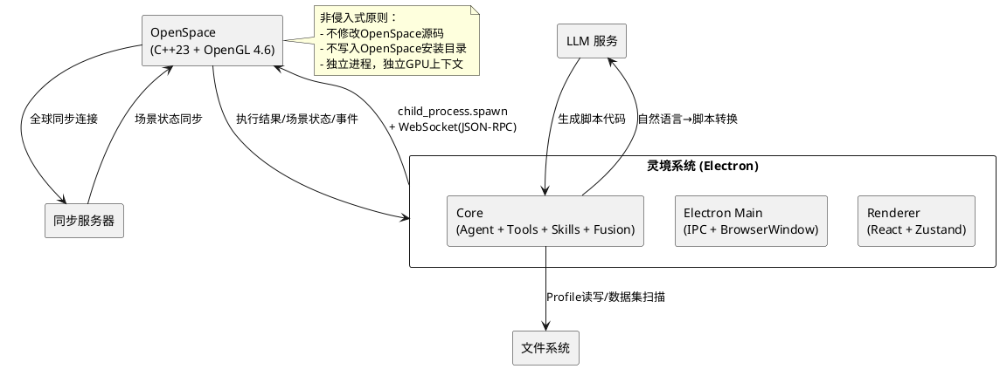
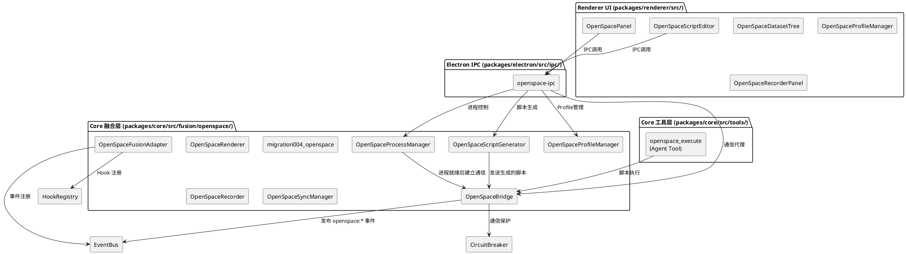
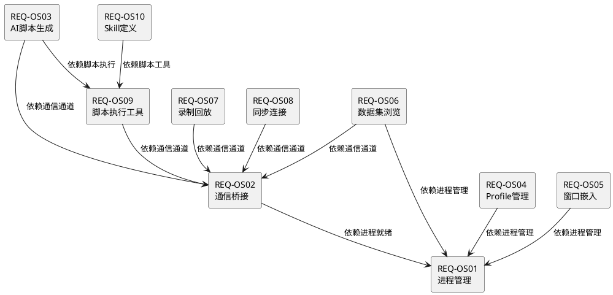
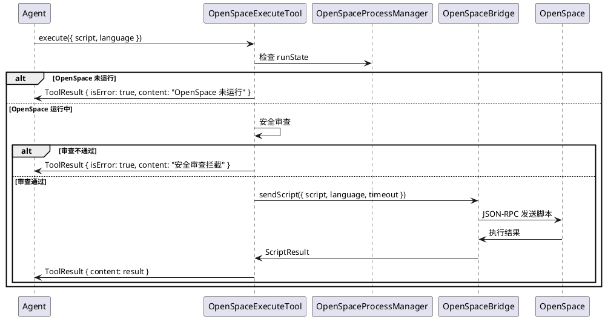

# **1. 实现模型**

## **1.1 上下文视图**

### 1.1.1 系统上下文

OpenSpace 以非侵入式进程级方式融合到灵境系统。灵境作为宿主应用，通过 `child_process.spawn` 启动 OpenSpace 子进程，并经由 WebSocket/stdio 双向通信协议进行交互。融合层位于灵境 Core 层的 `fusion` 基础设施之上，以适配器模式接入 EventBus 和 HookRegistry，不侵入灵境核心代码。



### 1.1.2 进程模型

| 维度 | 设计 |
|---|---|
| 进程关系 | 灵境 Electron 主进程 → `child_process.spawn` → OpenSpace 子进程 |
| 通信协议 | JSON-RPC over WebSocket（窗口模式优先）；stdio 回退（无头模式） |
| 窗口嵌入 | Electron BrowserWindow 通过 native window 句合或 child_window 嵌入 |
| 生命周期 | 灵境管理 OpenSpace 的启动/停止/健康检查/异常重启 |
| 隔离性 | OpenSpace 拥有独立内存空间和 OpenGL 渲染上下文，不共享 GPU 管线 |

### 1.1.3 与 Fusion 层集成策略

OpenSpace 融合层以适配器模式接入灵境已有的 fusion 基础设施：

| Fusion 基础设施 | OpenSpace 集成方式 |
|---|---|
| EventBus | 发布 `openspace:*` 系列事件主题，桥接 OpenSpace 内部事件到灵境事件总线 |
| HookRegistry | 注册 `before_openspace_execute` / `after_openspace_execute` 等 Hook，支持脚本执行前后的拦截与增强 |
| CircuitBreaker | 为 OpenSpace WebSocket 通信提供断路器保护，连续失败后自动熔断 |
| FusionInitializer | 在 FusionInitializer 初始化序列中追加 `openspace` 模块，支持启用/禁用/降级 |

---

## **1.2 服务/组件总体架构**

### 1.2.1 组件总览



### 1.2.2 依赖关系



---

## **1.3 实现设计文档**

### 1.3.1 OpenSpaceProcessManager — 进程生命周期管理

**文件位置**: `packages/core/src/fusion/openspace/process-manager.ts`

**职责**: 管理 OpenSpace 子进程的完整生命周期——安装检测、启动、健康检查、优雅停止。

#### 类型定义

```typescript
/** OpenSpace 安装检测结果 */
interface InstallationDetection {
  found: boolean;
  path: string | null;
  version: string | null;
  compatible: boolean;
  method: 'registry' | 'path' | 'manual' | 'common_dir' | null;
}

/** 进程启动配置 */
interface StartConfig {
  profilePath?: string;
  windowless?: boolean;
  syncConfig?: SyncConnectionConfig;
  additionalArgs?: string[];
}

/** 进程健康状态 */
type ProcessHealthStatus = 'healthy' | 'degraded' | 'unhealthy' | 'stopped';

/** 进程运行状态 */
type ProcessRunState = 'stopped' | 'starting' | 'running' | 'stopping' | 'failed';

/** 健康检查结果 */
interface HealthCheckResult {
  status: ProcessHealthStatus;
  processAlive: boolean;
  websocketConnected: boolean;
  lastResponseMs: number;
  uptime: number;
}

/** 进程管理器接口 */
interface IOpenSpaceProcessManager {
  readonly runState: ProcessRunState;
  readonly health: HealthCheckResult;
  detectInstallation(): Promise<InstallationDetection>;
  setManualPath(path: string): Promise<InstallationDetection>;
  start(config?: StartConfig): Promise<void>;
  stop(force?: boolean): Promise<void>;
  restart(config?: StartConfig): Promise<void>;
  onStateChange(handler: (state: ProcessRunState) => void): () => void;
}
```

#### 核心设计

| 方面 | 设计决策 |
|---|---|
| 安装路径检测 | Windows: 查询注册表 `HKLM\SOFTWARE\OpenSpace` → PATH 环境变量 → 常见路径 `C:\Program Files\OpenSpace`；Linux: `which openspace` → PATH → `/opt/openspace` |
| 子进程启动 | `child_process.spawn(execPath, args, { detached: false, stdio: ['pipe', 'pipe', 'pipe'] })`，收集 stdout/stderr 用于日志和就绪信号检测 |
| 就绪信号 | 启动后通过 stdio 监听 OpenSpace 输出的 WebSocket 端口号（正则匹配），或等待 WebSocket 端口可连接 |
| 健康检查 | 定时器（默认 5s 间隔），组合检测：`process.kill(pid, 0)` 存活检测 + WebSocket ping/pong |
| 优雅停止 | 发送 Lua 脚本 `openspace.exit()` → 等待 10s → `process.kill('SIGTERM')` → 再等 5s → `process.kill('SIGKILL')` |
| 版本兼容 | 启动参数 `--version` 获取版本号，与最低兼容版本 `v0.19.0` 比较 |
| EventBus 集成 | 状态变更时发布 `openspace:started` / `openspace:stopped` / `openspace:health_changed` |

---

### 1.3.2 OpenSpaceBridge — 双向通信桥接

**文件位置**: `packages/core/src/fusion/openspace/bridge.ts`

**职责**: 维持与 OpenSpace 进程的 WebSocket/stdio 双向通信通道，提供命令发送、结果接收、事件订阅和命令队列管理。

#### 类型定义

```typescript
/** 通信协议消息格式 (JSON-RPC over WebSocket) */
interface OpenSpaceMessage {
  type: 'command' | 'event' | 'response';
  id: string;
  method?: string;
  params?: unknown;
  result?: unknown;
  error?: { code: number; message: string };
  timestamp: number;
}

/** 脚本语言类型 */
type ScriptLanguage = 'lua' | 'javascript' | 'python';

/** 脚本执行请求 */
interface ScriptRequest {
  script: string;
  language: ScriptLanguage;
  timeout?: number;
}

/** 脚本执行结果 */
interface ScriptResult {
  success: boolean;
  result?: unknown;
  error?: string;
  duration: number;
  correlationId: string;
}

/** 场景属性订阅 */
interface PropertySubscription {
  property: string;
  callback: (value: unknown, property: string) => void;
}

/** 通信桥接配置 */
interface BridgeConfig {
  preferredTransport: 'websocket' | 'stdio';
  websocketPort: number;
  commandTimeout: number;
  maxReconnectAttempts: number;
  reconnectInterval: number;
}

/** 通信桥接接口 */
interface IOpenSpaceBridge {
  readonly connected: boolean;
  readonly transport: 'websocket' | 'stdio';
  connect(host: string, port: number): Promise<void>;
  disconnect(): Promise<void>;
  sendScript(request: ScriptRequest): Promise<ScriptResult>;
  subscribeProperty(property: string, callback: PropertySubscription['callback']): () => void;
  onEvent(event: string, handler: (data: unknown) => void): () => void;
}
```

#### 核心设计

| 方面 | 设计决策 |
|---|---|
| WebSocket 连接 | 使用 `ws` 库连接到 `ws://localhost:{port}`，OpenSpace 已有 WebSocket 服务器支持 |
| JSON-RPC 协议 | 请求: `{ jsonrpc: "2.0", id, method: "execute", params: { script, language } }`；响应: `{ jsonrpc: "2.0", id, result/error }` |
| 命令队列 | 使用 `AsyncQueue` 保证命令顺序执行，当前命令超时或完成后出队，发送下一条 |
| 断线重连 | WebSocket `close` 事件触发重连逻辑：最多 5 次，间隔 3s，指数退避 |
| 传输回退 | WebSocket 连接失败时自动回退到 stdio（读取子进程 stdout 解析 JSON-RPC 响应） |
| 事件桥接 | OpenSpace 场景事件（属性变更、场景加载完成等）→ 反序列化 → EventBus 发布 `openspace:scene_changed` / `openspace:property_changed` |
| 审计日志 | 每条命令记录 `{ correlationId, timestamp, script, result, duration }` 到审计日志 |
| CircuitBreaker | 包装 `sendScript` 调用，连续 N 次通信失败后熔断，保护灵境不因 OpenSpace 异常而阻塞 |

---

### 1.3.3 OpenSpaceScriptGenerator — AI 脚本生成器

**文件位置**: `packages/core/src/fusion/openspace/script-generator.ts`

**职责**: 将用户自然语言太空指令转换为可执行的 OpenSpace 脚本，支持上下文感知、模板匹配、安全审查和预览确认。

#### 类型定义

```typescript
/** 脚本生成请求 */
interface GenerationRequest {
  naturalLanguage: string;
  language: ScriptLanguage;
  sceneContext?: SceneContext;
  highRisk?: boolean;
}

/** 场景上下文 */
interface SceneContext {
  loadedModules: string[];
  cameraPosition: { x: number; y: number; z: number };
  focalTarget: string;
  visibleBodies: string[];
  currentProfile: string;
}

/** 安全审查结果 */
interface SecurityReviewResult {
  passed: boolean;
  riskLevel: 'low' | 'medium' | 'high' | 'critical';
  violations: SecurityViolation[];
}

interface SecurityViolation {
  pattern: string;
  description: string;
  position: { line: number; column: number };
}

/** 脚本生成结果 */
interface GenerationResult {
  script: string;
  language: ScriptLanguage;
  fromTemplate: boolean;
  templateName?: string;
  securityReview: SecurityReviewResult;
  requiresConfirmation: boolean;
}

/** 脚本模板 */
interface ScriptTemplate {
  name: string;
  category: 'navigation' | 'scene' | 'time' | 'layer' | 'recording' | 'sync';
  description: string;
  keywords: string[];
  scriptTemplate: string;
  highRisk: boolean;
}

/** 脚本生成器接口 */
interface IOpenSpaceScriptGenerator {
  generate(request: GenerationRequest): Promise<GenerationResult>;
  getTemplates(category?: string): ScriptTemplate[];
  reviewScript(script: string, language: ScriptLanguage): SecurityReviewResult;
}
```

#### 核心设计

| 方面 | 设计决策 |
|---|---|
| LLM 调用 | 通过 `ILLMAdapter.chat()` 发送转换请求，System Prompt 包含 OpenSpace Lua/JS API 参考和当前场景上下文 |
| 模板匹配 | 先对用户输入做关键词匹配（飞/导航/放大→navigation；加载/显示→scene；录制→recording），匹配成功则填充模板参数，否则走 LLM 全量生成 |
| 上下文注入 | 调用 `OpenSpaceBridge.sendScript` 获取当前场景状态（已加载模块、相机位置等），作为 LLM 上下文 |
| 安全审查 | 正则匹配危险模式：`os.remove`、`io.popen`、`require('os')`、`require('subprocess')`、网络请求等，按模式严重度标记 riskLevel |
| 预览确认 | `highRisk=true`（导航到新目标、加载大型数据集）时，返回 `requiresConfirmation=true`，前端展示脚本预览等用户确认 |
| 重试机制 | LLM 生成语法无效脚本时，将错误信息反馈给 LLM 重新生成（最多 2 次） |

#### 内置脚本模板库

| 模板名 | 类别 | 关键词 | 脚本示例 |
|---|---|---|---|
| navigate_to_body | navigation | 飞、导航、前往 | `openspace.setPropertyValue("NavigationHandler.Target", "{target}")` |
| set_camera_distance | navigation | 放大、缩小、距离 | `openspace.setPropertyValue("RenderEngine.Camera.FocalDistance", {distance})` |
| set_time | time | 时间、日期、时刻 | `openspace.time.setTime("{date}")` |
| toggle_layer | layer | 显示、隐藏、图层 | `openspace.setPropertyValue("{layer}.Enabled", {enabled})` |
| start_recording | recording | 录制、开始录制 | `openspace.setPropertyValue("FrameExport.Enabled", true)` |

---

### 1.3.4 OpenSpaceProfileManager — Profile/场景管理

**文件位置**: `packages/core/src/fusion/openspace/profile-manager.ts`

**职责**: 管理 OpenSpace Profile 配置文件的创建、编辑、删除、导入导出，支持场景模块选择、数据集路径配置和热更新。

#### 类型定义

```typescript
/** Profile 配置 */
interface OpenSpaceProfile {
  id: string;
  name: string;
  modules: ProfileModule[];
  datasetPaths: Record<string, string>;
  cameraInitialPosition?: CameraPosition;
  renderingOptions?: RenderingOptions;
  filePath: string;
  createdAt: number;
  updatedAt: number;
}

interface ProfileModule {
  identifier: string;
  enabled: boolean;
  config?: Record<string, unknown>;
}

interface CameraPosition {
  target: string;
  focalDistance: number;
  elevation: number;
  azimuth: number;
}

interface RenderingOptions {
  ambientLight: number;
  showStars: boolean;
  showGrid: boolean;
  logScale: boolean;
}

/** Profile 模板 */
interface ProfileTemplate {
  name: string;
  description: string;
  modules: ProfileModule[];
  renderingOptions?: RenderingOptions;
}

/** Profile 管理器接口 */
interface IOpenSpaceProfileManager {
  list(): Promise<OpenSpaceProfile[]>;
  get(id: string): Promise<OpenSpaceProfile | null>;
  create(profile: Omit<OpenSpaceProfile, 'id' | 'createdAt' | 'updatedAt'>): Promise<OpenSpaceProfile>;
  update(id: string, changes: Partial<OpenSpaceProfile>): Promise<OpenSpaceProfile>;
  delete(id: string): Promise<void>;
  importFromPath(path: string): Promise<OpenSpaceProfile>;
  exportToPath(id: string, targetPath: string): Promise<void>;
  getTemplates(): ProfileTemplate[];
  applyFromTemplate(templateName: string): Promise<OpenSpaceProfile>;
  hotReload(id: string): Promise<void>;
}
```

#### 核心设计

| 方面 | 设计决策 |
|---|---|
| 文件格式 | Profile 以 Lua 脚本形式存储（`.profile` 扩展名），灵境在内部以结构化对象管理，读写时做 Lua ↔ JSON 转换 |
| 存储位置 | 灵境工作目录下 `.openspace/profiles/`，不写入 OpenSpace 安装目录（非侵入式原则） |
| 热更新 | OpenSpace 运行中时，通过 `OpenSpaceBridge.sendScript` 发送属性更新脚本，无需重启进程 |
| 模板预设 | 内置"太阳系探索"、"深空观测"、"太空任务追踪"等模板，含预选模块和渲染参数 |
| Lua 解析 | 使用简化的 Lua AST 解析器提取模块引用和属性赋值，解析失败时报告具体行号 |

---

### 1.3.5 OpenSpaceRenderer — 可视化窗口嵌入

**文件位置**: `packages/core/src/fusion/openspace/renderer.ts`

**职责**: 管理 OpenSpace 渲染窗口在灵境 UI 中的嵌入方式、窗口状态同步和多显示器支持。

#### 类型定义

```typescript
/** 窗口显示模式 */
type DisplayMode = 'embedded' | 'standalone' | 'fullscreen';

/** 窗口状态 */
interface WindowState {
  mode: DisplayMode;
  position: { x: number; y: number };
  size: { width: number; height: number };
  focused: boolean;
  displayIndex: number;
}

/** 窗口嵌入配置 */
interface RendererConfig {
  preferredMode: DisplayMode;
  targetDisplay?: number;
  embeddedContainerId?: string;
}

/** 渲染器接口 */
interface IOpenSpaceRenderer {
  readonly windowState: WindowState;
  embed(config: RendererConfig): Promise<void>;
  setMode(mode: DisplayMode): Promise<void>;
  setDisplay(displayIndex: number): Promise<void>;
  onStateChange(handler: (state: WindowState) => void): () => void;
}
```

#### 核心设计

| 方面 | 设计决策 |
|---|---|
| 嵌入模式 | Electron 主进程通过 `child_window` 嵌入：获取 OpenSpace 窗口句柄 → `setParentWindow` 设为 BrowserWindow 子窗口 |
| 独立模式 | OpenSpace 以独立系统窗口运行，灵境仅通过脚本命令控制 |
| 全屏模式 | 发送 Lua 脚本 `openspace.setPropertyValue("RenderEngine.Window.Fullscreen", true)` |
| 窗口状态同步 | 监听 OpenSpace 窗口事件（移动/缩放/最大化/最小化/关闭），通过 EventBus 广播 `openspace:window_changed` |
| 嵌入失败回退 | 无法获取窗口句柄时自动回退到独立窗口模式，发布 `openspace:embed_fallback` 事件 |

---

### 1.3.6 OpenSpaceDatasetBrowser — 数据集浏览器

**文件位置**: `packages/core/src/fusion/openspace/dataset-browser.ts`

**职责**: 扫描 OpenSpace 数据集目录，解析元信息，提供数据集状态标记、搜索和加载/卸载控制。

#### 类型定义

```typescript
/** 数据集状态 */
type DatasetStatus = 'downloaded' | 'not_downloaded' | 'partial' | 'corrupted';

/** 数据集条目 */
interface DatasetEntry {
  id: string;
  name: string;
  category: string;
  path: string;
  status: DatasetStatus;
  size: number;
  lastModified: number;
  metadata: DatasetMetadata;
}

interface DatasetMetadata {
  source?: string;
  resolution?: string;
  description?: string;
  tags: string[];
  sceneFile?: string;
}

/** 数据集浏览器接口 */
interface IOpenSpaceDatasetBrowser {
  scan(rootPath: string): Promise<DatasetEntry[]>;
  getDetails(id: string): Promise<DatasetEntry>;
  search(query: string, filters?: { category?: string; status?: DatasetStatus }): Promise<DatasetEntry[]>;
  load(id: string): Promise<void>;
  unload(id: string): Promise<void>;
  setDatasetRoot(path: string): void;
}
```

#### 核心设计

| 方面 | 设计决策 |
|---|---|
| 目录扫描 | 递归扫描数据集根目录，按子目录名分类（stars/galaxies/planets/missions） |
| 元信息解析 | 读取 `.scene` 文件和 `dataset.ini`/`metadata.json` 获取描述、分辨率、来源 |
| 状态校验 | `downloaded`: 目录存在且关键文件完整；`partial`: 目录存在但缺失关键文件；`corrupted`: 文件校验失败 |
| 加载/卸载 | 通过 `OpenSpaceBridge.sendScript` 发送 `openspace.addSceneGraphNode` / `openspace.removeSceneGraphNode` |

---

### 1.3.7 OpenSpaceRecorder — 会话录制回放

**文件位置**: `packages/core/src/fusion/openspace/recorder.ts`

**职责**: 控制 OpenSpace 帧导出录制、回放和会话历史管理。

#### 类型定义

```typescript
/** 录制配置 */
interface RecordingConfig {
  resolution: { width: number; height: number };
  frameRate: number;
  format: 'png' | 'jpg' | 'tiff';
  outputPath: string;
}

/** 录制状态 */
type RecordingState = 'idle' | 'recording' | 'paused' | 'completed' | 'interrupted';

/** 录制会话 */
interface RecordingSession {
  id: string;
  startedAt: number;
  stoppedAt?: number;
  state: RecordingState;
  config: RecordingConfig;
  frameCount: number;
  outputPath: string;
  description?: string;
}

/** 回放控制 */
interface PlaybackControl {
  play(sessionId: string): Promise<void>;
  pause(): Promise<void>;
  seek(frameIndex: number): Promise<void>;
  setSpeed(rate: number): Promise<void>;
}

/** 录制器接口 */
interface IOpenSpaceRecorder {
  readonly state: RecordingState;
  startRecording(config: RecordingConfig): Promise<void>;
  stopRecording(): Promise<RecordingSession>;
  pauseRecording(): Promise<void>;
  resumeRecording(): Promise<void>;
  getSessions(): Promise<RecordingSession[]>;
  playback: PlaybackControl;
}
```

#### 核心设计

| 方面 | 设计决策 |
|---|---|
| 帧导出控制 | 通过脚本设置 `FrameExport.Enabled`/`FrameExport.Resolution`/`FrameExport.Framerate` 等属性 |
| 回放实现 | 基于录制会话中保存的操作时间线，按时间间隔重发脚本命令序列 |
| 磁盘监测 | 录制期间监测输出目录磁盘空间，不足时自动停止并保存已有帧 |
| 会话持久化 | 录制会话元信息存入 `openspace_sessions` 数据库表 |
| EventBus | 录制状态变更时发布 `openspace:recording_started` / `openspace:recording_stopped` |

---

### 1.3.8 OpenSpaceSyncManager — 全球同步连接管理

**文件位置**: `packages/core/src/fusion/openspace/sync-manager.ts`

**职责**: 管理 OpenSpace 全球同步连接的建立/断开、角色选择和 SyncProfile 配置。

#### 类型定义

```typescript
/** 同步角色 */
type SyncRole = 'host' | 'client';

/** 同步连接状态 */
type SyncState = 'disconnected' | 'connecting' | 'connected' | 'failed' | 'auth_failed';

/** 同步连接配置 */
interface SyncConnectionConfig {
  serverAddress: string;
  port: number;
  role: SyncRole;
  password?: string;
  sessionName?: string;
}

/** 同步状态信息 */
interface SyncStatus {
  state: SyncState;
  latency?: number;
  clientCount?: number;
  sessionName?: string;
  role?: SyncRole;
}

/** SyncProfile 配置 */
interface SyncProfile {
  id: string;
  name: string;
  serverAddress: string;
  port: number;
  password?: string;
  defaultRole: SyncRole;
}

/** 同步管理器接口 */
interface IOpenSpaceSyncManager {
  readonly status: SyncStatus;
  connect(config: SyncConnectionConfig): Promise<void>;
  disconnect(): Promise<void>;
  setRole(role: SyncRole): Promise<void>;
  getStatus(): SyncStatus;
  listProfiles(): Promise<SyncProfile[]>;
  createProfile(profile: Omit<SyncProfile, 'id'>): Promise<SyncProfile>;
  deleteProfile(id: string): Promise<void>;
}
```

#### 核心设计

| 方面 | 设计决策 |
|---|---|
| 连接控制 | 通过脚本发送 `openspace.sync.connect` 命令，传入服务器地址和认证信息 |
| 角色切换 | 发送 `openspace.sync.setRole` 命令，Host 推送状态，Client 跟随 |
| 状态监控 | 订阅 OpenSpace 同步状态属性，实时更新延迟和客户端数量 |
| SyncProfile | 以 Lua 格式存储在灵境工作目录 `.openspace/sync-profiles/` 下 |
| EventBus | 状态变更时发布 `openspace:sync_connected` / `openspace:sync_disconnected` |

---

### 1.3.9 openspace_execute 工具 — Agent 可调用工具

**文件位置**: `packages/core/src/fusion/openspace/tools/openspace-execute.ts`

**职责**: 实现灵境 Tool 接口，使 Agent 能通过工具调用方式执行 OpenSpace 脚本命令。

#### 类型定义

```typescript
/** openspace_execute 工具参数 Schema */
const openspaceExecuteSchema: JSONSchema = {
  type: 'object',
  properties: {
    script: {
      type: 'string',
      description: '要执行的 OpenSpace 脚本内容'
    },
    language: {
      type: 'string',
      enum: ['lua', 'javascript', 'python'],
      description: '脚本语言类型'
    },
    timeout: {
      type: 'number',
      description: '执行超时时间(ms)',
      default: 30000
    },
    scripts: {
      type: 'array',
      items: { type: 'string' },
      description: '批量执行的多条脚本命令（按顺序执行）'
    }
  },
  required: ['script', 'language']
};

/** openspace_execute 工具实现 */
class OpenSpaceExecuteTool implements Tool {
  readonly name = 'openspace_execute';
  readonly description = '执行 OpenSpace 脚本命令，控制宇宙可视化场景';
  readonly parameters = openspaceExecuteSchema;
  readonly riskLevel: RiskLevel = 'medium';

  async execute(
    params: { script: string; language: ScriptLanguage; timeout?: number; scripts?: string[] },
    context: ToolContext
  ): Promise<ToolResult> {
    // 1. 检查 OpenSpace 运行状态
    // 2. 安全审查（复用 OpenSpaceScriptGenerator.reviewScript）
    // 3. 通过 OpenSpaceBridge.sendScript 发送脚本
    // 4. 等待执行结果（超时控制）
    // 5. 返回 ToolResult
  }
}
```

#### 执行流程



#### 工具可用性守卫

| 守卫条件 | 行为 |
|---|---|
| OpenSpace 未启动 | 返回 `{ isError: true, content: "OpenSpace 未运行，请先启动" }` |
| 脚本语言不支持 | 返回 `{ isError: true, content: "不支持的脚本语言" }` |
| 安全审查拦截 | 返回 `{ isError: true, content: "脚本包含危险操作已被拦截" }` |
| 执行超时 | 返回 `{ isError: true, content: "命令执行超时" }` |

---

### 1.3.10 OpenSpace Skills — 灵境 Skills 系统注册

**文件位置**: `packages/core/src/fusion/openspace/skills/`

**职责**: 在灵境 Skills 三级扫描机制中注册 OpenSpace 相关技能，封装导航、场景管理和录制操作。

#### Skill 定义

| Skill | 文件 | 触发关键词 | 依赖工具 | 可用条件 |
|---|---|---|---|---|
| openspace-navigation | `openspace-navigate/SKILL.md` | 飞、导航、前往、放大、缩小、旋转 | openspace_execute | OpenSpace 运行中 |
| openspace-scene-management | `openspace-scene/SKILL.md` | 加载、卸载、显示、隐藏、切换场景、Profile | openspace_execute | OpenSpace 运行中 |
| openspace-recording | `openspace-record/SKILL.md` | 录制、开始录制、停止录制、回放 | openspace_execute | OpenSpace 运行中 |

#### Skill SKILL.md 模板结构（YAML frontmatter）

```yaml
---
name: openspace-navigation
version: 1.0.0
level: builtin
triggers:
  - 飞
  - 导航
  - 前往
  - 放大
  - 缩小
tools:
  - openspace_execute
requires_openspace: true
---

# OpenSpace 导航技能

通过 OpenSpace 脚本控制太空场景导航，包括飞往天体、调整相机距离和时间控制。

## 操作指令

- **飞往天体**: 生成 `openspace.setPropertyValue("NavigationHandler.Target", "{target}")` 脚本
- **设置距离**: 生成 `openspace.setPropertyValue("RenderEngine.Camera.FocalDistance", {distance})` 脚本
- **时间控制**: 生成 `openspace.time.setTime("{date}")` 脚本
```

#### 可用性联动

OpenSpace Skill 的可用性由 `OpenSpaceProcessManager.runState` 决定：
- `runState === 'running'` → Skill 标记为"可用"，参与意图匹配
- `runState !== 'running'` → Skill 标记为"不可用"，不参与意图匹配，Agent 不可调用

---

### 1.3.11 OpenSpaceFusionAdapter — 融合适配器

**文件位置**: `packages/core/src/fusion/openspace/fusion-adapter.ts`

**职责**: 作为 OpenSpace 融合层与灵境 fusion 基础设施的统一接入点，负责 EventBus 事件注册和 HookRegistry Hook 注册。

#### 类型定义

```typescript
interface OpenSpaceFusionConfig {
  enabled: boolean;
  installPath?: string;
  websocketPort: number;
  commandTimeout: number;
  healthCheckInterval: number;
  maxReconnectAttempts: number;
  reconnectInterval: number;
}

class OpenSpaceFusionAdapter {
  private eventBus: IEventBus;
  private hookRegistry: IHookRegistry;
  private processManager: IOpenSpaceProcessManager;
  private bridge: IOpenSpaceBridge;

  constructor(eventBus: IEventBus, hookRegistry: IHookRegistry);

  /** 初始化融合模块 */
  initialize(config: OpenSpaceFusionConfig): Promise<void>;

  /** 降级关闭 */
  shutdown(): Promise<void>;

  /** 健康检查 */
  healthCheck(): { healthy: boolean; modules: Record<string, boolean> };
}
```

#### EventBus 事件主题扩展

在 `EventTopic` 类型中追加以下主题：

```typescript
// 新增 OpenSpace 事件主题
| 'openspace:started' | 'openspace:stopped' | 'openspace:health_changed'
| 'openspace:script_executed' | 'openspace:script_failed'
| 'openspace:scene_changed' | 'openspace:scene_loaded' | 'openspace:property_changed'
| 'openspace:recording_started' | 'openspace:recording_stopped' | 'openspace:recording_paused'
| 'openspace:sync_connected' | 'openspace:sync_disconnected' | 'openspace:sync_failed'
| 'openspace:window_changed' | 'openspace:embed_fallback'
```

#### HookRegistry Hook 注册

| Hook 点 | 用途 | 注册时机 |
|---|---|---|
| BEFORE_TOOL_EXECUTE | 拦截 `openspace_execute` 调用，执行安全审查 | FusionAdapter 初始化时 |
| AFTER_TOOL_EXECUTE | 记录脚本执行审计日志，发布 EventBus 事件 | FusionAdapter 初始化时 |

---

# **2. 接口设计**

## **2.1 总体设计**

### 2.1.1 IPC 通道设计

OpenSpace 相关功能通过 `openspace:*` 系列 IPC 通道暴露给 Renderer 进程，遵循灵境已有的 `ipcMain.handle` / `ipcRenderer.invoke` 双向通信模式。

| IPC 通道 | 方向 | 参数 | 返回值 | 说明 |
|---|---|---|---|---|
| `openspace:detect` | R→M | — | `InstallationDetection` | 检测 OpenSpace 安装 |
| `openspace:setPath` | R→M | `path: string` | `InstallationDetection` | 手动设置安装路径 |
| `openspace:start` | R→M | `config?: StartConfig` | `{ success, error? }` | 启动 OpenSpace |
| `openspace:stop` | R→M | `force?: boolean` | `{ success, error? }` | 停止 OpenSpace |
| `openspace:health` | R→M | — | `HealthCheckResult` | 获取健康状态 |
| `openspace:execute` | R→M | `ScriptRequest` | `ScriptResult` | 执行脚本命令 |
| `openspace:subscribe` | R→M | `property: string` | `{ success }` | 订阅属性变更 |
| `openspace:generateScript` | R→M | `GenerationRequest` | `GenerationResult` | AI 生成脚本 |
| `openspace:getTemplates` | R→M | `category?: string` | `ScriptTemplate[]` | 获取脚本模板 |
| `openspace:profile:list` | R→M | — | `OpenSpaceProfile[]` | 列出 Profile |
| `openspace:profile:get` | R→M | `id: string` | `OpenSpaceProfile \| null` | 获取 Profile |
| `openspace:profile:create` | R→M | `Partial<OpenSpaceProfile>` | `OpenSpaceProfile` | 创建 Profile |
| `openspace:profile:update` | R→M | `id, changes` | `OpenSpaceProfile` | 更新 Profile |
| `openspace:profile:delete` | R→M | `id: string` | `{ success }` | 删除 Profile |
| `openspace:profile:hotReload` | R→M | `id: string` | `{ success, error? }` | 热更新 Profile |
| `openspace:profile:import` | R→M | `path: string` | `OpenSpaceProfile` | 导入 Profile |
| `openspace:profile:export` | R→M | `id, targetPath` | `{ success }` | 导出 Profile |
| `openspace:renderer:setMode` | R→M | `mode: DisplayMode` | `{ success }` | 设置窗口模式 |
| `openspace:renderer:setDisplay` | R→M | `index: number` | `{ success }` | 设置目标显示器 |
| `openspace:dataset:scan` | R→M | `rootPath: string` | `DatasetEntry[]` | 扫描数据集 |
| `openspace:dataset:search` | R→M | `query, filters?` | `DatasetEntry[]` | 搜索数据集 |
| `openspace:dataset:load` | R→M | `id: string` | `{ success, error? }` | 加载数据集 |
| `openspace:dataset:unload` | R→M | `id: string` | `{ success, error? }` | 卸载数据集 |
| `openspace:recording:start` | R→M | `config: RecordingConfig` | `{ success }` | 开始录制 |
| `openspace:recording:stop` | R→M | — | `RecordingSession` | 停止录制 |
| `openspace:recording:pause` | R→M | — | `{ success }` | 暂停录制 |
| `openspace:recording:sessions` | R→M | — | `RecordingSession[]` | 获取录制会话 |
| `openspace:sync:connect` | R→M | `config: SyncConnectionConfig` | `{ success }` | 连接同步服务器 |
| `openspace:sync:disconnect` | R→M | — | `{ success }` | 断开同步 |
| `openspace:sync:status` | R→M | — | `SyncStatus` | 同步状态 |
| `openspace:stateChange` | M→R | `state: ProcessRunState` | — | 进程状态变更推送 |

### 2.1.2 通信协议设计

#### WebSocket JSON-RPC 协议

**请求格式**（灵境 → OpenSpace）:
```json
{
  "jsonrpc": "2.0",
  "id": "correlation-id-uuid",
  "method": "execute",
  "params": {
    "script": "openspace.setPropertyValue(\"NavigationHandler.Target\", \"Mars\")",
    "language": "lua"
  }
}
```

**成功响应**（OpenSpace → 灵境）:
```json
{
  "jsonrpc": "2.0",
  "id": "correlation-id-uuid",
  "result": { "success": true, "returnValue": null }
}
```

**错误响应**（OpenSpace → 灵境）:
```json
{
  "jsonrpc": "2.0",
  "id": "correlation-id-uuid",
  "error": { "code": -32600, "message": "Script execution failed: property not found" }
}
```

**事件通知**（OpenSpace → 灵境）:
```json
{
  "jsonrpc": "2.0",
  "method": "propertyChanged",
  "params": {
    "property": "RenderEngine.Camera.FocalDistance",
    "value": 150000
  }
}
```

---

## **2.2 接口清单**

### Core 层接口

| 接口 | 模块 | 方法签名 |
|---|---|---|
| IOpenSpaceProcessManager | process-manager | `detectInstallation(): Promise<InstallationDetection>` |
| IOpenSpaceProcessManager | process-manager | `start(config?: StartConfig): Promise<void>` |
| IOpenSpaceProcessManager | process-manager | `stop(force?: boolean): Promise<void>` |
| IOpenSpaceProcessManager | process-manager | `restart(config?: StartConfig): Promise<void>` |
| IOpenSpaceBridge | bridge | `connect(host: string, port: number): Promise<void>` |
| IOpenSpaceBridge | bridge | `sendScript(request: ScriptRequest): Promise<ScriptResult>` |
| IOpenSpaceBridge | bridge | `subscribeProperty(property: string, callback): UnsubscribeFn` |
| IOpenSpaceScriptGenerator | script-generator | `generate(request: GenerationRequest): Promise<GenerationResult>` |
| IOpenSpaceScriptGenerator | script-generator | `reviewScript(script: string, language: ScriptLanguage): SecurityReviewResult` |
| IOpenSpaceProfileManager | profile-manager | `create(profile): Promise<OpenSpaceProfile>` |
| IOpenSpaceProfileManager | profile-manager | `hotReload(id: string): Promise<void>` |
| IOpenSpaceRenderer | renderer | `embed(config: RendererConfig): Promise<void>` |
| IOpenSpaceRenderer | renderer | `setMode(mode: DisplayMode): Promise<void>` |
| IOpenSpaceDatasetBrowser | dataset-browser | `scan(rootPath: string): Promise<DatasetEntry[]>` |
| IOpenSpaceDatasetBrowser | dataset-browser | `load(id: string): Promise<void>` |
| IOpenSpaceRecorder | recorder | `startRecording(config: RecordingConfig): Promise<void>` |
| IOpenSpaceRecorder | recorder | `stopRecording(): Promise<RecordingSession>` |
| IOpenSpaceSyncManager | sync-manager | `connect(config: SyncConnectionConfig): Promise<void>` |
| IOpenSpaceSyncManager | sync-manager | `disconnect(): Promise<void>` |
| OpenSpaceExecuteTool | tools | `execute(params, context): Promise<ToolResult>` |

### Electron 层接口

| 接口 | 文件 | 说明 |
|---|---|---|
| registerOpenSpaceIpc | `openspace-ipc.ts` | 注册所有 `openspace:*` IPC 通道 |

### Renderer 层接口

| 接口 | 文件 | 说明 |
|---|---|---|
| useOpenSpaceStore | `stores/openspace-store.ts` | Zustand Store，管理 OpenSpace UI 状态 |

---

# **4. 数据模型**

## **4.1 设计目标**

1. 持久化 OpenSpace 融合层的配置、脚本、Profile 和录制会话数据
2. 支持脚本审计日志的查询和追溯
3. 与灵境已有的 SQLite 数据库（`migration003_hermes_fusion`）兼容，追加新表
4. 所有数据模型均包含 `id`（TEXT PRIMARY KEY，UUID）、`created_at`、`updated_at` 时间戳字段

## **4.2 模型实现**

### 4.2.1 数据库迁移：migration004_openspace

**文件位置**: `packages/electron/src/database/migrations/migration004_openspace.ts`

```sql
-- OpenSpace 全局配置表
CREATE TABLE IF NOT EXISTS openspace_config (
  key TEXT PRIMARY KEY,
  value TEXT NOT NULL,
  updated_at TEXT DEFAULT datetime('now')
);

-- OpenSpace 录制会话表
CREATE TABLE IF NOT EXISTS openspace_sessions (
  id TEXT PRIMARY KEY,
  profile_id TEXT,
  started_at TEXT NOT NULL,
  stopped_at TEXT,
  state TEXT DEFAULT 'idle',
  config_json TEXT NOT NULL,
  frame_count INTEGER DEFAULT 0,
  output_path TEXT,
  description TEXT,
  created_at TEXT DEFAULT datetime('now'),
  updated_at TEXT DEFAULT datetime('now')
);

-- OpenSpace 脚本审计日志表
CREATE TABLE IF NOT EXISTS openspace_scripts (
  id TEXT PRIMARY KEY,
  correlation_id TEXT NOT NULL,
  script TEXT NOT NULL,
  language TEXT NOT NULL,
  source TEXT,
  result TEXT,
  error TEXT,
  duration_ms INTEGER,
  risk_level TEXT,
  security_passed INTEGER DEFAULT 1,
  executed_at TEXT DEFAULT datetime('now')
);

-- OpenSpace Profile 管理表
CREATE TABLE IF NOT EXISTS openspace_profiles (
  id TEXT PRIMARY KEY,
  name TEXT NOT NULL,
  modules_json TEXT DEFAULT '[]',
  dataset_paths_json TEXT DEFAULT '{}',
  camera_json TEXT,
  rendering_json TEXT,
  file_path TEXT,
  template_name TEXT,
  created_at TEXT DEFAULT datetime('now'),
  updated_at TEXT DEFAULT datetime('now')
);

-- 同步 Profile 表
CREATE TABLE IF NOT EXISTS openspace_sync_profiles (
  id TEXT PRIMARY KEY,
  name TEXT NOT NULL,
  server_address TEXT NOT NULL,
  port INTEGER NOT NULL,
  password TEXT,
  default_role TEXT DEFAULT 'client',
  created_at TEXT DEFAULT datetime('now'),
  updated_at TEXT DEFAULT datetime('now')
);

-- 索引
CREATE INDEX IF NOT EXISTS idx_openspace_sessions_state ON openspace_sessions(state);
CREATE INDEX IF NOT EXISTS idx_openspace_sessions_profile ON openspace_sessions(profile_id);
CREATE INDEX IF NOT EXISTS idx_openspace_scripts_correlation ON openspace_scripts(correlation_id);
CREATE INDEX IF NOT EXISTS idx_openspace_scripts_language ON openspace_scripts(language);
CREATE INDEX IF NOT EXISTS idx_openspace_scripts_executed ON openspace_scripts(executed_at);
CREATE INDEX IF NOT EXISTS idx_openspace_profiles_name ON openspace_profiles(name);

-- 默认配置
INSERT OR IGNORE INTO openspace_config (key, value) VALUES ('install_path', '');
INSERT OR IGNORE INTO openspace_config (key, value) VALUES ('websocket_port', '4680');
INSERT OR IGNORE INTO openspace_config (key, value) VALUES ('command_timeout', '30000');
INSERT OR IGNORE INTO openspace_config (key, value) VALUES ('health_check_interval', '5000');
INSERT OR IGNORE INTO openspace_config (key, value) VALUES ('max_reconnect_attempts', '5');
INSERT OR IGNORE INTO openspace_config (key, value) VALUES ('reconnect_interval', '3000');
INSERT OR IGNORE INTO openspace_config (key, value) VALUES ('preferred_transport', 'websocket');
INSERT OR IGNORE INTO openspace_config (key, value) VALUES ('min_compatible_version', '0.19.0');

-- Fusion 模块注册
INSERT OR IGNORE INTO fusion_config (module_name, enabled, config_json) VALUES ('openspace', 0, '{}');
```

### 4.2.2 UI 状态模型（Zustand Store）

**文件位置**: `packages/renderer/src/stores/openspace-store.ts`

```typescript
interface OpenSpaceStoreState {
  // 进程状态
  runState: ProcessRunState;
  health: HealthCheckResult | null;
  installation: InstallationDetection | null;

  // 通信状态
  bridgeConnected: boolean;
  transport: 'websocket' | 'stdio' | null;

  // 脚本编辑
  currentScript: string;
  currentLanguage: ScriptLanguage;
  scriptResult: ScriptResult | null;
  scriptTemplates: ScriptTemplate[];

  // Profile 管理
  profiles: OpenSpaceProfile[];
  activeProfileId: string | null;

  // 渲染窗口
  windowState: WindowState | null;

  // 数据集
  datasets: DatasetEntry[];
  datasetRoot: string | null;

  // 录制
  recordingState: RecordingState;
  recordingSessions: RecordingSession[];
  currentSessionId: string | null;

  // 同步
  syncStatus: SyncStatus | null;

  // 降级状态
  degraded: boolean;
  installGuideVisible: boolean;
}

interface OpenSpaceStoreActions {
  detectInstallation(): Promise<void>;
  setManualPath(path: string): Promise<void>;
  startOpenSpace(config?: StartConfig): Promise<void>;
  stopOpenSpace(): Promise<void>;
  executeScript(request: ScriptRequest): Promise<ScriptResult>;
  generateScript(request: GenerationRequest): Promise<GenerationResult>;
  // ... 其他操作方法
}
```

### 4.2.3 UI 组件设计

| 组件 | 文件位置 | 职责 |
|---|---|---|
| OpenSpacePanel | `packages/renderer/src/components/openspace/OpenSpacePanel.tsx` | 主面板：进程启动/停止按钮、健康状态指示灯、场景信息摘要、窗口模式切换 |
| OpenSpaceScriptEditor | `packages/renderer/src/components/openspace/OpenSpaceScriptEditor.tsx` | 脚本编辑器：Monaco Editor 嵌入、Lua 语法高亮、脚本模板选择器、安全审查提示、执行/预览按钮、执行结果展示 |
| OpenSpaceDatasetTree | `packages/renderer/src/components/openspace/OpenSpaceDatasetTree.tsx` | 数据集树形浏览器：按分类展示数据集目录树、状态图标、元信息弹窗、加载/卸载按钮、搜索框 |
| OpenSpaceProfileManager | `packages/renderer/src/components/openspace/OpenSpaceProfileManager.tsx` | Profile 管理：Profile 列表、模板选择、模块勾选、参数编辑、导入/导出、热更新按钮 |
| OpenSpaceRecorderPanel | `packages/renderer/src/components/openspace/OpenSpaceRecorderPanel.tsx` | 录制回放：录制启停按钮、参数配置（分辨率/帧率/格式）、录制状态指示、会话历史列表、回放控制条 |
| OpenSpaceInstallGuide | `packages/renderer/src/components/openspace/OpenSpaceInstallGuide.tsx` | 安装引导：OpenSpace 未安装时的降级提示、下载链接、系统要求说明、手动路径设置 |

### 4.2.4 降级策略

当 OpenSpace 未安装或不可用时，所有功能 graceful 降级：

| 场景 | 降级行为 |
|---|---|
| OpenSpace 未安装 | 隐藏主面板功能，显示 `OpenSpaceInstallGuide` 安装引导组件，提供下载链接和系统要求 |
| OpenSpace 启动失败 | 主面板显示错误状态和重试按钮，禁用脚本编辑器和场景控制 |
| OpenSpace 运行中异常退出 | 弹出通知"OpenSpace 意外退出"，提供重启选项，禁用依赖 OpenSpace 的功能 |
| 通信断开且重连失败 | 标记为降级模式，禁用脚本执行，保留 Profile 管理等离线功能 |
| `openspace_execute` 被调用但 OpenSpace 未运行 | 工具返回明确错误，Agent 告知用户需先启动 OpenSpace |
| OpenSpace Skill 不可用 | Skill 标记为"不可用"不参与意图匹配，Agent 使用其他 Skill 完成任务 |
| 窗口嵌入失败 | 自动回退到独立窗口模式，通知用户 |

---

## 附录 A：文件结构规划

```
packages/core/src/fusion/openspace/
├── index.ts                          # 模块导出
├── types.ts                          # 公共类型定义
├── fusion-adapter.ts                 # 融合适配器（EventBus + Hook 注册）
├── process-manager.ts                # 进程生命周期管理
├── bridge.ts                         # 双向通信桥接
├── script-generator.ts               # AI 脚本生成器
├── script-templates.ts               # 内置脚本模板库
├── security-review.ts                # 脚本安全审查
├── profile-manager.ts               # Profile/场景管理
├── renderer.ts                       # 可视化窗口嵌入
├── dataset-browser.ts                # 数据集浏览器
├── recorder.ts                       # 会话录制回放
├── sync-manager.ts                   # 全球同步连接管理
├── tools/
│   └── openspace-execute.ts          # Agent 可调用工具
└── skills/
    ├── openspace-navigate/
    │   └── SKILL.md                  # 导航技能
    ├── openspace-scene/
    │   └── SKILL.md                  # 场景管理技能
    └── openspace-record/
        └── SKILL.md                  # 录制技能

packages/electron/src/
├── ipc/
│   └── openspace-ipc.ts              # OpenSpace IPC 注册
└── database/migrations/
    └── migration004_openspace.ts      # 数据库迁移

packages/renderer/src/
├── stores/
│   └── openspace-store.ts            # Zustand Store
└── components/openspace/
    ├── OpenSpacePanel.tsx             # 主面板
    ├── OpenSpaceScriptEditor.tsx      # 脚本编辑器
    ├── OpenSpaceDatasetTree.tsx       # 数据集树
    ├── OpenSpaceProfileManager.tsx    # Profile 管理
    ├── OpenSpaceRecorderPanel.tsx     # 录制回放
    └── OpenSpaceInstallGuide.tsx      # 安装引导
```

## 附录 B：EventBus 事件主题完整清单

| 事件主题 | 触发时机 | 数据类型 |
|---|---|---|
| `openspace:started` | OpenSpace 进程启动成功 | `{ pid, version, config }` |
| `openspace:stopped` | OpenSpace 进程停止 | `{ exitCode, reason }` |
| `openspace:health_changed` | 健康状态变更 | `HealthCheckResult` |
| `openspace:script_executed` | 脚本执行成功 | `{ correlationId, script, result, duration }` |
| `openspace:script_failed` | 脚本执行失败 | `{ correlationId, script, error, duration }` |
| `openspace:scene_changed` | 场景属性变更 | `{ property, value, source }` |
| `openspace:scene_loaded` | 场景加载完成 | `{ profileName, modules }` |
| `openspace:property_changed` | 订阅属性值变更 | `{ property, value }` |
| `openspace:recording_started` | 录制开始 | `{ sessionId, config }` |
| `openspace:recording_stopped` | 录制停止 | `{ sessionId, frameCount }` |
| `openspace:recording_paused` | 录制暂停 | `{ sessionId }` |
| `openspace:sync_connected` | 同步连接成功 | `{ serverAddress, role }` |
| `openspace:sync_disconnected` | 同步断开 | `{ reason }` |
| `openspace:sync_failed` | 同步连接失败 | `{ error }` |
| `openspace:window_changed` | 窗口状态变更 | `WindowState` |
| `openspace:embed_fallback` | 窗口嵌入失败回退 | `{ reason, fallbackMode }` |
