# OpenSpace 非侵入式融合到灵境系统 — 需求规格文档

## 1. 组件定位

### 1.1 核心职责

本组件负责将 OpenSpace 交互式宇宙可视化软件以非侵入式进程级方式融合到灵境系统中，实现 AI 驱动的太空场景控制与可视化能力增强。

### 1.2 核心输入

1. OpenSpace 进程实例（通过 WebSocket/stdio 通信的外部独立进程）
2. 用户的自然语言太空可视化指令（如"飞到火星""显示银河系""播放旅行者1号轨迹"）
3. OpenSpace Profile 配置文件（场景定义、数据集路径、渲染参数）
4. OpenSpace Lua/JavaScript/Python 脚本命令
5. OpenSpace 安装路径与版本信息
6. 帧导出配置（录制分辨率、帧率、输出路径）

### 1.3 核心输出

1. 转换后的 OpenSpace 脚本命令（自然语言→Lua/JS/Python脚本）
2. OpenSpace 进程生命周期管理事件（启动/停止/健康状态变更）
3. 场景配置文件（Profile/SyncProfile）
4. 录制帧序列与回放控制信号
5. 全球同步连接管理指令
6. OpenSpace 渲染窗口句柄（嵌入灵境UI）

### 1.4 职责边界

1. 本组件不负责修改 OpenSpace 的任何源码或构建产物
2. 本组件不负责实现 OpenGL 渲染逻辑或 3D 图形管线
3. 本组件不负责管理 OpenSpace 的数据集下载与版权授权
4. 本组件不负责替代灵境已有的 EventBus/HookRegistry/fusion 基础设施，而是复用并扩展
5. 本组件不负责在 macOS 上支持 OpenSpace 运行（因 Apple Silicon 不兼容 OpenGL 4.6）
6. OpenSpace 进程不可用时，本组件不应影响灵境核心功能的正常运行

---

## 2. 领域术语

**OpenSpace**
: 由 Linköping University 和 American Museum of Natural History 主导开发的开源交互式宇宙可视化软件，基于 C++23 + OpenGL 4.6 构建，支持天文馆穹顶等多投影环境渲染。

**Profile**
: OpenSpace 的场景配置文件，定义当前会话加载的模块、数据集、渲染属性和相机初始状态，以 Lua 脚本形式组织。

**SyncProfile**
: OpenSpace 的全球同步连接配置文件，定义同步服务器的地址、端口、会话标识和角色（主机/客机）。

**脚本引擎（Script Engine）**
: OpenSpace 内置的 Lua/JavaScript/Python 脚本执行引擎，接受外部脚本命令并执行场景操作（导航、属性修改、数据加载等）。

**全球同步（Global Sync）**
: OpenSpace 的多实例同步连接能力，允许多个地理分布的 OpenSpace 实例共享同一场景状态和导航路径。

**帧导出（Frame Export）**
: OpenSpace 的会话录制能力，将交互式渲染帧序列导出为图像文件，用于视频合成或回放。

**进程级集成（Process-level Integration）**
: 宿主应用（灵境）启动外部进程（OpenSpace），通过标准化通信协议（WebSocket/stdio）交互，而非代码级嵌入的集成方式。

**AI脚本生成器（AI Script Generator）**
: 灵境 AI Agent 将用户自然语言意图转换为 OpenSpace 脚本命令的转换层，利用 LLM 理解语义并生成可执行脚本。

**非侵入式融合（Non-invasive Fusion）**
: 融合方式不修改被融合软件的任何源码，仅通过外部接口和标准化协议进行交互，确保双方可独立演进。

**融合适配器（Fusion Adapter）**
: 位于灵境 `packages/core/src/fusion/` 层的适配器模块，为 OpenSpace 集成提供 EventBus 注册、Hook 接入和标准化接口适配。

---

## 3. 角色与边界

### 3.1 核心角色

- **灵境用户**：使用灵境 AI 编码助手的开发者或天文爱好者，期望通过自然语言操控太空可视化场景
- **天文馆操作员**：在多投影仪/穹顶环境中使用灵境+OpenSpace 进行天文演示的专业人员
- **场景设计师**：创建和管理 OpenSpace Profile 配置文件及数据集的技术用户
- **系统管理员**：负责配置 OpenSpace 安装路径、同步服务器、资源限制和权限策略

### 3.2 外部系统

- **OpenSpace 进程**：独立运行的可视化引擎进程，接受脚本命令并返回执行结果和场景状态
- **灵境 Core 层**：Agent 循环、工具系统、Skills 系统、fusion 适配器层、EventBus、HookRegistry
- **灵境 Electron 层**：IPC 通道、BrowserWindow 管理、native module 加载
- **灵境 Renderer 层**：React UI 组件、Zustand Store、窗口布局管理
- **LLM 服务（含国内模型：百度文心、腾讯混元、Kimi、通义千问、豆包、GLM、MiniMax等）**：提供大语言模型推理能力，用于自然语言到脚本转换
- **同步服务器**：OpenSpace 全球同步连接的中央服务器

### 3.3 交互上下文

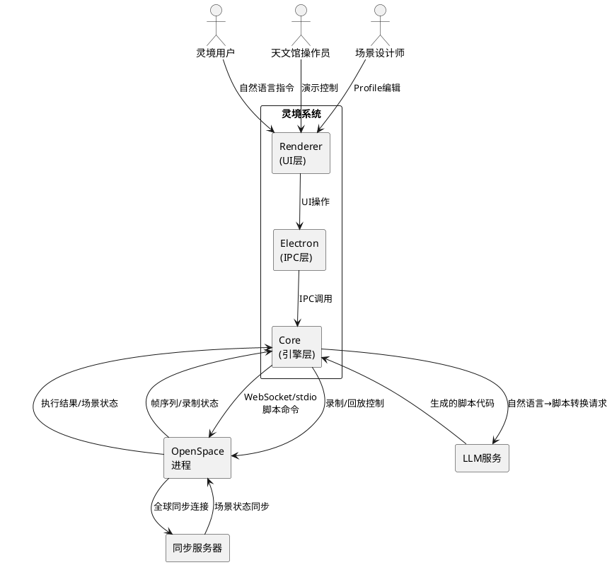

---

## 4. DFX约束

### 4.1 性能

1. **通信延迟**：灵境发送脚本命令到 OpenSpace 执行并返回确认的端到端延迟应不超过 200ms（本地 WebSocket 场景）
2. **AI脚本生成**：自然语言到可执行脚本的转换延迟应不超过 5s（依赖 LLM 推理速度）
3. **进程启动**：OpenSpace 进程从启动到可接受脚本命令的时间应不超过 30s
4. **帧导出吞吐**：录制帧导出不应导致 OpenSpace 渲染帧率下降超过 20%

### 4.2 可靠性

1. **进程存活检测**：健康检查间隔不超过 5s，进程异常退出应在 10s 内检测并通知
2. **通信断线重连**：WebSocket 断线后应自动重试连接，最多重试 5 次，间隔 3s
3. **命令执行超时**：单个脚本命令执行超时上限 30s，超时后应返回超时错误而非无限等待
4. **降级可用性**：OpenSpace 进程不可用时，灵境所有非 OpenSpace 功能应 100% 正常运行

### 4.3 安全性

1. **脚本执行沙箱**：AI 生成的脚本在发送到 OpenSpace 前应通过安全审查（检测危险操作模式）
2. **安装路径校验**：OpenSpace 安装路径应校验为合法的可执行文件路径，防止路径注入
3. **同步连接认证**：全球同步连接应支持密码保护，防止未授权接入
4. **脚本审计日志**：所有发送到 OpenSpace 的脚本命令应记录审计日志（时间、来源、脚本内容、执行结果）

### 4.4 可维护性

1. **日志规范**：融合层所有操作应输出结构化日志，包含 correlationId 用于链路追踪
2. **配置外部化**：OpenSpace 安装路径、通信端口、超时参数等应通过灵境配置文件管理
3. **版本兼容检测**：启动时应检测 OpenSpace 版本并报告兼容性状态

### 4.5 兼容性

1. **平台限制**：本融合仅支持 Windows 和 Linux，不支持 macOS（Apple Silicon 不兼容 OpenGL 4.6）
2. **OpenSpace 版本**：应兼容 OpenSpace v0.19.0 及以上版本
3. **向后兼容**：融合层接口变更应保持向后兼容，旧版 Profile 配置应能正常加载
4. **独立运行**：OpenSpace 应能在灵境外独立启动和运行，融合层不引入对灵境的运行时依赖

---

## 5. 核心能力

### 5.1 OpenSpace 进程管理（REQ-OS01）

#### 5.1.1 业务规则

1. **安装路径检测**：灵境必须在首次使用前检测 OpenSpace 安装路径，支持自动搜索（PATH 环境变量、常见安装目录）和手动指定

   a. 当用户首次打开 OpenSpace 功能面板时，系统应系统自动搜索 OpenSpace 可执行文件，若未找到则提示用户手动指定路径

2. **进程启动**：灵境应能以子进程方式启动 OpenSpace，并传递必要的启动参数（Profile 路径、窗口模式、同步配置）

   a. 当用户点击"启动 OpenSpace"时，系统应系统以子进程方式启动 OpenSpace 并建立 WebSocket 通信通道，状态变为"运行中"

3. **进程停止**：灵境应能优雅停止 OpenSpace 进程（先发送退出命令，超时后强制终止）

   a. 当用户点击"停止 OpenSpace"时，系统应系统向 OpenSpace 发送退出命令，若 10s 内未退出则强制终止进程，状态变为"已停止"

4. **健康检查**：灵境应周期性检查 OpenSpace 进程存活状态和通信可用性

   a. 当OpenSpace 进程运行中且通信正常时，系统应健康状态为"健康"，每 5s 检查一次
   b. 当OpenSpace 进程异常退出或通信中断时，系统应健康状态变为"异常"，10s 内通知用户并尝试自动重连

5. **版本兼容性检测**：启动时应检测 OpenSpace 版本号并与兼容版本范围比较

   a. 当检测到的 OpenSpace 版本在兼容范围内时，系统应允许启动并显示版本信息
   b. 当检测到的 OpenSpace 版本低于最低兼容版本时，系统应警告用户版本不兼容，但仍允许尝试启动

6. **禁止项**：灵境禁止直接修改 OpenSpace 的二进制文件或配置模板

   a. 当任何时刻时，系统应灵境不写入 OpenSpace 安装目录下的任何文件，Profile 等配置文件应存储在灵境工作目录中

#### 5.1.2 交互流程

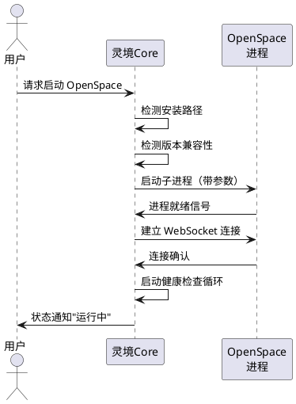

#### 5.1.3 异常场景

1. **OpenSpace 未安装**

   a. 触发条件：自动搜索和手动指定路径均未找到合法的 OpenSpace 可执行文件
   b. 系统行为：标记安装状态为"未安装"，禁用所有 OpenSpace 功能入口
   c. 用户感知：提示"未检测到 OpenSpace 安装，请安装后重试"并提供下载链接

2. **进程启动失败**

   a. 触发条件：OpenSpace 子进程启动后 30s 内未发送就绪信号
   b. 系统行为：终止子进程，标记状态为"启动失败"，记录错误日志
   c. 用户感知：提示"OpenSpace 启动超时，请检查系统要求（OpenGL 4.6, C++23）"

3. **进程异常退出**

   a. 触发条件：健康检查检测到 OpenSpace 进程已退出（非用户主动停止）
   b. 系统行为：标记状态为"异常退出"，记录退出码，根据策略尝试自动重启或通知用户
   c. 用户感知：提示"OpenSpace 意外退出（退出码: X），是否重新启动？"

4. **通信通道断开**

   a. 触发条件：WebSocket 连接断开或 stdio 管道关闭
   b. 系统行为：暂停命令发送队列，按重连策略尝试恢复连接
   c. 用户感知：提示"与 OpenSpace 的通信中断，正在尝试重连..."

---

### 5.2 双向通信桥接（REQ-OS02）

#### 5.2.1 业务规则

1. **通信协议选择**：灵境应支持 WebSocket（优先）和 stdio 两种通信方式与 OpenSpace 交互

   a. 当OpenSpace 以窗口模式启动时，系统应使用 WebSocket 通信（端口可配置）
   b. 当OpenSpace 以无头模式启动时，系统应使用 stdio 通信

2. **命令发送**：灵境应能向 OpenSpace 发送脚本命令并接收执行结果

   a. 当灵境发送 Lua 脚本 `openspace.setPropertyValue("RenderEngine.Camera.FocalDistance", 100)`时，系统应OpenSpace 执行脚本并返回成功/失败结果

3. **场景状态订阅**：灵境应能订阅 OpenSpace 的场景属性变更通知

   a. 当灵境订阅相机位置属性时，系统应当用户在 OpenSpace 中导航时，灵境实时接收到相机位置变更事件

4. **命令队列管理**：当 OpenSpace 忙碌时，灵境应将命令排入队列顺序执行

   a. 当连续发送 10 个脚本命令时，系统应命令按发送顺序排队执行，每个命令返回后发送下一个

5. **双向事件桥接**：OpenSpace 事件应通过灵境 EventBus 广播，灵境事件也应在适当时机同步到 OpenSpace

   a. 当OpenSpace 触发"场景加载完成"事件时，系统应灵境 EventBus 发布 `openspace:scene-loaded` 事件

#### 5.2.2 交互流程

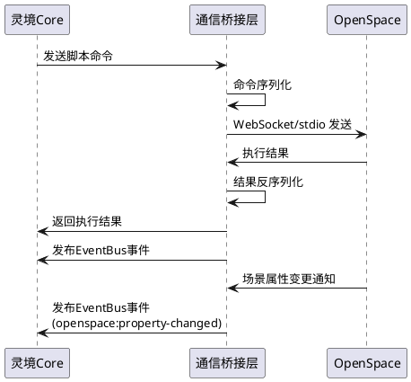

#### 5.2.3 异常场景

1. **命令执行失败**

   a. 触发条件：OpenSpace 返回脚本执行错误（语法错误、属性不存在等）
   b. 系统行为：记录错误详情到审计日志，将错误信息返回给调用方
   c. 用户感知：提示"脚本执行失败: [错误详情]"

2. **通信协议不匹配**

   a. 触发条件：WebSocket 端口被占用或 OpenSpace 未启用 WebSocket 模块
   b. 系统行为：自动回退到 stdio 通信方式
   c. 用户感知：提示"WebSocket 连接失败，已切换到 stdio 通信"

3. **命令超时**

   a. 触发条件：脚本命令执行超过 30s 未返回结果
   b. 系统行为：标记命令为超时，从队列移除，继续执行下一条命令
   c. 用户感知：提示"命令执行超时，已取消"

---

### 5.3 AI 脚本生成器（REQ-OS03）

#### 5.3.1 业务规则

1. **自然语言转脚本**：灵境 AI Agent 应将用户自然语言太空指令转换为可执行的 OpenSpace 脚本

   a. 当用户输入"飞到火星表面"时，系统应AI 生成 Lua 脚本 `openspace.setPropertyValue("NavigationHandler.Target", "Mars")` 等导航命令序列

2. **多语言脚本支持**：AI 生成器应支持生成 Lua、JavaScript、Python 三种脚本语言

   a. 当用户指定使用 JavaScript 脚本时，系统应AI 生成的脚本使用 JavaScript 语法

3. **脚本上下文感知**：AI 生成脚本时应考虑当前场景状态（已加载的模块、相机位置、可见天体等）

   a. 当当前场景已加载火星高分辨率图像时，系统应AI 生成"放大火星"脚本时使用火星相关属性而非通用缩放

4. **脚本安全审查**：AI 生成的脚本在发送前应通过安全审查

   a. 当AI 生成的脚本包含文件系统删除操作时，系统应安全审查拦截并提示"脚本包含危险操作，已拦截"

5. **脚本模板库**：系统应维护常用操作的脚本模板，AI 生成脚本时优先匹配模板

   a. 当用户输入"显示银河系"时，系统应AI 匹配预置模板"加载银河系数据集"而非从零生成

6. **脚本预览与确认**：对于高风险操作（导航到新目标、加载大型数据集），应先展示脚本预览

   a. 当AI 生成导航到新行星的脚本时，系统应在执行前向用户展示脚本内容，需用户确认后执行

#### 5.3.2 交互流程

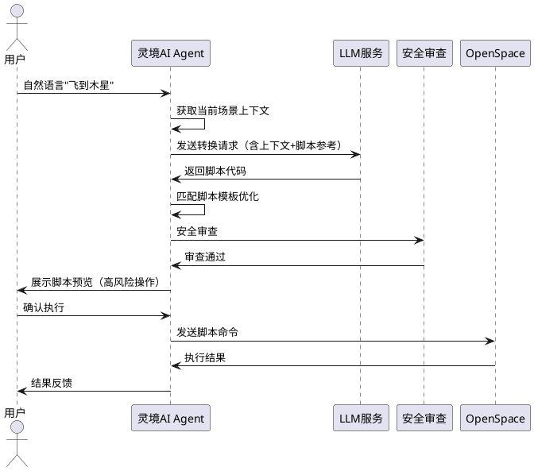

#### 5.3.3 异常场景

1. **LLM 生成无效脚本**

   a. 触发条件：AI 生成的脚本语法错误或调用不存在的 OpenSpace API
   b. 系统行为：记录错误，尝试让 LLM 重新生成（最多 2 次），若仍失败则告知用户
   c. 用户感知：提示"生成的脚本无效，请重新描述您的需求"

2. **安全审查拦截**

   a. 触发条件：脚本包含危险操作模式（文件删除、系统命令、网络请求等）
   b. 系统行为：拦截脚本执行，记录安全审计日志
   c. 用户感知：提示"脚本包含危险操作已被拦截: [具体原因]，如需强制执行请使用高级模式"

---

### 5.4 Profile/场景管理（REQ-OS04）

#### 5.4.1 业务规则

1. **Profile 文件管理**：灵境应能创建、编辑、删除、导入、导出 OpenSpace Profile 配置文件

   a. 当用户在灵境中创建新 Profile时，系统应生成标准 OpenSpace Profile Lua 文件并存储在灵境工作目录

2. **场景模块选择**：灵境应提供可视化界面让用户选择要加载的 OpenSpace 模块（太阳系、银河系、数字宇宙目录等）

   a. 当用户勾选"太阳系"和"数字宇宙目录"模块时，系统应Profile 中包含对应模块的引用和配置

3. **数据集路径管理**：灵境应能配置 OpenSpace 数据集的存储路径和缓存策略

   a. 当用户设置数据集目录为 D:\openspace-data时，系统应Profile 中数据集路径引用解析到该目录

4. **Profile 模板**：灵境应提供预设 Profile 模板（太阳系探索、深空观测、太空任务追踪等）

   a. 当用户选择"太阳系探索"模板时，系统应创建包含太阳系行星、高分辨率图像、轨道线的 Profile

5. **配置热更新**：修改 Profile 后应能热应用到运行中的 OpenSpace，无需重启进程

   a. 当用户在运行中修改相机初始位置时，系统应通过脚本命令更新 OpenSpace 相机属性，无需重启

#### 5.4.2 交互流程

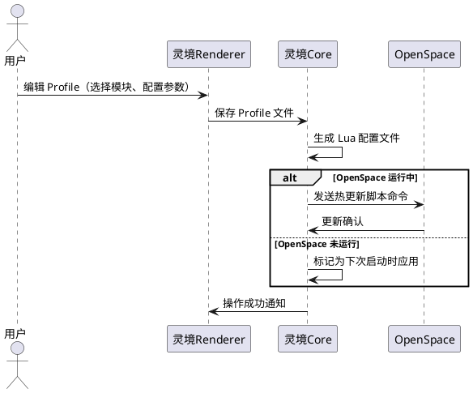

#### 5.4.3 异常场景

1. **Profile 文件损坏**

   a. 触发条件：Profile Lua 文件语法错误或关键字段缺失
   b. 系统行为：解析失败时报告具体错误位置，不覆盖原文件
   c. 用户感知：提示"Profile 解析失败: [错误行号和原因]"

2. **数据集路径不存在**

   a. 触发条件：Profile 引用的数据集目录在文件系统中不存在
   b. 系统行为：标记该数据集为"不可用"，提示用户配置正确路径
   c. 用户感知：提示"数据集路径不存在: [路径]，请检查数据集是否已下载"

---

### 5.5 可视化窗口嵌入（REQ-OS05）

#### 5.5.1 业务规则

1. **窗口嵌入模式**：灵境应能将 OpenSpace 渲染窗口嵌入到灵境 UI 中，支持以下模式：

   a. 当用户选择"嵌入模式"时，系统应OpenSpace 渲染窗口作为灵境 UI 的子窗口显示，可拖拽调整大小

2. **独立窗口模式**：灵境应支持 OpenSpace 以独立窗口运行

   a. 当用户选择"独立窗口模式"时，系统应OpenSpace 以独立系统窗口运行，灵境通过脚本命令控制

3. **全屏模式**：灵境应能将 OpenSpace 切换到全屏渲染模式

   a. 当用户点击"全屏"时，系统应OpenSpace 渲染窗口全屏显示，按 Esc 退出全屏

4. **多显示器支持**：灵境应支持将 OpenSpace 渲染窗口指定到特定显示器

   a. 当用户选择显示器 2时，系统应OpenSpace 渲染窗口在显示器 2 上全屏显示

5. **窗口状态同步**：灵境应感知 OpenSpace 窗口的状态变化（最大化、最小化、关闭）

   a. 当用户在 OpenSpace 窗口点击关闭时，系统应灵境接收到窗口关闭事件，更新状态为"窗口已关闭"而非"进程已退出"

#### 5.5.2 交互流程

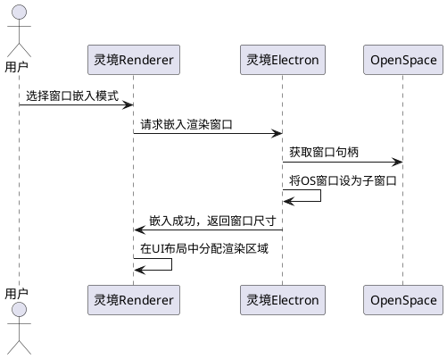

#### 5.5.3 异常场景

1. **窗口嵌入失败**

   a. 触发条件：Electron 无法获取 OpenSpace 窗口句柄（权限不足或窗口模式不兼容）
   b. 系统行为：自动回退到独立窗口模式
   c. 用户感知：提示"窗口嵌入失败，已切换到独立窗口模式"

2. **OpenGL 上下文冲突**

   a. 触发条件：灵境 Electron 的 GPU 进程与 OpenSpace OpenGL 上下文发生资源冲突
   b. 系统行为：建议用户为 OpenSpace 指定独立 GPU（多 GPU 环境）
   c. 用户感知：提示"检测到 GPU 资源冲突，建议在设置中为 OpenSpace 指定独立显卡"

---

### 5.6 数据集浏览器（REQ-OS06）

#### 5.6.1 业务规则

1. **数据集目录浏览**：灵境应提供可视化界面浏览 OpenSpace 数据集目录结构

   a. 当用户打开数据集浏览器时，系统应显示数据集目录树（恒星、星系、行星图像、太空任务等分类）

2. **数据集元信息展示**：每个数据集应展示元信息（名称、大小、来源、分辨率、最后更新时间）

   a. 当用户点击"火星高分辨率图像"数据集时，系统应展示元信息：名称、文件大小、分辨率、数据来源机构>

3. **数据集状态标记**：数据集应标记其状态（已下载、未下载、部分下载、损坏）

   a. 当数据集文件存在且校验通过时，系统应状态标记为"已下载"（绿色图标）
   b. 当数据集目录存在但文件不完整时，系统应状态标记为"部分下载"（黄色图标）

4. **数据集搜索**：灵境应支持按名称、类型、标签搜索数据集

   a. 当用户搜索"星系"时，系统应返回所有包含"星系"关键字的数据集列表

5. **数据集加载控制**：用户应能从浏览器直接加载/卸载数据集到当前场景

   a. 当用户点击"加载"按钮时，系统应通过脚本命令将数据集加载到 OpenSpace 当前场景

#### 5.6.2 交互流程

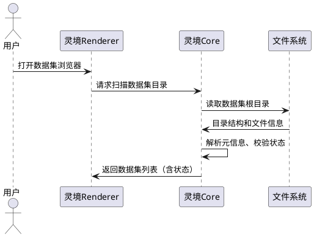

#### 5.6.3 异常场景

1. **数据集目录不可访问**

   a. 触发条件：数据集目录路径不存在或权限不足
   b. 系统行为：显示空状态，提示用户配置正确路径
   c. 用户感知：提示"无法访问数据集目录，请检查路径配置和访问权限"

---

### 5.7 会话录制回放（REQ-OS07）

#### 5.7.1 业务规则

1. **录制启动**：灵境应能启动 OpenSpace 的帧导出录制

   a. 当用户点击"开始录制"并配置分辨率/帧率时，系统应向 OpenSpace 发送帧导出启动命令，状态变为"录制中"

2. **录制停止**：灵境应能停止录制并获取导出帧序列信息

   a. 当用户点击"停止录制"时，系统应向 OpenSpace 发送帧导出停止命令，返回帧数量和输出目录

3. **录制配置**：灵境应提供录制参数配置界面（分辨率、帧率、输出格式、输出路径）

   a. 当用户设置分辨率为 3840x2160、帧率为 60fps时，系统应录制启动时传递对应参数

4. **回放控制**：灵境应能控制录制会话的回放（播放、暂停、跳转、速度调节）

   a. 当用户点击"回放"并选择录制会话时，系统应按录制时的操作序列重放场景变化

5. **录制会话管理**：灵境应管理录制会话列表（时间、时长、帧数、描述）

   a. 当用户打开录制历史时，系统应显示所有录制会话的列表，含时间戳、时长、帧数信息

#### 5.7.2 交互流程

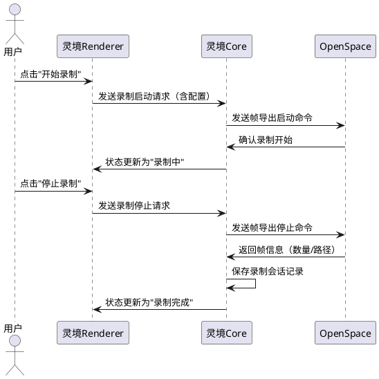

#### 5.7.3 异常场景

1. **磁盘空间不足**

   a. 触发条件：录制过程中输出目录磁盘空间不足
   b. 系统行为：自动停止录制，保存已有帧，通知用户
   c. 用户感知：提示"磁盘空间不足，录制已自动停止。已保存 X 帧"

2. **录制期间 OpenSpace 崩溃**

   a. 触发条件：录制过程中 OpenSpace 进程异常退出
   b. 系统行为：标记录制会话为"中断"，保存已有的帧序列
   c. 用户感知：提示"OpenSpace 异常退出，录制中断。已保存部分帧序列"

---

### 5.8 全球同步连接管理（REQ-OS08）

#### 5.8.1 业务规则

1. **同步服务器连接**：灵境应能配置并连接 OpenSpace 全球同步服务器

   a. 当用户输入同步服务器地址和端口时，系统应向 OpenSpace 发送同步连接命令，状态变为"已连接"

2. **角色选择**：灵境应支持选择同步角色（主机/客机）

   a. 当用户选择"主机"角色时，系统应OpenSpace 作为同步主机，其他客机跟随其场景状态
   b. 当用户选择"客机"角色时，系统应OpenSpace 跟随主机的场景状态和导航

3. **同步状态监控**：灵境应实时显示同步连接状态（已连接/断开/延迟/客户端数量）

   a. 当同步连接正常时，系统应显示"已连接"、延迟毫秒数、当前客户端数量

4. **SyncProfile 管理**：灵境应能创建和编辑 SyncProfile 配置

   a. 当用户创建 SyncProfile 并设置服务器地址和密码时，系统应生成 OpenSpace SyncProfile 文件

5. **同步断开**：灵境应能主动断开同步连接

   a. 当用户点击"断开同步"时，系统应向 OpenSpace 发送断开命令，状态变为"未连接"

#### 5.8.2 交互流程

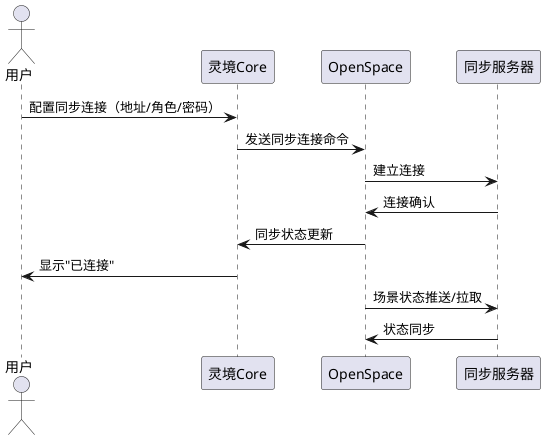

#### 5.8.3 异常场景

1. **同步服务器不可达**

   a. 触发条件：同步服务器地址无效或网络不通
   b. 系统行为：连接超时后标记状态为"连接失败"，不重试
   c. 用户感知：提示"无法连接同步服务器，请检查地址和网络"

2. **同步认证失败**

   a. 触发条件：同步服务器密码不正确
   b. 系统行为：标记状态为"认证失败"
   c. 用户感知：提示"同步认证失败，请检查密码"

---

### 5.9 脚本执行工具（REQ-OS09）

#### 5.9.1 业务规则

1. **Agent 工具注册**：灵境应在 Agent 工具系统中注册 `openspace_execute` 工具

   a. 当灵境 Agent 工具列表时，系统应包含 `openspace_execute` 工具，描述为"执行 OpenSpace 脚本命令"

2. **工具参数定义**：`openspace_execute` 工具应接受脚本内容、脚本语言类型、超时时间参数

   a. 当Agent 调用 `openspace_execute({ script: "...", language: "lua", timeout: 10000 })`时，系统应通过通信桥接层发送脚本到 OpenSpace 执行

3. **工具返回结果**：工具应返回脚本执行结果（成功/失败、返回值、执行耗时）

   a. 当脚本执行成功时，系统应返回 `{ success: true, result: "...", duration: 120 }`
   b. 当脚本执行失败时，系统应返回 `{ success: false, error: "属性不存在", duration: 50 }`

4. **工具可用性守卫**：当 OpenSpace 未启动时，工具调用应返回明确错误而非静默失败

   a. 当OpenSpace 未启动时 Agent 调用 `openspace_execute`时，系统应返回 `{ success: false, error: "OpenSpace 未运行，请先启动" }`

5. **批量脚本执行**：工具应支持一次调用执行多条脚本命令（按顺序执行）

   a. 当Agent调用 `openspace_execute({ scripts: ["cmd1", "cmd2", "cmd3"], language: "lua" })` 时，系统应按顺序执行三条命令，返回每条命令的执行结果

#### 5.9.2 交互流程

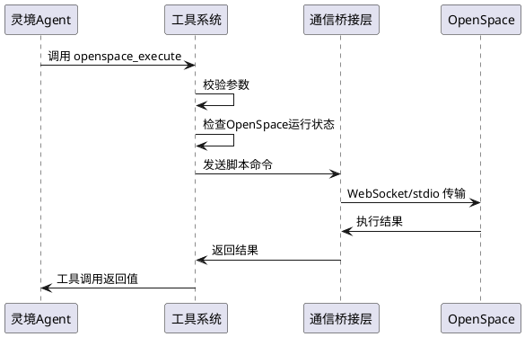

#### 5.9.3 异常场景

1. **OpenSpace 未运行**

   a. 触发条件：Agent 调用工具时 OpenSpace 进程未启动
   b. 系统行为：直接返回错误，不尝试启动 OpenSpace（需用户主动启动）
   c. 用户感知：Agent 回复"OpenSpace 当前未运行，请先启动 OpenSpace 后再执行此操作"

2. **脚本语言不支持**

   a. 触发条件：Agent 传入的 language 参数不是 lua/javascript/python 之一
   b. 系统行为：返回参数校验错误
   c. 用户感知：Agent 回复"不支持的脚本语言: [language]，请使用 lua、javascript 或 python"

---

### 5.10 OpenSpace Skill 定义（REQ-OS10）

#### 5.10.1 业务规则

1. **Skill 注册**：灵境应在 Skills 系统中注册 OpenSpace 相关技能，遵循三级扫描机制（builtin/user/project）

   a. 当灵境 Skills 列表时，系统应包含 `openspace-navigation`、`openspace-scene-management`、`openspace-recording` 等技能

2. **导航技能**：`openspace-navigation` Skill 应封装常见导航操作（飞到天体、设置相机、时间控制）

   a. 当用户输入"飞到土星"时，系统应Skill 匹配导航意图，调用 `openspace_execute` 执行导航脚本

3. **场景管理技能**：`openspace-scene-management` Skill 应封装场景操作（加载/卸载数据集、切换 Profile）

   a. 当用户输入"加载火星高分辨率地图"时，系统应Skill 匹配场景管理意图，执行数据集加载脚本

4. **录制技能**：`openspace-recording` Skill 应封装录制操作（开始/停止录制、回放、配置参数）

   a. 当用户输入"录制当前演示，60帧每秒"时，系统应Skill 匹配录制意图，配置参数并启动录制

5. **Skill 触发条件**：OpenSpace Skill 仅在 OpenSpace 进程运行时激活

   a. 当OpenSpace 未运行时，系统应OpenSpace 相关 Skill 标记为"不可用"，不参与意图匹配
   b. 当OpenSpace 启动成功时，系统应OpenSpace 相关 Skill 标记为"可用"，参与意图匹配

6. **Skill 自定义扩展**：用户应能在 project 级别创建自定义 OpenSpace Skill

   a. 当用户在项目 `.skills/` 目录创建 `openspace-custom.md`时，系统应Skills 系统扫描并注册该自定义 Skill

#### 5.10.2 交互流程

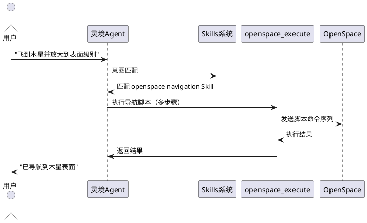

#### 5.10.3 异常场景

1. **Skill 执行时 OpenSpace 不可用**

   a. 触发条件：Skill 执行过程中 OpenSpace 进程退出
   b. 系统行为：标记 Skill 为"不可用"，中断当前执行，通知 Agent 重新规划
   c. 用户感知：Agent 回复"OpenSpace 已断开，无法完成操作。请重新启动 OpenSpace"

---

## 6. 数据约束

### 6.1 OpenSpace 进程配置

1. **安装路径**：合法的文件系统路径，指向 OpenSpace 可执行文件，路径长度不超过 260 字符（Windows MAX_PATH 限制）
2. **通信端口**：WebSocket 端口号，范围 1024-65535，默认 4680
3. **启动超时**：进程启动等待超时时间，范围 10-120 秒，默认 30 秒
4. **健康检查间隔**：范围 1-30 秒，默认 5 秒
5. **命令执行超时**：单个脚本命令超时时间，范围 5-120 秒，默认 30 秒
6. **重连最大次数**：范围 1-20 次，默认 5 次
7. **重连间隔**：范围 1-30 秒，默认 3 秒

### 6.2 Profile 配置

1. **Profile 名称**：非空字符串，仅含字母、数字、下划线、连字符，长度不超过 128 字符
2. **Profile 文件格式**：Lua 脚本格式，文件扩展名 `.profile`
3. **模块标识**：字符串，匹配 OpenSpace 已注册模块名（如 `sol-ar-system`、`milky-way`、`digital-universe`）
4. **数据集路径**：合法的文件系统路径，支持绝对路径和相对于 OpenSpace 安装目录的相对路径

### 6.3 录制配置

1. **分辨率**：宽和高均为正整数，宽度范围 640-7680，高度范围 480-4320
2. **帧率**：正整数，范围 1-120，默认 30
3. **输出格式**：枚举值，支持 PNG、JPG、TIFF
4. **输出路径**：合法的文件系统路径，需有写入权限

### 6.4 同步连接配置

1. **服务器地址**：合法的 IP 地址或域名，长度不超过 256 字符
2. **端口**：范围 1-65535
3. **角色**：枚举值，Host 或 Client
4. **密码**：字符串，长度 0-64 字符（空密码表示不启用认证）

### 6.5 脚本命令

1. **脚本内容**：非空字符串，长度不超过 65536 字符
2. **脚本语言**：枚举值，lua、javascript、python 之一
3. **脚本标签**：用于安全审查和模板匹配的元数据，键值对集合

---

## 7. 功能对比矩阵

| OpenSpace 能力 | 灵境现状 | 融合策略 | 需求编号 |
|---|---|---|---|
| C++/OpenGL 宇宙渲染引擎 | Electron/React UI 渲染 | 进程级集成，灵境启动 OpenSpace 子进程 | REQ-OS01, REQ-OS05 |
| Lua/JS/Python 脚本引擎 | Agent 工具系统 | 注册 openspace_execute 工具，AI 生成脚本 | REQ-OS03, REQ-OS09 |
| Profile 场景配置系统 | 无对应能力 | 灵境管理 Profile 文件生命周期 | REQ-OS04 |
| AMNH 数字宇宙数据集 | 无对应能力 | 灵境提供数据集浏览器和管理界面 | REQ-OS06 |
| 帧导出/会话录制 | 无对应能力 | 灵境提供录制控制 UI 和回放管理 | REQ-OS07 |
| 全球同步连接 | 无对应能力 | 灵境管理 SyncProfile 和连接状态 | REQ-OS08 |
| 多投影/穹顶渲染 | Electron 多窗口 | 窗口嵌入和全屏模式支持 | REQ-OS05 |
| 自定义场景加载 | Skills 系统 | OpenSpace Skill 注册到灵境 Skills 三级扫描 | REQ-OS10 |

---

## 8. 非侵入式融合原则声明

1. **源码不修改**：灵境不修改 OpenSpace 的任何源码、构建脚本或二进制文件
2. **进程独立运行**：OpenSpace 作为独立子进程运行，拥有自己的内存空间和渲染上下文
3. **通信标准化**：灵境与 OpenSpace 的所有交互仅通过标准化协议（WebSocket/stdio）进行，不依赖内部 API 或内存共享
4. **配置隔离**：灵境管理的 Profile/场景配置文件存储在灵境工作目录中，不写入 OpenSpace 安装目录
5. **插件化接入**：融合层以适配器模式接入灵境 fusion 基础设施（EventBus、HookRegistry），不侵入灵境核心代码
6. **降级容错**：OpenSpace 不可用时（未安装、启动失败、进程崩溃），灵境核心功能（AI 编码、文件管理、对话等）不受影响
7. **独立可运行**：OpenSpace 可在灵境外独立启动和运行，不引入对灵境的运行时依赖

---

## 9. 实施优先级与兼容性保障

### 9.1 实施优先级

| 优先级 | 需求编号 | 需求名称 | 依赖 | 理由 |
|---|---|---|---|---|
| P0 | REQ-OS01 | OpenSpace 进程管理 | 无 | 所有其他功能的基础 |
| P0 | REQ-OS02 | 双向通信桥接 | REQ-OS01 | 脚本执行和状态同步的基础 |
| P1 | REQ-OS09 | 脚本执行工具 | REQ-OS02 | Agent 调用 OpenSpace 的核心通道 |
| P1 | REQ-OS03 | AI 脚本生成器 | REQ-OS02, REQ-OS09 | 自然语言控制的差异化价值 |
| P1 | REQ-OS10 | OpenSpace Skill 定义 | REQ-OS09 | Skills 系统接入 |
| P2 | REQ-OS04 | Profile/场景管理 | REQ-OS01 | 配置管理增强用户体验 |
| P2 | REQ-OS05 | 可视化窗口嵌入 | REQ-OS01 | UI 融合增强 |
| P2 | REQ-OS06 | 数据集浏览器 | REQ-OS01, REQ-OS02 | 数据管理便利性 |
| P3 | REQ-OS07 | 会话录制回放 | REQ-OS02 | 高级功能 |
| P3 | REQ-OS08 | 全球同步连接管理 | REQ-OS02 | 高级功能，天文馆场景 |

### 9.2 兼容性保障

1. **平台兼容**：仅支持 Windows（x64）和 Linux（x64），macOS 不支持（OpenGL 4.6 限制）
2. **OpenSpace 版本**：最低兼容版本 v0.19.0，推荐最新稳定版
3. **运行时依赖**：OpenSpace 需要 OpenGL 4.6 驱动、C++23 运行时、CMake 4.0+
4. **灵境版本**：融合层需灵境 fusion 基础设施（EventBus、HookRegistry）可用
5. **GPU 要求**：需支持 OpenGL 4.6 的 GPU，推荐独立显卡

---

## 10. 依赖关系与接口约定

### 10.1 外部依赖

| 依赖项 | 版本要求 | 用途 | 可选性 |
|---|---|---|---|
| OpenSpace 可执行文件 | ≥ v0.19.0 | 宇宙可视化引擎 | 必需 |
| OpenGL 驱动 | ≥ 4.6 | OpenSpace 渲染 | 必需 |
| WebSocket 模块 | - | 通信桥接（窗口模式） | 首选 |
| stdio 管道 | - | 通信桥接（无头模式） | 备选 |

### 10.2 灵境内部依赖

| 依赖项 | 路径 | 用途 |
|---|---|---|
| EventBus | `packages/core/src/fusion/EventBus` | OpenSpace 事件广播 |
| HookRegistry | `packages/core/src/fusion/HookRegistry` | 融合层 Hook 接入 |
| Agent 工具系统 | `packages/core/src/tools/` | openspace_execute 工具注册 |
| Skills 系统 | `packages/core/src/skills/` | OpenSpace Skill 注册 |
| IPC 通道 | Electron 主进程↔渲染进程 | UI 与 Core 通信 |

### 10.3 接口约定

1. **通信接口**：WebSocket JSON 协议，消息格式 `{ type: "command"|"event"|"response", id: string, payload: any, timestamp: number }`
2. **脚本执行接口**：`openspace_execute(script: string, language: "lua"|"javascript"|"python", timeout?: number) => Promise<{ success: boolean, result?: any, error?: string, duration: number }>`
3. **事件订阅接口**：`openspace_subscribe(property: string, callback: (value: any) => void) => () => void`（返回取消订阅函数）
4. **进程管理接口**：`openspace_start(config: StartConfig) => Promise<void>`、`openspace_stop(force?: boolean) => Promise<void>`、`openspace_health() => HealthStatus`

---

## 11. 前置条件

1. **OpenSpace 预装**：用户需自行安装 OpenSpace（从 GitHub Releases 或源码编译），灵境不负责 OpenSpace 的安装和编译
2. **系统要求满足**：用户系统需满足 OpenGL 4.6、C++23 编译器运行时、CMake 4.0+ 等要求
3. **灵境 fusion 层可用**：灵境 Core 层的 EventBus 和 HookRegistry 基础设施已就绪
4. **数据集预下载**（可选）：OpenSpace 数据集（行星图像、数字宇宙目录等）需用户自行下载，灵境提供下载指引
5. **GPU 驱动更新**：用户需确保 GPU 驱动支持 OpenGL 4.6
6. **端口可用**：WebSocket 通信端口（默认 4680）未被其他程序占用

## 12. 共享术语表

（见lingjing-review/spec.md第7章共享术语表）

## 13. 修复追踪

| 问题编号 | 问题描述 | 修复方式 |
|---------|---------|---------|
| F-4 | agent-ipc.ts行号不准确 | 统一更新为第699行 |
| F-5 | Tool接口riskLevel属性 | 标注为OpenSpace安全扫描模块专有，非通用属性 |
| F-7 | searchExpertMemory行号偏移 | 标注行号可能因版本变化略有偏移 |
| M-6 | security/checkpoint源码不在仓库 | OpenSpace安全审查依赖fusion/skill-security模块 |
| M-7 | LLM Provider遗漏国内模型 | 补充百度文心、腾讯混元、Kimi、通义千问、豆包、GLM、MiniMax等 |
| C-2 | Agent构造行号不一致 | 统一更新或改用上下文描述 |
| G-1 | 验收条件格式不一致 | 统一为中文EARS格式 |
| G-2 | EARS中英混杂 | 全部转换为中文 |
| G-5 | 术语定义位置不一致 | 建立共享术语表引用 |
