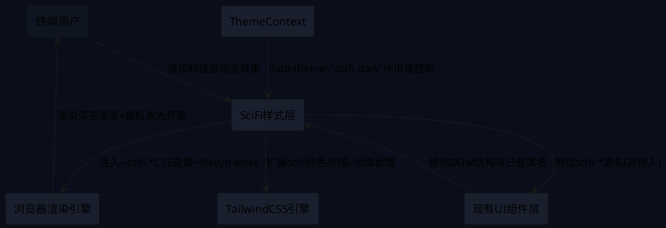
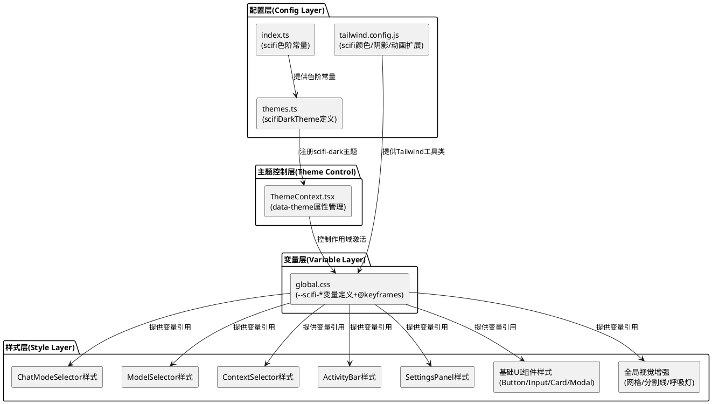

# **1. 实现模型**

## **1.1 上下文视图**

### 系统上下文

SciFi UI美化模块作为灵境(LingJing)应用的纯样式增强层，通过CSS变量体系与Tailwind配置扩展实现科技感视觉升级，不侵入任何组件逻辑代码。



### 作用域隔离机制

所有SciFi样式通过 `[data-theme="scifi-dark"]` CSS选择器实现作用域隔离：

- **激活条件**：`document.documentElement.setAttribute('data-theme', 'scifi-dark')`
- **选择器前缀**：所有新增CSS规则包裹在 `[data-theme="scifi-dark"]` 下
- **类名前缀**：所有新增CSS类以 `scifi-` 前缀命名
- **变量前缀**：所有新增CSS变量以 `--scifi-` 前缀命名
- **回退机制**：当 `data-theme` 不为 `scifi-dark` 时，所有SciFi样式不生效，界面保持原有dark/light主题

## **1.2 服务/组件总体架构**

### 分层架构图



### 修改文件清单

| 文件路径 | 修改类型 | 修改内容 |
|----------|----------|----------|
| `packages/renderer/tailwind.config.js` | 扩展 | 新增scifi-*颜色、neon-*阴影、pulse-neon等动画、glass backdropFilter |
| `packages/renderer/src/styles/global.css` | 追加 | 新增 `[data-theme="scifi-dark"]` 作用域下的--scifi-*变量定义、@keyframes、组件样式覆盖 |
| `packages/renderer/src/design-tokens/themes.ts` | 扩展 | 新增 `scifiDarkTheme` 定义并注册到 `themes` 对象 |
| `packages/renderer/src/design-tokens/index.ts` | 扩展 | 新增scifi色阶常量(neonBlue/neonPurple) |
| `packages/renderer/src/contexts/ThemeContext.tsx` | 扩展 | 支持scifi-dark主题名，设置data-theme属性 |

## **1.3 实现设计文档**

### 1.3.1 配色方案设计

#### 深空背景三级色阶

| 层级 | 变量名 | 色值 | HSL | 用途 |
|------|--------|------|-----|------|
| Base | `--scifi-bg-base` | #0a0e1a | HSL(220,47%,7%) | 页面最底层背景 |
| Surface | `--scifi-bg-surface` | #0f1525 | HSL(224,40%,10%) | 面板、卡片背景基础 |
| Elevated | `--scifi-bg-elevated` | #1a1f2e | HSL(226,27%,14%) | 弹出层、悬浮面板背景 |

#### 双Accent色体系

| 角色 | 变量名 | 色值 | HSL | 用途 |
|------|--------|------|-----|------|
| Primary | `--scifi-accent-primary` | #00d4ff | HSL(193,100%,50%) | 主交互元素高亮、选中态、焦点环 |
| Secondary | `--scifi-accent-secondary` | #a855f7 | HSL(271,91%,66%) | 次交互元素高亮、hover预览态 |

#### 语义色(霓虹化)

| 角色 | 变量名 | 色值 | HSL | 用途 |
|------|--------|------|-----|------|
| Success | `--scifi-neon-green` | #22c55e | HSL(142,71%,45%) | 成功/在线状态指示 |
| Error | `--scifi-neon-red` | #ef4444 | HSL(0,84%,60%) | 错误/离线状态指示 |
| Warning | `--scifi-neon-amber` | #f59e0b | HSL(38,92%,50%) | 警告/注意状态指示 |

#### 发光色(30%透明度)

| 角色 | 变量名 | 色值 | 用途 |
|------|--------|------|------|
| Primary Glow | `--scifi-glow-primary` | rgba(0,212,255,0.3) | 主accent元素glow效果 |
| Secondary Glow | `--scifi-glow-secondary` | rgba(168,85,247,0.3) | 辅accent元素glow效果 |
| Error Glow | `--scifi-glow-error` | rgba(239,68,68,0.3) | 错误状态glow效果 |
| Success Glow | `--scifi-glow-success` | rgba(34,197,94,0.3) | 成功状态glow效果 |

#### 玻璃拟态色

| 角色 | 变量名 | 色值 | 用途 |
|------|--------|------|------|
| Glass BG | `--scifi-glass-bg` | rgba(10,14,26,0.75) | 玻璃拟态面板背景 |
| Glass Border | `--scifi-glass-border` | rgba(0,212,255,0.1) | 玻璃拟态微发光边框 |
| Glass Blur | `--scifi-glass-blur` | 16px | 模糊半径 |

### 1.3.2 CSS变量扩展设计

在 `global.css` 中新增 `[data-theme="scifi-dark"]` 作用域下的变量定义：

```css
[data-theme="scifi-dark"] {
  /* === 深空背景三级色阶 === */
  --scifi-bg-base: #0a0e1a;
  --scifi-bg-surface: #0f1525;
  --scifi-bg-elevated: #1a1f2e;

  /* === 双Accent色 === */
  --scifi-accent-primary: #00d4ff;
  --scifi-accent-secondary: #a855f7;

  /* === 霓虹语义色 === */
  --scifi-neon-green: #22c55e;
  --scifi-neon-red: #ef4444;
  --scifi-neon-amber: #f59e0b;

  /* === RGB分量(用于rgba计算) === */
  --scifi-accent-primary-rgb: 0, 212, 255;
  --scifi-accent-secondary-rgb: 168, 85, 247;

  /* === 发光色(30%透明度) === */
  --scifi-glow-primary: rgba(0, 212, 255, 0.3);
  --scifi-glow-secondary: rgba(168, 85, 247, 0.3);
  --scifi-glow-error: rgba(239, 68, 68, 0.3);
  --scifi-glow-success: rgba(34, 197, 94, 0.3);

  /* === 玻璃拟态 === */
  --scifi-glass-bg: rgba(10, 14, 26, 0.75);
  --scifi-glass-border: rgba(0, 212, 255, 0.1);
  --scifi-glass-blur: 16px;

  /* === 发光阴影token === */
  --scifi-glow-sm: 0 0 4px;
  --scifi-glow-md: 0 0 8px;
  --scifi-glow-lg: 0 0 16px;

  --scifi-shadow-neon-blue-sm: 0 0 4px rgba(0, 212, 255, 0.4);
  --scifi-shadow-neon-blue-md: 0 0 8px rgba(0, 212, 255, 0.3);
  --scifi-shadow-neon-blue-lg: 0 0 16px rgba(0, 212, 255, 0.2);
  --scifi-shadow-neon-purple-sm: 0 0 4px rgba(168, 85, 247, 0.4);
  --scifi-shadow-neon-purple-md: 0 0 8px rgba(168, 85, 247, 0.3);

  /* === 背景渐变 === */
  --scifi-bg-gradient: linear-gradient(180deg, #0a0e1a 0%, #1a1f2e 100%);
  --scifi-bg-start: #0a0e1a;
  --scifi-bg-end: #1a1f2e;

  /* === 圆角与间距 === */
  --scifi-radius-sm: 6px;
  --scifi-radius-md: 8px;
  --scifi-radius-lg: 12px;
  --scifi-indicator-width: 3px;
  --scifi-tab-indicator-height: 2px;

  /* === 覆盖cp-*变量(通过级联) === */
  --cp-bg: #0a0e1a;
  --cp-sidebar: #0f1525;
  --cp-editor: #0a0e1a;
  --cp-panel: #0f1525;
  --cp-activitybar: #0a0e1a;
  --cp-border: rgba(0, 212, 255, 0.1);
  --cp-accent: #00d4ff;
  --cp-text: #e0e8ff;
  --cp-text-dim: #7b8bb5;
  --cp-success: #22c55e;
  --cp-error: #ef4444;
  --cp-warning: #f59e0b;
  --cp-info: #00d4ff;
}
```

### 1.3.3 Tailwind扩展设计

在 `tailwind.config.js` 的 `theme.extend` 中新增以下配置：

#### 颜色扩展

```javascript
colors: {
  // ... 保留已有配置 ...
  'scifi-bg-base': 'var(--scifi-bg-base, #0a0e1a)',
  'scifi-bg-surface': 'var(--scifi-bg-surface, #0f1525)',
  'scifi-bg-elevated': 'var(--scifi-bg-elevated, #1a1f2e)',
  'scifi-accent-primary': {
    DEFAULT: 'var(--scifi-accent-primary, #00d4ff)',
    50: '#e6f9ff',
    100: '#b3f0ff',
    200: '#80e7ff',
    300: '#4ddfff',
    400: '#1ad6ff',
    500: '#00d4ff',
    600: '#00aac9',
    700: '#007f94',
    800: '#00555f',
    900: '#002a2f',
  },
  'scifi-accent-secondary': {
    DEFAULT: 'var(--scifi-accent-secondary, #a855f7)',
    50: '#f3e8ff',
    100: '#e9d5ff',
    200: '#d8b4fe',
    300: '#c084fc',
    400: '#a855f7',
    500: '#9333ea',
    600: '#7e22ce',
    700: '#6b21a8',
    800: '#581c87',
    900: '#3b0764',
  },
  'scifi-neon-green': 'var(--scifi-neon-green, #22c55e)',
  'scifi-neon-red': 'var(--scifi-neon-red, #ef4444)',
  'scifi-neon-amber': 'var(--scifi-neon-amber, #f59e0b)',
  'scifi-glass-bg': 'var(--scifi-glass-bg, rgba(10, 14, 26, 0.75))',
  'scifi-glass-border': 'var(--scifi-glass-border, rgba(0, 212, 255, 0.1))',
}
```

#### 阴影扩展

```javascript
boxShadow: {
  // ... 保留已有glow/glow-lg ...
  /** 电光蓝小发光 - 用于hover态、标签 */
  'neon-sm': '0 0 4px rgba(0, 212, 255, 0.4)',
  /** 电光蓝中发光 - 用于按钮、输入框焦点 */
  'neon-md': '0 0 8px rgba(0, 212, 255, 0.3)',
  /** 电光蓝大发光 - 用于面板边框、选中态 */
  'neon-lg': '0 0 16px rgba(0, 212, 255, 0.2)',
  /** 量子紫发光 - 用于hover预览态 */
  'neon-purple': '0 0 8px rgba(168, 85, 247, 0.3)',
  /** 量子紫小发光 */
  'neon-purple-sm': '0 0 4px rgba(168, 85, 247, 0.4)',
}
```

#### 动画扩展

```javascript
animation: {
  // ... 保留已有fade-in/animate-in ...
  /** 选中态脉冲发光动画 - 周期2s */
  'pulse-neon': 'pulseNeon 2s ease-in-out infinite',
  /** 发光边框动画 - 周期3s */
  'glow-border': 'glowBorder 3s ease-in-out infinite',
  /** 呼吸灯动画 - 周期2s */
  'breathe': 'breathe 2s ease-in-out infinite',
  /** 上滑淡入动画 - 200ms */
  'slide-up-fade': 'slideUpFade 200ms ease-out',
},
keyframes: {
  // ... 保留已有fadeIn ...
  pulseNeon: {
    '0%, 100%': { boxShadow: '0 0 8px rgba(0, 212, 255, 0.3)' },
    '50%': { boxShadow: '0 0 16px rgba(0, 212, 255, 0.6)' },
  },
  glowBorder: {
    '0%, 100%': { borderColor: 'rgba(0, 212, 255, 0.3)' },
    '50%': { borderColor: 'rgba(0, 212, 255, 0.6)' },
  },
  breathe: {
    '0%, 100%': { opacity: '0.6' },
    '50%': { opacity: '1' },
  },
  slideUpFade: {
    '0%': { opacity: '0', transform: 'translateY(8px)' },
    '100%': { opacity: '1', transform: 'translateY(0)' },
  },
}
```

#### BackdropFilter扩展

```javascript
backdropFilter: {
  /** 玻璃拟态模糊 - 用于面板玻璃效果 */
  'glass': 'blur(16px)',
}
```

### 1.3.4 组件样式覆盖设计

所有组件样式覆盖均在 `global.css` 的 `[data-theme="scifi-dark"]` 选择器内定义，不修改任何组件TSX文件。

#### ChatModeSelector样式覆盖(REQ-UI02)

**当前组件结构**：
- 容器: `div.flex.items-center.gap-0.5.bg-white/[0.04].rounded-md.p-0.5`
- 选中按钮: `bg-cp-accent text-cp-text font-semibold`
- 未选中按钮: `text-white/70 hover:text-cp-text hover:bg-white/[0.08]`

**SciFi样式覆盖(CSS选择器方式)**：

```css
[data-theme="scifi-dark"] .scifi-chat-mode-selector {
  background: rgba(0, 212, 255, 0.03);
  border: 1px solid rgba(0, 212, 255, 0.08);
  border-radius: 8px;
}

/* 选中态分段按钮 */
[data-theme="scifi-dark"] .scifi-chat-mode-item--active {
  background: rgba(0, 212, 255, 0.2);
  border: 1px solid rgba(0, 212, 255, 0.6);
  box-shadow: 0 0 8px rgba(0, 212, 255, 0.4);
  color: #00d4ff;
  border-radius: 6px;
  transition: all 150ms ease;
}

/* 未选中态分段按钮 */
[data-theme="scifi-chat-mode-item"] {
  border: 1px solid #1e293b;
  border-radius: 6px;
  transition: all 150ms ease;
}

/* hover态 */
[data-theme="scifi-dark"] .scifi-chat-mode-item:hover {
  border-color: rgba(0, 212, 255, 0.3);
  box-shadow: 0 0 4px rgba(0, 212, 255, 0.2);
}
```

**等价Tailwind类名组合**：
- 选中项: `bg-scifi-accent-primary/20 border-scifi-accent-primary/60 shadow-neon-sm text-scifi-accent-primary rounded-[6px] transition-all duration-150`
- 未选中项: `border-[#1e293b] rounded-[6px] transition-all duration-150`
- hover: `hover:border-scifi-accent-primary/30 hover:shadow-neon-sm`

#### ModelSelector样式覆盖(REQ-UI03)

**当前组件结构**：
- 触发按钮: `flex items-center gap-2 px-3 py-1.5 rounded-lg text-sm text-cp-text-dim`
- 下拉面板: `absolute top-full ... bg-cp-panel border border-cp-border rounded-lg shadow-xl`
- 选中模型项: `text-cp-accent`
- hover模型项: `hover:bg-white/10`

**SciFi样式覆盖**：

```css
/* 下拉面板玻璃拟态 */
[data-theme="scifi-dark"] .scifi-model-dropdown {
  background: rgba(10, 14, 26, 0.75);
  -webkit-backdrop-filter: blur(16px);
  backdrop-filter: blur(16px);
  border: 1px solid rgba(0, 212, 255, 0.1);
  box-shadow: 0 0 12px rgba(0, 212, 255, 0.15);
}

/* 选中模型项 - 左侧电光蓝竖条指示器 */
[data-theme="scifi-dark"] .scifi-model-item--active {
  border-left: 3px solid #00d4ff;
  color: #00d4ff;
  background: rgba(0, 212, 255, 0.05);
}

/* hover模型项 - 左侧量子紫竖条指示器 */
[data-theme="scifi-dark"] .scifi-model-item:hover {
  border-left: 3px solid #a855f7;
  background: rgba(168, 85, 247, 0.05);
}
```

**等价Tailwind类名组合**：
- 下拉面板: `bg-scifi-glass-bg backdrop-blur-xl border-scifi-glass-border shadow-neon-lg`
- 选中项: `border-l-[3px] border-l-scifi-accent-primary text-scifi-accent-primary bg-scifi-accent-primary/5`
- hover项: `hover:border-l-[3px] hover:border-l-scifi-accent-secondary hover:bg-scifi-accent-secondary/5`

#### ContextSelector样式覆盖(REQ-UI04)

**当前组件结构**：
- 弹出面板: `absolute bottom-full ... bg-cp-panel border border-cp-border rounded-lg shadow-xl`
- Tab栏: `flex gap-1 p-2 border-b border-cp-border/50`
- 选中Tab: `bg-cp-accent/20 text-cp-accent`
- 搜索框: `w-full bg-transparent ... outline-none`

**SciFi样式覆盖**：

```css
/* 弹出面板玻璃拟态 */
[data-theme="scifi-dark"] .scifi-context-panel {
  background: rgba(10, 14, 26, 0.8);
  -webkit-backdrop-filter: blur(16px);
  backdrop-filter: blur(16px);
  border: 1px solid rgba(0, 212, 255, 0.1);
  box-shadow: 0 0 12px rgba(0, 212, 255, 0.15);
  animation: slideUpFade 200ms ease-out;
}

/* 选中Tab - 底部霓虹指示器 */
[data-theme="scifi-dark"] .scifi-context-tab--active {
  color: #00d4ff;
  border-bottom: 2px solid #00d4ff;
  box-shadow: 0 2px 8px rgba(0, 212, 255, 0.3);
}

/* 搜索框焦点发光边框 */
[data-theme="scifi-dark"] .scifi-context-search:focus {
  border-color: #00d4ff;
  box-shadow: 0 0 8px rgba(0, 212, 255, 0.3);
}

/* 搜索框默认态 */
[data-theme="scifi-dark"] .scifi-context-search {
  border: 1px solid #1e293b;
  transition: all 150ms ease;
}
```

**等价Tailwind类名组合**：
- 弹出面板: `bg-[rgba(10,14,26,0.8)] backdrop-blur-xl border-scifi-glass-border shadow-neon-lg animate-slide-up-fade`
- 选中Tab: `text-scifi-accent-primary border-b-2 border-b-scifi-accent-primary shadow-neon-sm`
- 搜索框focus: `focus:border-scifi-accent-primary focus:shadow-neon-sm`
- 搜索框默认: `border-[#1e293b] transition-all duration-150`

#### ActivityBar样式覆盖(REQ-UI05)

**当前组件结构**：
- 容器: `w-12 bg-cp-activitybar flex flex-col ... border-r border-cp-border`
- 选中图标: `text-cp-text`
- 未选中图标: `text-cp-text-dim/50 hover:text-cp-text`
- 选中指示器: `absolute left-0 ... w-0.5 h-6 bg-white rounded-r`

**SciFi样式覆盖**：

```css
/* ActivityBar深空渐变背景 */
[data-theme="scifi-dark"] .scifi-activity-bar {
  background: linear-gradient(180deg, #0a0e1a 0%, #0f1320 100%);
  border-right: 1px solid rgba(0, 212, 255, 0.08);
}

/* 选中图标 - 电光蓝+脉冲发光 */
[data-theme="scifi-dark"] .scifi-activity-item--active {
  color: #00d4ff;
  animation: pulseNeon 2s ease-in-out infinite;
}

/* 选中指示器 - 霓虹竖条替代白色竖条 */
[data-theme="scifi-dark"] .scifi-activity-indicator {
  background: #00d4ff;
  box-shadow: 0 0 8px rgba(0, 212, 255, 0.4);
}

/* hover非选中项 - 量子紫微弱发光 */
[data-theme="scifi-dark"] .scifi-activity-item:hover {
  color: #a855f7;
  filter: drop-shadow(0 0 4px rgba(168, 85, 247, 0.3));
}

/* 尊重prefers-reduced-motion */
@media (prefers-reduced-motion: reduce) {
  [data-theme="scifi-dark"] .scifi-activity-item--active {
    animation: none;
    box-shadow: 0 0 8px rgba(0, 212, 255, 0.3);
  }
}
```

**等价Tailwind类名组合**：
- 容器: `bg-gradient-to-b from-[#0a0e1a] to-[#0f1320] border-r-scifi-glass-border`
- 选中图标: `text-scifi-accent-primary animate-pulse-neon`
- 选中指示器: `bg-scifi-accent-primary shadow-neon-sm`
- hover图标: `hover:text-scifi-accent-secondary hover:drop-shadow-[0_0_4px_rgba(168,85,247,0.3)]`

#### SettingsPanel样式覆盖(REQ-UI06)

**当前组件结构**：
- 左侧导航: `w-[180px] bg-cp-sidebar border-r border-cp-border`
- 选中导航项: `bg-cp-surface text-cp-text font-medium`
- hover导航项: `text-cp-text-dim hover:bg-white/5 hover:text-cp-text`

**SciFi样式覆盖**：

```css
/* 导航区深空渐变背景 */
[data-theme="scifi-dark"] .scifi-settings-nav {
  background: linear-gradient(180deg, #0a0e1a 0%, #0f1320 100%);
  border-right: 1px solid rgba(0, 212, 255, 0.08);
}

/* 选中导航项 - 左侧电光蓝发光竖条 */
[data-theme="scifi-dark"] .scifi-settings-nav-item--active {
  border-left: 3px solid #00d4ff;
  background: rgba(0, 212, 255, 0.05);
  color: #00d4ff;
  box-shadow: inset 3px 0 8px rgba(0, 212, 255, 0.2);
}

/* hover导航项 */
[data-theme="scifi-dark"] .scifi-settings-nav-item:hover {
  background: rgba(0, 212, 255, 0.05);
  border-left: 3px solid rgba(168, 85, 247, 0.3);
}

/* 内容区玻璃卡片 */
[data-theme="scifi-dark"] .scifi-settings-card {
  background: rgba(10, 14, 26, 0.6);
  -webkit-backdrop-filter: blur(12px);
  backdrop-filter: blur(12px);
  border: 1px solid rgba(0, 212, 255, 0.08);
}
```

**等价Tailwind类名组合**：
- 导航区: `bg-gradient-to-b from-[#0a0e1a] to-[#0f1320] border-r-scifi-glass-border`
- 选中导航项: `border-l-[3px] border-l-scifi-accent-primary bg-scifi-accent-primary/5 text-scifi-accent-primary shadow-[inset_3px_0_8px_rgba(0,212,255,0.2)]`
- hover导航项: `hover:bg-scifi-accent-primary/5 hover:border-l-[3px] hover:border-l-scifi-accent-secondary/30`
- 内容卡片: `bg-[rgba(10,14,26,0.6)] backdrop-blur-[12px] border-scifi-accent-primary/8`

### 1.3.5 基础UI组件样式覆盖(REQ-UI10)

#### Button - scifi-neon variant

**Tailwind类名组合**：
- 默认: `border-scifi-accent-primary text-scifi-accent-primary bg-scifi-accent-primary/10 shadow-neon-sm rounded-[6px]`
- hover: `hover:shadow-neon-md hover:bg-scifi-accent-primary/20`
- transition: `transition-all duration-150`

#### Card - 玻璃拟态效果

**Tailwind类名组合**：
- 默认: `bg-[rgba(10,14,26,0.6)] backdrop-blur-[12px] border-scifi-accent-primary/8 rounded-[12px]`

#### Input - 发光边框

**Tailwind类名组合**：
- 默认态: `border-[#1e293b] bg-transparent transition-all duration-150`
- focus态: `focus:border-scifi-accent-primary focus:shadow-neon-sm focus:outline-none`

#### Modal - 玻璃拟态

**Tailwind类名组合**：
- 遮罩层: `bg-black/60`
- 内容面板: `bg-[rgba(10,14,26,0.85)] backdrop-blur-[20px] border-scifi-accent-primary/10 shadow-neon-lg`

### 1.3.6 全局视觉增强(REQ-UI08)

#### 背景网格线

```css
[data-theme="scifi-dark"] .scifi-bg-grid {
  background-image:
    linear-gradient(rgba(0, 212, 255, 0.03) 1px, transparent 1px),
    linear-gradient(90deg, rgba(0, 212, 255, 0.03) 1px, transparent 1px);
  background-size: 40px 40px;
}
```

#### 渐变发光分割线

```css
[data-theme="scifi-dark"] .scifi-glow-divider {
  height: 1px;
  background: linear-gradient(90deg, transparent, rgba(0, 212, 255, 0.3), transparent);
}
```

#### 状态指示灯呼吸动画

**Tailwind类名组合**：`animate-breathe`

#### 图标hover发光

```css
[data-theme="scifi-dark"] .scifi-icon-glow:hover {
  filter: drop-shadow(0 0 4px rgba(0, 212, 255, 0.5));
}
```

### 1.3.7 动画规格汇总

| 动画名称 | @keyframes定义 | 周期 | 应用场景 |
|----------|----------------|------|----------|
| pulseNeon | `0%,100%: box-shadow 0 0 8px rgba(0,212,255,0.3); 50%: box-shadow 0 0 16px rgba(0,212,255,0.6)` | 2s | ActivityBar选中态脉冲 |
| glowBorder | `0%,100%: border-color rgba(0,212,255,0.3); 50%: border-color rgba(0,212,255,0.6)` | 3s | 发光边框渐变 |
| breathe | `0%,100%: opacity 0.6; 50%: opacity 1` | 2s | 状态指示灯呼吸 |
| slideUpFade | `0%: opacity 0, translateY(8px); 100%: opacity 1, translateY(0)` | 200ms | ContextSelector面板展开 |

**交互过渡统一规格**：
- 过渡时长: `150ms`
- 过渡属性: `background-color, border-color, box-shadow, transform, opacity`
- 缓动函数: `ease`
- Tailwind: `transition-all duration-150`

**hover霓虹光效**：
- 过渡: `transition-all duration-150`
- hover发光: `hover:shadow-neon-sm`

**选中脉冲(单次)**：
- `@keyframes pulseNeonOnce: 0% { box-shadow: 0 0 8px } 50% { box-shadow: 0 0 16px } 100% { box-shadow: 0 0 8px }`
- 时长: 200ms
- 执行: 单次(forwards)

**玻璃拟态**：
- `backdrop-blur-xl` + `bg-white/5` + `border-white/10` (通用)
- 或 `bg-scifi-glass-bg` + `backdrop-blur-xl` + `border-scifi-glass-border` (具体)

### 1.3.8 主题注册设计(themes.ts扩展)

```typescript
// 新增scifiDarkTheme
export const scifiDarkTheme: Theme = {
  name: 'scifi-dark',
  type: 'dark',
  colors: {
    background: '#0a0e1a',
    backgroundSecondary: '#0f1525',
    backgroundTertiary: '#1a1f2e',
    surface: '#0f1525',
    surfaceHover: '#141b2d',
    surfaceActive: '#1a2238',
    border: 'rgba(0, 212, 255, 0.1)',
    borderFocus: '#00d4ff',
    text: '#e0e8ff',
    textSecondary: '#7b8bb5',
    textTertiary: '#4a5578',
    textInverse: '#0a0e1a',
    primary: '#00d4ff',
    primaryHover: '#33ddff',
    primaryActive: '#00aac9',
    success: '#22c55e',
    error: '#ef4444',
    warning: '#f59e0b',
    info: '#00d4ff',
  },
};

// 注册到themes
export const themes = {
  dark: darkTheme,
  light: lightTheme,
  'scifi-dark': scifiDarkTheme,
} as const;

export type ThemeName = keyof typeof themes;
```

### 1.3.9 ThemeContext扩展设计

在 `ThemeContext.tsx` 的 `useEffect` 中，当 `themeName === 'scifi-dark'` 时：

```typescript
if (themeName === 'scifi-dark') {
  root.classList.add('dark');
  root.classList.remove('light');
  root.setAttribute('data-theme', 'scifi-dark');
} else if (themeName === 'dark') {
  root.classList.add('dark');
  root.classList.remove('light');
  root.removeAttribute('data-theme');
} else {
  root.classList.add('light');
  root.classList.remove('dark');
  root.removeAttribute('data-theme');
}
```

当 `themeName === 'scifi-dark'` 时，cp-*变量覆盖为SciFi色值：

```typescript
const cpVars = themeName === 'scifi-dark'
  ? {
      '--cp-bg': '#0a0e1a',
      '--cp-sidebar': '#0f1525',
      '--cp-editor': '#0a0e1a',
      '--cp-panel': '#0f1525',
      '--cp-statusbar': '#00d4ff',
      '--cp-activitybar': '#0a0e1a',
      '--cp-tab-active': '#0f1525',
      '--cp-tab-inactive': '#141b2d',
      '--cp-border': 'rgba(0, 212, 255, 0.1)',
      '--cp-text': '#e0e8ff',
      '--cp-text-dim': '#7b8bb5',
      '--cp-accent': '#00d4ff',
      '--cp-success': '#22c55e',
      '--cp-error': '#ef4444',
      '--cp-warning': '#f59e0b',
      '--cp-info': '#00d4ff',
    }
  : themeName === 'light'
    ? { /* 保留原有light cpVars */ }
    : { /* 保留原有dark cpVars */ };
```

### 1.3.10 滚动条SciFi主题样式

```css
[data-theme="scifi-dark"] ::-webkit-scrollbar-track {
  background: rgba(10, 14, 26, 0.5);
}

[data-theme="scifi-dark"] ::-webkit-scrollbar-thumb {
  background: rgba(0, 212, 255, 0.15);
  border-radius: 4px;
}

[data-theme="scifi-dark"] ::-webkit-scrollbar-thumb:hover {
  background: rgba(0, 212, 255, 0.3);
}
```

### 1.3.11 非侵入式实现约束确认

| 约束项 | 实现方式 | 验证方法 |
|--------|----------|----------|
| 不修改组件TSX逻辑代码 | 所有样式通过global.css中CSS选择器覆盖 | git diff无.tsx文件变更(除ThemeContext.tsx的主题名扩展) |
| 作用域隔离 | `[data-theme="scifi-dark"]` 选择器 | 非scifi-dark主题下无任何样式影响 |
| 类名前缀隔离 | 所有新增CSS类以 `scifi-` 前缀 | 全局搜索 `scifi-` 前缀一致性 |
| 变量前缀隔离 | 所有新增CSS变量以 `--scifi-` 前缀 | 全局搜索 `--scifi-` 前缀一致性 |
| 不覆盖已有类名 | 新增样式类独立定义，不重定义已有类 | 无 `!important` 滥用(除必要主题覆盖) |
| 原有主题保护 | SciFi样式仅在data-theme="scifi-dark"下生效 | 切换dark/light主题无视觉变化 |
| 渐进增强 | backdrop-filter不支持时回退半透明背景 | Safari旧版本测试 |

# **2. 接口设计**

## **2.1 总体设计**

本方案为纯样式层增强，无新增API接口。所有对外交互通过以下通道实现：

1. **主题名扩展**：`ThemeName` 类型从 `'dark' | 'light'` 扩展为 `'dark' | 'light' | 'scifi-dark'`
2. **CSS变量接口**：组件可通过 `var(--scifi-*)` 引用SciFi变量
3. **Tailwind工具类接口**：组件可通过 `scifi-*` 类名使用SciFi工具类
4. **data-theme属性**：浏览器DOM接口，控制SciFi作用域

## **2.2 接口清单**

### 2.2.1 ThemeContext接口扩展

| 接口 | 类型 | 变更 | 说明 |
|------|------|------|------|
| `ThemeName` | 类型 | 扩展 | 新增 `'scifi-dark'` 联合类型成员 |
| `themes` | 对象 | 扩展 | 新增 `scifi-dark: scifiDarkTheme` 属性 |
| `setTheme('scifi-dark')` | 方法调用 | 扩展 | 支持传入scifi-dark主题名 |
| `document.documentElement.dataset.theme` | DOM属性 | 新增 | scifi-dark时设置为"scifi-dark" |

### 2.2.2 CSS变量接口

| 变量名 | 值类型 | 作用域 | 说明 |
|--------|--------|--------|------|
| `--scifi-bg-base` | color | scifi-dark | 深空背景base色 |
| `--scifi-bg-surface` | color | scifi-dark | 深空背景surface色 |
| `--scifi-bg-elevated` | color | scifi-dark | 深空背景elevated色 |
| `--scifi-accent-primary` | color | scifi-dark | 电光蓝主accent色 |
| `--scifi-accent-secondary` | color | scifi-dark | 量子紫辅accent色 |
| `--scifi-glow-primary` | color | scifi-dark | 主accent发光色(30%透明度) |
| `--scifi-glow-secondary` | color | scifi-dark | 辅accent发光色(30%透明度) |
| `--scifi-glow-error` | color | scifi-dark | 错误发光色 |
| `--scifi-glow-success` | color | scifi-dark | 成功发光色 |
| `--scifi-glass-bg` | color | scifi-dark | 玻璃拟态背景色 |
| `--scifi-glass-border` | color | scifi-dark | 玻璃拟态边框色 |
| `--scifi-glass-blur` | length | scifi-dark | 玻璃拟态模糊半径 |

### 2.2.3 Tailwind工具类接口

| 工具类前缀 | 类别 | 示例 | 说明 |
|------------|------|------|------|
| `scifi-bg-*` | backgroundColor | `bg-scifi-bg-base` | SciFi背景色 |
| `scifi-accent-*` | color | `text-scifi-accent-primary` | SciFi accent色 |
| `neon-*` | boxShadow | `shadow-neon-sm` | 霓虹发光阴影 |
| `pulse-neon` | animation | `animate-pulse-neon` | 脉冲发光动画 |
| `breathe` | animation | `animate-breathe` | 呼吸灯动画 |
| `glow-border` | animation | `animate-glow-border` | 发光边框动画 |
| `slide-up-fade` | animation | `animate-slide-up-fade` | 上滑淡入动画 |
| `glass` | backdropFilter | `backdrop-blur-glass` | 玻璃模糊(16px) |

# **4. 数据模型**

## **4.1 设计目标**

1. 将SciFi配色方案结构化为TypeScript类型安全的设计令牌常量
2. 扩展Theme接口以支持scifi-dark主题的完整色彩定义
3. 确保色阶体系与原有primary色阶体系对齐(50-900)

## **4.2 模型实现**

### 4.2.1 index.ts扩展 - SciFi色阶常量

```typescript
/** 电光蓝色阶 - 主accent色 */
export const neonBlue = {
  50: '#e6f9ff',
  100: '#b3f0ff',
  200: '#80e7ff',
  300: '#4ddfff',
  400: '#1ad6ff',
  500: '#00d4ff',
  600: '#00aac9',
  700: '#007f94',
  800: '#00555f',
  900: '#002a2f',
} as const;

/** 量子紫色阶 - 辅accent色 */
export const neonPurple = {
  50: '#f3e8ff',
  100: '#e9d5ff',
  200: '#d8b4fe',
  300: '#c084fc',
  400: '#a855f7',
  500: '#9333ea',
  600: '#7e22ce',
  700: '#6b21a8',
  800: '#581c87',
  900: '#3b0764',
} as const;

/** SciFi背景色阶 */
export const scifiBg = {
  base: '#0a0e1a',
  surface: '#0f1525',
  elevated: '#1a1f2e',
} as const;

/** SciFi语义色 */
export const scifiSemantic = {
  green: '#22c55e',
  red: '#ef4444',
  amber: '#f59e0b',
} as const;
```

### 4.2.2 Theme类型扩展

Theme接口无需变更，scifiDarkTheme复用已有Theme类型定义，所有字段均可映射：

| Theme字段 | scifiDark值 | 说明 |
|-----------|-------------|------|
| background | #0a0e1a | 深空背景base |
| backgroundSecondary | #0f1525 | 深空背景surface |
| backgroundTertiary | #1a1f2e | 深空背景elevated |
| surface | #0f1525 | 面板surface色 |
| surfaceHover | #141b2d | hover态surface |
| surfaceActive | #1a2238 | active态surface |
| border | rgba(0,212,255,0.1) | 微发光边框 |
| borderFocus | #00d4ff | 焦点边框(电光蓝) |
| text | #e0e8ff | 主文字(偏蓝白) |
| textSecondary | #7b8bb5 | 次文字(蓝灰) |
| textTertiary | #4a5578 | 三级文字(暗蓝灰) |
| textInverse | #0a0e1a | 反色文字(深空色) |
| primary | #00d4ff | 主色(电光蓝) |
| primaryHover | #33ddff | 主色hover(亮电光蓝) |
| primaryActive | #00aac9 | 主色active(深电光蓝) |
| success | #22c55e | 成功(霓虹绿) |
| error | #ef4444 | 错误(霓虹红) |
| warning | #f59e0b | 警告(霓虹橙) |
| info | #00d4ff | 信息(电光蓝) |
