# **1. 组件定位**

## **1.1 核心职责**

本组件负责对灵境(LingJing)全栈AI编码助手的UI界面进行科技感美化升级，实现暗色主题视觉增强、选择组件美化与交互样式增强。

## **1.2 核心输入**

1. 用户对UI科技感美化的需求指令（配色方案、交互增强、视觉元素等方向性要求）
2. 当前UI系统的设计令牌体系（`--cp-*` CSS变量、primary 50-900色阶、语义色）
3. 当前UI系统的Tailwind扩展配置（`cp-*`颜色系列、glow/glow-lg阴影、fade-in动画）
4. 现有组件的DOM结构与逻辑接口（Button、Input、Modal、Card、VirtualList及所有选择组件）

## **1.3 核心输出**

1. 升级后的CSS变量体系（`scifi-*`前缀变量、霓虹色token、发光阴影token）
2. 升级后的Tailwind扩展配置（新增scifi颜色系列、霓虹阴影、发光动画）
3. 各选择组件的科技感样式覆盖（霓虹发光选中态、玻璃拟态背景、微动画过渡）
4. 基础UI组件的科技感variant扩展（Button霓虹variant、Card玻璃效果、Input发光边框）
5. 全局视觉增强样式（背景网格线、渐变分割线、状态指示灯呼吸动画）

## **1.4 职责边界**

1. 不修改任何组件的JS/TS逻辑代码，仅修改CSS/Tailwind配置和组件样式
2. 不破坏原有light主题的可用性，通过CSS变量覆盖实现主题升级
3. 不覆盖已有CSS类名，新增样式类以`scifi-`前缀命名
4. 不改变组件的DOM结构、props接口和事件处理逻辑
5. 不涉及后端API、数据层、状态管理(Zustand)的任何变更

# **2. 领域术语**

**深空暗色主题(SciFi Dark Theme)**
: 一种以深空宇宙为视觉灵感的暗色主题方案，背景采用从#0a0e1a到#1a1f2e的渐变，营造深邃太空氛围。

**霓虹accent色(Neon Accent)**
: 用于界面重点元素高亮的发光色系，由电光蓝(#00d4ff)和量子紫(#a855f7)构成双accent色体系。

**玻璃拟态(Glassmorphism)**
: 一种视觉设计风格，元素背景呈半透明磨砂玻璃效果，通过backdrop-filter:blur()与半透明背景色实现。

**霓虹发光选中态(Neon Glow Selected State)**
: 组件选中时呈现的霓虹灯光效果，通过box-shadow多层发光+对应accent色边框实现。

**脉冲动画(Pulse Animation)**
: 选中态下元素周期性缩放或发光强度变化的微动画，模拟霓虹灯脉冲呼吸效果。

**呼吸动画(Breathing Animation)**
: 元素透明度或发光强度在固定周期内缓慢渐变的效果，模拟呼吸节奏。

**发光边框(Glow Border)**
: 边框通过box-shadow外发光实现的光效边框，颜色与当前accent色一致。

**渐变发光分割线(Gradient Glow Divider)**
: 分割线采用从透明到accent色再到透明的渐变，呈现中央亮两端暗的发光效果。

**背景网格线(Background Grid)**
: 页面背景绘制的低透明度网格线，营造科幻HUD(抬头显示器)界面感。

**scifi-前缀(scifi Prefix)**
: 所有新增CSS类名的统一前缀，确保与已有样式不产生命名冲突。

**电光蓝(Electric Blue)**
: 霓虹accent色系的主色，色值#00d4ff，用于主要交互元素的高亮与发光。

**量子紫(Quantum Purple)**
: 霓虹accent色系的辅色，色值#a855f7，用于次要交互元素和状态指示的高亮。

# **3. 角色与边界**

## **3.1 核心角色**

- **终端用户**：使用灵境AI编码助手的开发者，直接感知UI视觉效果与交互体验
- **UI/UX设计师**：定义科技感视觉规范、配色方案和交互样式标准

## **3.2 外部系统**

- **TailwindCSS引擎**：接收扩展配置，输出科技感样式工具类
- **浏览器渲染引擎**：接收CSS变量和样式规则，渲染最终视觉效果
- **React组件系统**：提供现有组件DOM结构，接收样式类名和CSS变量覆盖

## **3.3 交互上下文**

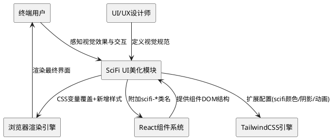

# **4. DFX约束**

## **4.1 性能**

1. CSS变量覆盖和新增样式不得导致首屏渲染时间增加超过50ms
2. 霓虹发光效果(box-shadow多层)的动画帧率应不低于30fps
3. backdrop-filter:blur()模糊半径不得超过20px，避免GPU渲染性能劣化
4. 脉冲动画和呼吸动画的CSS animation不得引起布局重排(reflow)

## **4.2 可靠性**

1. 原有light主题必须保持100%可用，不得因scifi样式引入而退化
2. 原有dark主题的所有交互功能必须保持正常
3. CSS变量缺失时必须回退到原有dark主题的默认值

## **4.3 安全性**

1. 新增CSS中不得引入任何外部URL资源引用（如外部字体、图片CDN）
2. CSS变量值必须为合法CSS颜色值或数值，不得注入非CSS内容

## **4.4 可维护性**

1. 所有新增CSS类必须以`scifi-`前缀命名，便于全局搜索和批量管理
2. 所有新增CSS变量必须以`--scifi-`前缀命名
3. 每个选择组件的科技感样式应独立为单个CSS文件或独立样式块，避免交叉耦合
4. 新增Tailwind扩展配置项必须有JSDoc注释说明

## **4.5 兼容性**

1. 目标浏览器：Chrome 90+、Edge 90+、Firefox 88+、Safari 14+
2. backdrop-filter:blur()需提供-webkit-前缀兼容Safari
3. CSS自定义属性(CSS Variables)在目标浏览器中均原生支持，无需Polyfill
4. 不支持backdrop-filter的浏览器应graceful degradation，回退为半透明纯色背景

# **5. 核心能力**

## **5.1 深空暗色主题升级(REQ-UI01)**

### **5.1.1 业务规则**

1. **背景渐变规则**：深空暗色主题的页面背景必须采用从#0a0e1a(顶部)到#1a1f2e(底部)的线性渐变，替代原有dark主题的#1e1e1e纯色背景

   a. 验收条件：[When 用户切换到scifi暗色主题] → [页面背景呈现从#0a0e1a到#1a1f2e的垂直线性渐变]

2. **双accent色规则**：主题必须定义电光蓝(#00d4ff)为主accent色、量子紫(#a855f7)为辅accent色，替代原有单一primary色

   a. 验收条件：[When 界面元素需要accent高亮] → [主交互元素使用#00d4ff，次交互元素使用#a855f7]

3. **发光边框规则**：选中态、焦点态元素的边框必须呈现对应accent色的外发光效果(box-shadow扩散2-4px)

   a. 验收条件：[When 元素处于选中态或焦点态] → [元素边框呈现accent色外发光，box-shadow包含对应accent色且spread为2-4px]

4. **色阶扩展规则**：电光蓝和量子紫必须各生成50-900色阶，与原有primary色阶体系对齐

   a. 验收条件：[When 引用scifi-blue-500或scifi-purple-500] → [Tailwind可解析对应色阶值]

5. **禁止项**：禁止修改原有`--cp-*`CSS变量的默认值，必须通过新增`--scifi-*`变量覆盖

   a. 验收条件：[When 原有组件引用--cp-primary-500] → [在scifi主题下通过CSS变量级联覆盖为#00d4ff，而非直接修改--cp-primary-500定义]

### **5.1.2 交互流程**

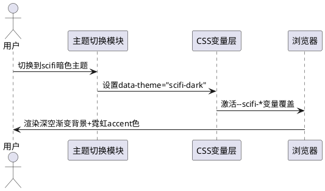

### **5.1.3 异常场景**

1. **浏览器不支持backdrop-filter**

   a. 触发条件：浏览器版本过旧，不支持backdrop-filter:blur()
   b. 系统行为：CSS中提供fallback背景色(rgba半透明纯色)
   c. 用户感知：玻璃拟态效果回退为半透明纯色背景，不影响功能使用

2. **CSS变量覆盖失效**

   a. 触发条件：CSS特异性(specificity)冲突导致--scifi-*变量未生效
   b. 系统行为：回退到原有dark主题的--cp-*变量默认值
   c. 用户感知：界面呈现原有dark主题样式，无scifi效果

## **5.2 ChatModeSelector科技感美化(REQ-UI02)**

### **5.2.1 业务规则**

1. **分段按钮霓虹规则**：ChatModeSelector的每个分段按钮必须具有霓虹发光边框效果，未选中态为暗淡边框(#1e293b)，选中态为电光蓝发光边框

   a. 验收条件：[When 用户选中某个ChatMode分段按钮] → [该按钮边框变为#00d4ff并呈现box-shadow: 0 0 8px rgba(0,212,255,0.4)外发光]

2. **选中态发光规则**：选中按钮的背景必须呈现accent色半透明填充(rgba(0,212,255,0.1))加发光边框

   a. 验收条件：[While 某分段按钮处于选中态] → [按钮背景为rgba(0,212,255,0.1)，边框#00d4ff，box-shadow包含rgba(0,212,255,0.4)发光]

3. **切换过渡规则**：按钮选中态切换时必须具有150ms的transition过渡动画，过渡属性包含background-color、border-color、box-shadow

   a. 验收条件：[When 用户从一个分段按钮切换到另一个] → [旧按钮的发光效果和新按钮的发光效果均在150ms内平滑过渡]

4. **按钮间距规则**：分段按钮之间的间距必须为2px，按钮圆角统一为8px

   a. 验收条件：[When 渲染ChatModeSelector] → [相邻按钮间距2px，每个按钮圆角8px]

### **5.2.2 交互流程**

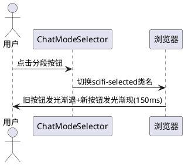

### **5.2.3 异常场景**

1. **快速连续点击**

   a. 触发条件：用户在150ms内连续点击不同分段按钮
   b. 系统行为：CSS transition自然完成最后一次点击的过渡，取消中间态
   c. 用户感知：最终选中态正确，过渡动画可能出现跳帧但不影响功能

## **5.3 ModelSelector科技感美化(REQ-UI03)**

### **5.3.1 业务规则**

1. **下拉面板玻璃拟态规则**：ModelSelector的下拉面板背景必须采用玻璃拟态效果——rgba(10,14,26,0.75)背景色+backdrop-filter:blur(16px)+1px微边框rgba(0,212,255,0.1)

   a. 验收条件：[When 用户打开ModelSelector下拉面板] → [面板背景为rgba(10,14,26,0.75)的模糊玻璃效果，带微弱accent色边框]

2. **模型项发光高亮规则**：当前选中的模型项必须呈现左侧#00d4ff竖条指示器(宽3px)和accent色文字

   a. 验收条件：[While 某模型项处于选中态] → [该模型项左侧出现3px宽#00d4ff竖条，文字颜色为#00d4ff]

3. **hover发光规则**：鼠标悬浮的模型项必须呈现左侧量子紫竖条指示器和rgba(168,85,247,0.05)背景填充

   a. 验收条件：[When 鼠标悬浮在非选中模型项上] → [该模型项左侧出现3px宽#a855f7竖条，背景rgba(168,85,247,0.05)]

4. **面板边框发光规则**：下拉面板的外边框必须呈现微弱的accent色外发光(box-shadow: 0 0 12px rgba(0,212,255,0.15))

   a. 验收条件：[When 下拉面板打开] → [面板外边框呈现#00d4ff微弱外发光]

### **5.3.2 交互流程**

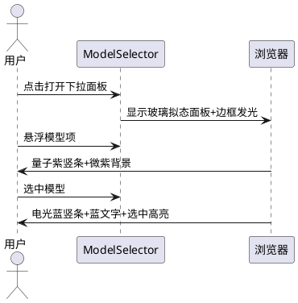

### **5.3.3 异常场景**

1. **面板内容超出视口**

   a. 触发条件：模型列表过长，下拉面板高度超出可视区域
   b. 系统行为：面板设置max-height并出现滚动条，滚动条样式与scifi主题一致(暗色轨道+accent色滑块)
   c. 用户感知：可正常滚动浏览所有模型项

## **5.4 ContextSelector科技感美化(REQ-UI04)**

### **5.4.1 业务规则**

1. **弹出面板玻璃效果规则**：ContextSelector的弹出面板背景必须采用玻璃拟态——rgba(10,14,26,0.8)背景色+backdrop-filter:blur(16px)+微发光边框

   a. 验收条件：[When 弹出面板打开] → [面板呈玻璃拟态效果，背景半透明模糊，边框微发光]

2. **Tab霓虹指示器规则**：选中Tab的底部指示器必须为#00d4ff色且呈现发光效果(高度2px+box-shadow发光)，未选中Tab指示器为透明

   a. 验收条件：[When 某Tab处于选中态] → [Tab底部出现2px高#00d4ff指示器，指示器带box-shadow发光]

3. **搜索框发光边框规则**：搜索输入框在获得焦点时，边框必须呈现#00d4ff发光效果(box-shadow: 0 0 8px rgba(0,212,255,0.3))

   a. 验收条件：[When 搜索框获得焦点] → [搜索框边框变为#00d4ff并呈现8px外发光]

4. **搜索框默认态规则**：搜索框未获焦点时，边框为#1e293b暗色，无发光效果

   a. 验收条件：[While 搜索框未获得焦点] → [搜索框边框为#1e293b，无box-shadow发光]

5. **面板展开过渡规则**：面板展开和收起时必须具有200ms的transform+opacity过渡动画

   a. 验收条件：[When 面板展开或收起] → [动画在200ms内完成，包含scaleY和opacity变化]

### **5.4.2 交互流程**

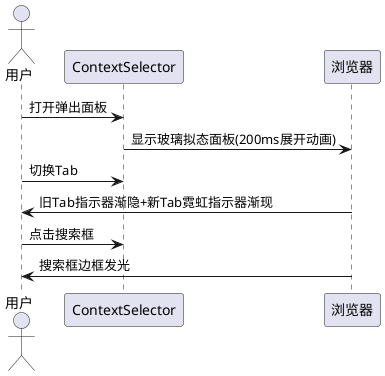

### **5.4.3 异常场景**

1. **Tab内容为空**

   a. 触发条件：选中Tab下无任何上下文项
   b. 系统行为：显示空状态提示，样式与scifi主题一致(暗色文字+accent色图标)
   c. 用户感知：看到"暂无上下文"等提示信息

## **5.5 ActivityBar科技感美化(REQ-UI05)**

### **5.5.1 业务规则**

1. **图标发光规则**：ActivityBar中选中项的图标必须呈现accent色(#00d4ff)填充和发光效果(filter: drop-shadow)

   a. 验收条件：[While 某ActivityBar项处于选中态] → [图标颜色为#00d4ff且具有drop-shadow发光]

2. **选中态脉冲规则**：选中项的图标背景必须呈现周期性脉冲发光动画(周期2s，发光强度在0.3-0.6之间渐变)

   a. 验收条件：[While 某ActivityBar项处于选中态] → [图标背景呈现2s周期的脉冲发光动画，box-shadow的alpha在0.3-0.6间渐变]

3. **背景渐变规则**：ActivityBar整体背景必须采用从#0a0e1a到#0f1320的垂直渐变，与页面深空主题呼应

   a. 验收条件：[When 渲染ActivityBar] → [背景为从#0a0e1a到#0f1320的线性渐变]

4. **hover发光规则**：鼠标悬浮在非选中项上时，图标必须呈现微弱的量子紫发光预览效果

   a. 验收条件：[When 鼠标悬浮在非选中ActivityBar项上] → [图标呈现#a855f7微弱drop-shadow发光]

### **5.5.2 交互流程**

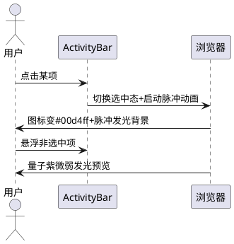

### **5.5.3 异常场景**

1. **脉冲动画性能问题**

   a. 触发条件：低端设备上脉冲动画导致帧率低于30fps
   b. 系统行为：通过prefers-reduced-motion媒体查询自动禁用脉冲动画，保留静态发光
   c. 用户感知：选中态仍有accent色高亮，但无脉冲动画

## **5.6 SettingsPanel科技感美化(REQ-UI06)**

### **5.6.1 业务规则**

1. **导航项发光指示规则**：SettingsPanel中选中导航项的左侧必须呈现#00d4ff竖条指示器(宽3px)加发光效果

   a. 验收条件：[While 某Settings导航项处于选中态] → [该导航项左侧出现3px宽#00d4ff竖条指示器，竖条带box-shadow发光]

2. **内容区玻璃卡片规则**：设置内容区的每个分组卡片必须采用玻璃拟态效果——rgba(10,14,26,0.6)背景+backdrop-filter:blur(12px)+1px微边框rgba(0,212,255,0.08)

   a. 验收条件：[When 渲染Settings内容区卡片] → [卡片呈玻璃拟态效果，背景半透明模糊+微发光边框]

3. **hover导航项规则**：鼠标悬浮在非选中导航项上时，必须呈现rgba(0,212,255,0.05)背景填充和左侧量子紫微弱竖条

   a. 验收条件：[When 鼠标悬浮在非选中Settings导航项上] → [项背景rgba(0,212,255,0.05)，左侧微弱#a855f7竖条]

4. **导航区域背景规则**：SettingsPanel的左侧导航区域背景必须采用#0a0e1a到#0f1320渐变，与深空主题一致

   a. 验收条件：[When 渲染SettingsPanel导航区域] → [背景为从#0a0e1a到#0f1320的线性渐变]

### **5.6.2 交互流程**

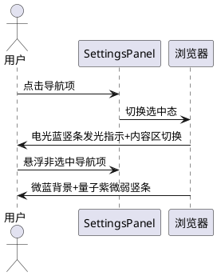

### **5.6.3 异常场景**

1. **设置项过多导致滚动**

   a. 触发条件：导航项或内容项超出可视区域
   b. 系统行为：出现scifi主题风格滚动条(暗色轨道+accent色滑块)
   c. 用户感知：可正常滚动，滚动条与主题风格一致

## **5.7 通用选择交互增强(REQ-UI07)**

### **5.7.1 业务规则**

1. **hover霓虹光效规则**：所有选择类组件的可选项在hover时必须呈现accent色微弱发光背景(rgba(0,212,255,0.06))和边框色渐变

   a. 验收条件：[When 鼠标悬浮在选择类组件的任意可选项上] → [项背景rgba(0,212,255,0.06)，边框向accent色渐变]

2. **选中脉冲规则**：所有选择类组件的选中项在首次被选中时，必须触发一次脉冲缩放动画(scale 1→1.02→1，时长200ms)

   a. 验收条件：[When 用户选中某个可选项] → [该项触发一次200ms的缩放脉冲动画，scale从1到1.02再回到1]

3. **焦点发光环规则**：所有选择类组件在获得键盘焦点时，必须呈现#00d4ff焦点发光环(outline: 2px solid + box-shadow发光)

   a. 验收条件：[When 选择类组件获得键盘焦点] → [组件出现2px宽#00d4ff的outline和box-shadow发光环]

4. **过渡统一规则**：所有选择交互状态变化(hover/selected/focus)必须具有统一过渡时长150ms，过渡属性包含background-color、border-color、box-shadow、transform

   a. 验收条件：[When 任意选择交互状态变化] → [过渡在150ms内完成，覆盖background-color/border-color/box-shadow/transform]

5. **禁止项**：禁止在交互过渡中使用引起layout reflow的属性(如width、height、padding的transition)

   a. 验收条件：[When 交互状态变化] → [不得transition width/height/padding，仅允许transform缩放]

### **5.7.2 交互流程**

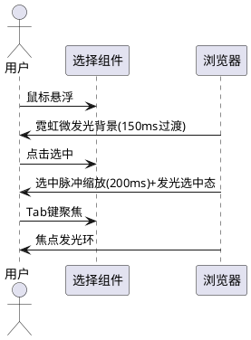

### **5.7.3 异常场景**

1. **快速切换选中项**

   a. 触发条件：用户在200ms内快速切换多个选中项
   b. 系统行为：脉冲动画仅执行最后一次选中的动画，取消之前的脉冲
   c. 用户感知：最终选中态正确，脉冲动画仅触发一次

2. **辅助功能模式**

   a. 触发条件：用户开启prefers-reduced-motion
   b. 系统行为：禁用所有脉冲动画和呼吸动画，保留静态发光效果
   c. 用户感知：无动画但有颜色高亮区分

## **5.8 视觉元素丰富化(REQ-UI08)**

### **5.8.1 业务规则**

1. **背景网格线规则**：深空暗色主题下的主内容区域背景必须绘制低透明度网格线(线条颜色rgba(0,212,255,0.03)，间距40px，1px线宽)，营造HUD界面感

   a. 验收条件：[When scifi暗色主题激活] → [主内容区背景出现rgba(0,212,255,0.03)色的40px间距网格线]

2. **渐变发光分割线规则**：所有区域分割线必须呈现从透明→accent色→透明的水平渐变发光效果(高度1px)

   a. 验收条件：[When 渲染区域分割线] → [分割线为1px高，颜色从transparent经rgba(0,212,255,0.3)到transparent的线性渐变]

3. **状态指示灯呼吸动画规则**：所有状态指示灯(如连接状态、模型加载状态)必须呈现2s周期的呼吸动画(透明度在0.4-1.0间渐变)

   a. 验收条件：[While 状态指示灯显示中] → [指示灯透明度在2s周期内于0.4-1.0间渐变]

4. **图标发光规则**：功能图标在hover时必须呈现accent色drop-shadow发光效果

   a. 验收条件：[When 鼠标悬浮在功能图标上] → [图标呈现#00d4ff的drop-shadow(0 0 4px)发光]

5. **禁止项**：背景网格线不得覆盖在文本内容之上影响可读性，必须位于最底层背景

   a. 验收条件：[When 渲染内容文本] → [网格线z-index低于内容层，不遮挡文字]

### **5.8.2 交互流程**

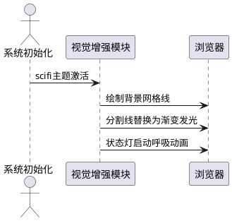

### **5.8.3 异常场景**

1. **网格线影响性能**

   a. 触发条件：大面积网格线导致GPU渲染压力过大
   b. 系统行为：通过background-image:linear-gradient实现网格(而非SVG/Canvas)，确保GPU加速
   c. 用户感知：网格线正常显示，无性能卡顿

## **5.9 CSS变量体系扩展(REQ-UI09)**

### **5.9.1 业务规则**

1. **scifi-*变量命名规则**：所有新增CSS变量必须以`--scifi-`为前缀，与已有`--cp-*`变量体系并存不冲突

   a. 验收条件：[When 定义新的科技感CSS变量] → [变量名以--scifi-开头，如--scifi-neon-blue、--scifi-glow-sm]

2. **霓虹色token规则**：必须定义以下霓虹色CSS变量：
   - `--scifi-neon-blue: #00d4ff`（电光蓝主accent）
   - `--scifi-neon-purple: #a855f7`（量子紫辅accent）
   - `--scifi-neon-blue-rgb: 0, 212, 255`（电光蓝RGB分量，用于rgba计算）
   - `--scifi-neon-purple-rgb: 168, 85, 247`（量子紫RGB分量）

   a. 验收条件：[When 引用--scifi-neon-blue] → [值为#00d4ff]；[When 引用--scifi-neon-blue-rgb] → [值为0, 212, 255]

3. **发光阴影token规则**：必须定义以下发光阴影CSS变量：
   - `--scifi-glow-sm: 0 0 4px`（小发光扩散）
   - `--scifi-glow-md: 0 0 8px`（中发光扩散）
   - `--scifi-glow-lg: 0 0 16px`（大发光扩散）
   - `--scifi-shadow-neon-blue-sm: 0 0 4px rgba(0,212,255,0.4)`（电光蓝小发光）
   - `--scifi-shadow-neon-blue-md: 0 0 8px rgba(0,212,255,0.3)`（电光蓝中发光）
   - `--scifi-shadow-neon-purple-sm: 0 0 4px rgba(168,85,247,0.4)`（量子紫小发光）

   a. 验收条件：[When 引用--scifi-shadow-neon-blue-md] → [值为0 0 8px rgba(0,212,255,0.3)]

4. **背景渐变token规则**：必须定义深空背景渐变变量：
   - `--scifi-bg-gradient: linear-gradient(180deg, #0a0e1a 0%, #1a1f2e 100%)`
   - `--scifi-bg-start: #0a0e1a`
   - `--scifi-bg-end: #1a1f2e`

   a. 验收条件：[When 引用--scifi-bg-gradient] → [值为linear-gradient(180deg, #0a0e1a 0%, #1a1f2e 100%)]

5. **玻璃拟态token规则**：必须定义玻璃拟态相关变量：
   - `--scifi-glass-bg: rgba(10, 14, 26, 0.75)`
   - `--scifi-glass-blur: 16px`
   - `--scifi-glass-border: 1px solid rgba(0, 212, 255, 0.1)`

   a. 验收条件：[When 引用--scifi-glass-bg] → [值为rgba(10, 14, 26, 0.75)]

6. **禁止项**：禁止用--scifi-*变量覆盖--cp-*变量的定义，必须通过CSS选择器特异性(如[data-theme="scifi-dark"])实现值替换

   a. 验收条件：[When data-theme不为scifi-dark] → [--scifi-*变量不生效，界面使用原有--cp-*变量值]

### **5.9.2 交互流程**

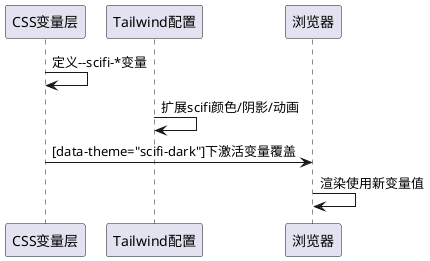

### **5.9.3 异常场景**

1. **变量循环引用**

   a. 触发条件：--scifi-*变量引用了自身或其他--scifi-*变量形成循环
   b. 系统行为：CSS规范下循环引用变量视为无效值，回退到属性初始值
   c. 用户感知：相关样式缺失，但不影响其他功能

## **5.10 基础UI组件升级(REQ-UI10)**

### **5.10.1 业务规则**

1. **Button霓虹variant规则**：Button组件必须新增`scifi-neon`variant，样式为accent色发光边框+半透明accent背景+hover时发光增强

   a. 验收条件：[When Button使用scifi-neon variant] → [按钮边框#00d4ff+box-shadow发光+背景rgba(0,212,255,0.1)]；[When hover该Button] → [发光强度增强(box-shadow alpha增大)]

2. **Card玻璃效果规则**：Card组件在scifi主题下必须默认采用玻璃拟态效果——rgba(10,14,26,0.6)背景+backdrop-filter:blur(12px)+微accent色边框

   a. 验收条件：[When scifi主题下渲染Card] → [Card呈玻璃拟态效果，半透明模糊背景+rgba(0,212,255,0.08)微边框]

3. **Input发光边框规则**：Input组件在获得焦点时，边框必须呈现#00d4ff发光效果(box-shadow: 0 0 8px rgba(0,212,255,0.3))

   a. 验收条件：[When Input获得焦点] → [边框变为#00d4ff+8px外发光]

4. **Input默认态规则**：Input未获焦点时，边框为#1e293b暗色，无发光

   a. 验收条件：[While Input未获得焦点] → [边框#1e293b，无box-shadow发光]

5. **Modal玻璃效果规则**：Modal的遮罩层必须为rgba(0,0,0,0.6)，内容面板必须采用玻璃拟态效果(rgba(10,14,26,0.85)+blur(20px)+微发光边框)

   a. 验收条件：[When Modal打开] → [遮罩rgba(0,0,0,0.6)，内容面板玻璃拟态+边框微发光]

6. **禁止项**：禁止修改组件的props接口和事件逻辑，仅通过CSS类名附加和变量覆盖实现样式升级

   a. 验收条件：[When 组件升级后] → [组件props接口不变，事件处理逻辑不变，仅className和style变化]

### **5.10.2 交互流程**

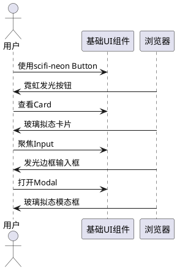

### **5.10.3 异常场景**

1. **Button scifi-neon在light主题下**

   a. 触发条件：scifi-neon variant Button在light主题下渲染
   b. 系统行为：发光效果使用更深的蓝色(#0066cc)并降低发光强度，适配浅色背景
   c. 用户感知：按钮仍可辨识，发光效果适配浅色背景

# **6. 数据约束**

## **6.1 SciFi配色方案**

1. **--scifi-bg-start**：深空背景起始色，色值#0a0e1a，HSL(220,47%,7%)，用于页面背景渐变起点
2. **--scifi-bg-end**：深空背景终止色，色值#1a1f2e，HSL(226,27%,14%)，用于页面背景渐变终点
3. **--scifi-neon-blue**：电光蓝主accent色，色值#00d4ff，HSL(193,100%,50%)，用于主要交互元素高亮
4. **--scifi-neon-purple**：量子紫辅accent色，色值#a855f7，HSL(271,91%,66%)，用于次要交互元素高亮
5. **--scifi-neon-green**：量子绿状态色，色值#22c55e，HSL(142,71%,45%)，用于成功/在线状态指示
6. **--scifi-neon-red**：霓虹红警告色，色值#ef4444，HSL(0,84%,60%)，用于错误/离线状态指示
7. **--scifi-neon-amber**：霓虹琥珀注意色，色值#f59e0b，HSL(38,92%,50%)，用于警告/注意状态指示
8. **--scifi-surface**：面板表面色，色值#0f1320，HSL(224,33%,9%)，用于卡片和面板背景基础色
9. **--scifi-border-dim**：暗淡边框色，色值#1e293b，HSL(217,33%,17%)，用于未激活元素边框
10. **--scifi-border-glow**：发光边框色，色值rgba(0,212,255,0.15)，用于面板和卡片微发光边框

## **6.2 SciFi阴影体系**

1. **--scifi-shadow-neon-blue-sm**：电光蓝小发光，值0 0 4px rgba(0,212,255,0.4)，用于小元素(hover态、标签)
2. **--scifi-shadow-neon-blue-md**：电光蓝中发光，值0 0 8px rgba(0,212,255,0.3)，用于中等元素(按钮、输入框焦点)
3. **--scifi-shadow-neon-blue-lg**：电光蓝大发光，值0 0 16px rgba(0,212,255,0.2)，用于大元素(面板边框、选中态)
4. **--scifi-shadow-neon-purple-sm**：量子紫小发光，值0 0 4px rgba(168,85,247,0.4)，用于hover预览态
5. **--scifi-shadow-neon-purple-md**：量子紫中发光，值0 0 8px rgba(168,85,247,0.3)，用于次要选中态

## **6.3 SciFi动画参数**

1. **transition-duration**：交互过渡时长，值150ms，适用于所有hover/selected/focus状态过渡
2. **transition-property**：过渡属性集，值background-color, border-color, box-shadow, transform, opacity
3. **pulse-duration**：脉冲动画周期，值2s，适用于ActivityBar选中态和状态指示灯
4. **pulse-scale**：脉冲缩放幅度，值1.02，适用于选中项首次选中脉冲
5. **pulse-duration-select**：选中脉冲时长，值200ms，适用于选中项触发的单次缩放脉冲
6. **breath-alpha-min**：呼吸动画最小透明度，值0.4，适用于状态指示灯呼吸动画
7. **breath-alpha-max**：呼吸动画最大透明度，值1.0，适用于状态指示灯呼吸动画
8. **glow-alpha-min**：脉冲发光最小alpha，值0.3，适用于ActivityBar选中态脉冲发光
9. **glow-alpha-max**：脉冲发光最大alpha，值0.6，适用于ActivityBar选中态脉冲发光

## **6.4 SciFi圆角与间距**

1. **--scifi-radius-sm**：小组件圆角，值6px，适用于标签、小按钮
2. **--scifi-radius-md**：中组件圆角，值8px，适用于分段按钮、输入框
3. **--scifi-radius-lg**：大组件圆角，值12px，适用于卡片、面板、Modal
4. **--scifi-indicator-width**：指示器宽度，值3px，适用于选中项左侧竖条指示器
5. **--scifi-tab-indicator-height**：Tab指示器高度，值2px，适用于Tab底部霓虹指示器

# **7. 实施优先级与兼容性保障**

## **7.1 实施优先级**

| 优先级 | 需求编号 | 需求名称 | 依赖关系 | 实施复杂度 |
|--------|----------|----------|----------|------------|
| P0 | REQ-UI09 | CSS变量体系扩展 | 无 | 低 |
| P0 | REQ-UI01 | 深空暗色主题升级 | REQ-UI09 | 中 |
| P1 | REQ-UI07 | 通用选择交互增强 | REQ-UI09 | 中 |
| P1 | REQ-UI02 | ChatModeSelector科技感美化 | REQ-UI09, REQ-UI07 | 中 |
| P1 | REQ-UI03 | ModelSelector科技感美化 | REQ-UI09, REQ-UI07 | 中 |
| P1 | REQ-UI04 | ContextSelector科技感美化 | REQ-UI09, REQ-UI07 | 中 |
| P1 | REQ-UI05 | ActivityBar科技感美化 | REQ-UI09, REQ-UI07 | 中 |
| P1 | REQ-UI06 | SettingsPanel科技感美化 | REQ-UI09, REQ-UI07 | 中 |
| P2 | REQ-UI10 | 基础UI组件升级 | REQ-UI09 | 中 |
| P2 | REQ-UI08 | 视觉元素丰富化 | REQ-UI01 | 中 |

## **7.2 兼容性保障**

1. **主题切换兼容**：通过`data-theme`属性控制scifi主题激活，默认不激活，用户可选择开启
2. **原有主题保护**：所有scifi样式必须在`[data-theme="scifi-dark"]`选择器内定义，确保不影响原有dark/light主题
3. **渐进增强**：不支持backdrop-filter的浏览器自动降级为半透明纯色背景，不影响功能
4. **辅助功能**：尊重`prefers-reduced-motion`媒体查询，为运动敏感用户禁用脉冲和呼吸动画
5. **类名隔离**：所有新增CSS类以`scifi-`前缀命名，与已有类名零冲突
6. **变量隔离**：所有新增CSS变量以`--scifi-`前缀命名，与已有`--cp-*`变量零冲突
7. **回退机制**：scifi变量未定义时，组件自动回退到原有dark主题样式
